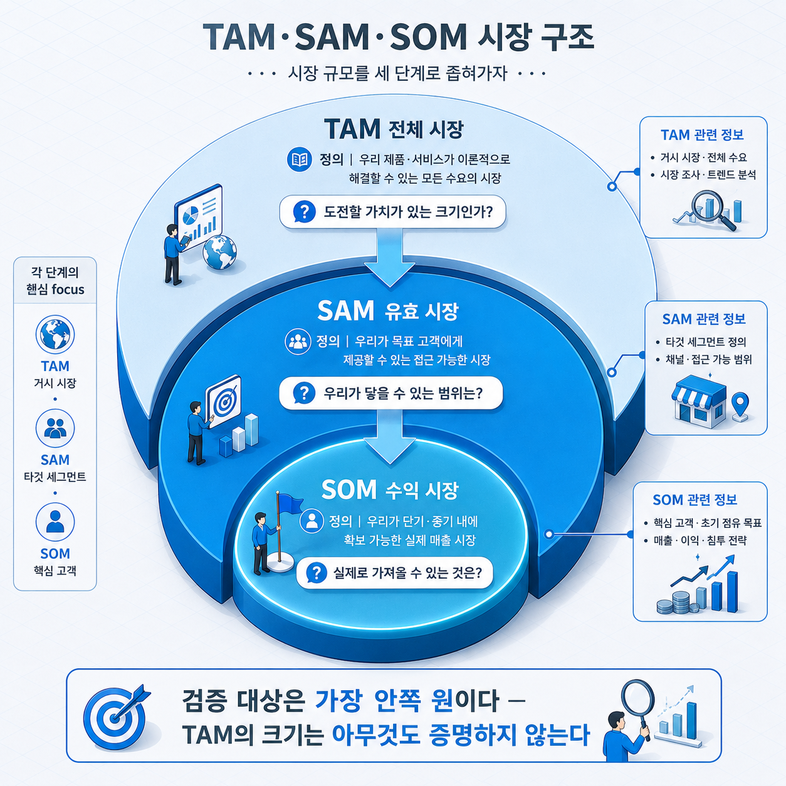
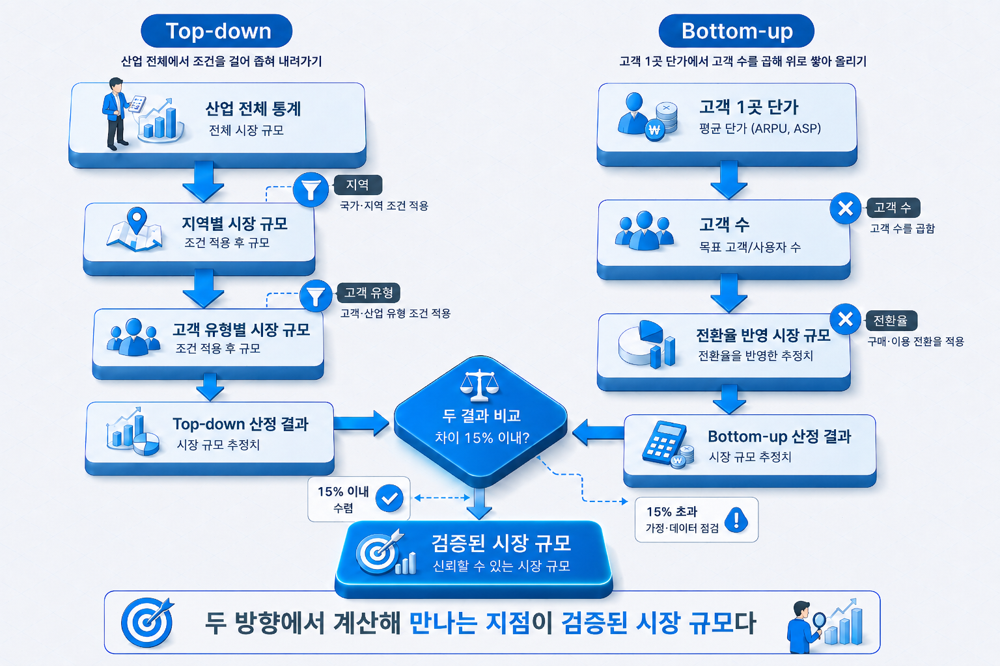

# I-3. 시장분석 — TAM·SAM·SOM으로 시장 규모 산정하기

## 시장 규모 수치가 유독 까다로운 이유

사업계획서에서 가장 자주 반려되는 항목 중 하나가 시장 규모다. 수치를 찾지 못해서가 아니다. 오히려 반대다. 검색하면 "글로벌 시장 300조 원, 연평균 성장률 20%" 같은 수치는 쉽게 나온다. 문제는 그 수치가 **해당 사업과 연결되지 않는다**는 데 있다.

이 항목에서 확인해야 할 것은 시장이 크다는 사실이 아니다. **이 팀이 자기 시장을 얼마나 정확히 이해하고 있는가**다. 300조 원 시장에서 실제로 닿을 수 있는 고객이 몇이고, 그중 얼마를 언제까지 차지할 수 있는지를 논리적으로 설명할 수 있는지가 판단 기준이다.

이 장은 분석 깔때기의 마지막 층이다. 거시환경에서 산업 구조로 좁혀 들어온 시선을 **실제로 얻을 수 있는 시장**까지 좁힌다.

## TAM·SAM·SOM이란 무엇인가

시장 규모를 세 단계로 나누어 좁혀 가는 구조다. 하나의 수치 대신 세 개의 수치를 제시하는 이유는 각 단계가 서로 다른 질문에 답하기 때문이다.

| 구분 | 의미 | 답하는 질문 |
|------|------|-------------|
| **TAM** (Total Addressable Market — 전체 시장) | 자사 제품이 속한 시장 전체의 수요 | 이 시장이 도전할 가치가 있는 크기인가 |
| **SAM** (Serviceable Available Market — 유효 시장) | 그중 자사 제품·채널·지역으로 실제 서비스 가능한 범위 | 자사가 닿을 수 있는 시장은 어디까지인가 |
| **SOM** (Serviceable Obtainable Market — 수익 시장) | 앞으로 3~5년 안에 현실적으로 얻을 수 있는 몫 | 실제로 차지할 수 있는 몫은 얼마인가 |

세 수치 중 **가장 중요한 것은 SOM이다.** TAM은 시장의 매력도를 보여 줄 뿐이고, 실제 검증 대상은 SOM이다. 상장 시점의 기술 기업 대부분이 자신이 제시했던 TAM의 0.1~2% 정도만 차지한 상태라는 점을 생각하면, TAM을 부풀리는 일이 왜 무의미한지 분명해진다. 큰 TAM은 아무것도 증명하지 않는다.

SOM 산정에서 흔히 나타나는 실수가 있다. SAM에 임의의 점유율을 곱해서 SOM을 만드는 방식이다. "유효 시장 1조 원의 5%를 차지해 500억 원"이라는 문장은 근거가 없다. **SOM은 자사 역량에서 거꾸로 계산해야 한다.** 영업 인력이 몇 명이고, 한 명이 한 해에 몇 곳을 만날 수 있고, 그중 몇 퍼센트가 계약으로 이어지는지에서 출발한 수치여야 한다.


> 그림 1 — TAM·SAM·SOM 3단 구조. 검증 대상은 가장 안쪽 원이다 — TAM의 크기는 아무것도 증명하지 않는다.

## Top-down — 큰 시장에서 좁혀 내려오기

공신력 있는 기관이 발표한 전체 시장 규모에서 출발해, 조건을 걸어 자사의 시장까지 좁히는 방식이다.

절차는 세 단계다. 먼저 통계청·부처 보고서·시장조사 기관 자료에서 산업 전체 규모를 확인한다. 다음으로 지역·제품군·고객 유형 같은 조건을 순서대로 적용해 범위를 줄인다. 마지막으로 각 단계에서 적용한 비율의 근거를 남긴다.

이 방식의 장점은 **빠르고 출처가 분명하다**는 것이다. 짧은 시간에 시장의 윤곽을 그릴 수 있고, 인용한 통계가 공식 자료이므로 수치 자체를 의심받지 않는다.

약점도 분명하다. **좁혀 가는 과정의 비율이 대부분 가정**이라는 점이다. "국내 제조업 중 우리 대상은 30%"라는 문장에서 30%의 근거가 없으면, 최종 수치는 출처 있는 통계에서 출발했더라도 결론은 추정에 불과하다. 계획의 신뢰가 결정되는 지점이 정확히 여기다.

## Bottom-up — 고객 한 곳에서 쌓아 올리기

반대 방향이다. 고객 한 곳에서 얻을 수 있는 금액에서 출발해, 그런 고객이 몇이나 되는지를 세어 올라간다.

```
고객 1곳당 연간 매출 × 실제 도달 가능한 고객 수 = 시장 규모
```

예를 들어 중소 제조기업에 연 500만 원짜리 솔루션을 판다면, 대상이 되는 기업 수를 통계에서 확인하고 그중 자사 조건(업종·규모·지역)에 맞는 곳을 추려 곱한다. 여기에 자사의 영업 역량으로 몇 년 안에 몇 곳까지 닿을 수 있는지를 반영하면 SOM이 나온다.

결과는 Top-down보다 작게 나온다. **작게 나오는 것이 정상이고, 그래서 더 신뢰받는다.** 모든 가정이 추적 가능하기 때문이다. 고객당 단가는 자사 가격표에서, 고객 수는 통계에서, 전환율은 자사 영업 데이터나 업계 평균에서 온다. 각 수치의 출처를 물어도 답할 수 있다.

## 두 방식을 함께 써야 하는 이유

결론부터 말하면, **둘 중 하나만 제시하면 안 된다.**

2026년 투자 심사에서 가장 자주 지적되는 문제가 Top-down 단독 제시다. 반대로 두 방식을 모두 제시한 창업자들이 투자 유치를 눈에 띄게 빠르게 마무리한다는 데이터도 있다(Carta, 2025년 기준). 이유는 단순하다. 투자자가 두 수치를 서로 대조해 검증할 수 있기 때문이다.

**두 결과가 15% 이내로 수렴하면** 산정이 신뢰할 만하다고 본다. 큰 차이가 난다면 그 자체가 정보다. Top-down이 훨씬 크게 나왔다면 좁히는 과정의 가정이 느슨했거나, 실제로 닿을 수 없는 고객까지 포함한 것이다. Bottom-up이 더 크게 나왔다면 단가나 전환율을 낙관적으로 정했을 가능성이 크다.

차이를 발견했을 때 할 일은 수치를 맞추는 것이 아니라 **어느 가정이 틀렸는지 찾는 것이다.** 이 과정을 거친 사업계획서는 시장 규모 항목에서 질문을 받아도 답할 수 있다.


> 그림 2 — Top-down과 Bottom-up 산정 경로. 두 방향에서 계산해 만나는 지점이 검증된 시장 규모다.

## 국내 자료로 근거 세우기

Bottom-up의 관건은 **대상 고객 수를 어디서 세느냐다.** 국내에는 무료로 쓸 수 있는 공식 통계가 충분히 있다.

| 필요한 수치 | 자료 |
|------------|------|
| 업종별·규모별 사업체 수 | 통계청 전국사업체조사 (국가통계포털 KOSIS) |
| 중소기업 현황·업종 분포 | 중소벤처기업부 중소기업 실태조사 |
| 산업별 생산·출하·시장 규모 | 통계청 광업제조업조사, 산업연구원(KIET) 산업 전망 |
| 수출입 규모·품목별 교역 | 관세청 수출입무역통계, 한국무역협회 K-stat |
| 인구·가구 기반 소비 시장 | 통계청 인구총조사·가계동향조사 |
| 공공·기관 대상 시장 | 조달청 나라장터 발주 실적, 공공데이터포털 |

이 자료들의 장점은 **원문 확인이 가능하다**는 것이다. 출처를 열어 확인할 수 있는 수치는 신뢰를 얻는다. 반대로 블로그나 기사에서 재인용한 시장조사 기관 수치는 원 보고서를 확인할 수 없어 의심받기 쉽다. 유료 보고서를 인용해야 한다면 보고서명과 발행 연도를 함께 적는다.

## 자주 나오는 오류 3가지

**오류 1 — TAM만 크게 제시하고 끝낸다**

"글로벌 시장 300조 원"으로 시작해 SOM까지 내려오지 않는 경우다. 수치는 인상적이지만 해당 사업과 연결되지 않아 아무 근거가 되지 못한다. 이 대목에서 팀이 자기 시장을 모른다는 사실이 드러난다.

**오류 2 — SAM에 임의 점유율을 곱해 SOM을 만든다**

"유효 시장의 5%를 차지하겠다"는 문장에 근거가 없는 경우다. 5%가 왜 가능한지, 그 5%를 어떤 영업 활동으로 만들 것인지가 없으면 희망을 수치로 적은 것에 불과하다. SOM은 팀 규모·예산·판매 채널에서 거꾸로 계산한다.

**오류 3 — 경쟁자가 없는 것처럼 계산한다**

SAM 전체를 자사가 다 차지할 수 있다고 전제하는 경우다. 이미 그 시장을 나눠 갖고 있는 기업들이 있고, 신규 진입자도 들어온다. 산업분석 장(→ [I-2장](I-02_산업분석.md))에서 다룬 경쟁 구조가 여기에 반영되어야 한다.

세 오류의 공통점은 같다. **수치를 크게 보이려다 논리를 잃는 것이다.** 작더라도 설명 가능한 수치가 큰 수치보다 강하다.

## 사업계획에서의 위치

| 사업계획 구성 요소 | 이 장의 내용이 답하는 것 |
|------|------|
| 목표 시장·시장 규모 | 세 단계 수치와 SOM 산출 논리 |
| 매출 계획의 전제 | 도달 가능한 고객 수와 개발 결과물의 수요처 규모 |
| 외부 제시(투자자·파트너) | 두 방식 병행 제시로 검증 가능성을 높임 |

시장 규모는 홀로 서 있는 항목이 아니다. **타깃 고객 정의 → 시장 규모 → 매출 계획 → 마케팅 전략**으로 이어지는 흐름의 한 부분이다. SOM과 매출 계획이 어긋나면 문서 전체의 신뢰가 훼손된다. SOM이 100억 원인데 3년 차 매출 목표가 300억 원이면 두 수치 중 하나는 틀린 것이다.

여기까지가 정태적 분석이다. 거시환경에서 산업 구조를 거쳐 목표 시장까지, 구조를 읽는 세 층을 지나왔다. 다음 장에서는 시선을 시간 축으로 옮긴다. 지금이 어느 시점인지, 기술이 수명주기의 어디에 있는지를 읽는 방법이다. 구조를 읽었다면 다음은 변화를 읽을 차례다.

> 시장 규모 항목에서 평가가 나뉘는 지점은 수치의 크기가 아니라 그 수치에 도달한 경로다. 두 방향에서 계산해 서로 대조한 흔적이 보이면, 나머지 항목도 같은 수준으로 검토되었다는 신뢰가 생긴다.

## 연결 장

- 선행: (→ [I-2장](I-02_산업분석.md)) 산업분석 — Five Forces·가치사슬
- 후행: (→ [I-4장](I-04_기술시장_변화.md)) 기술·시장 변화의 특징과 유형
- 참조: (→ [I-1장](I-01_환경분석.md)) 환경분석 — 분석 깔때기의 첫 층
