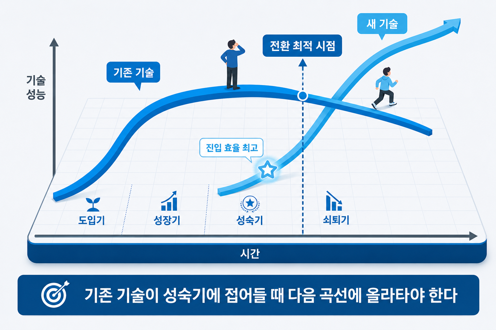
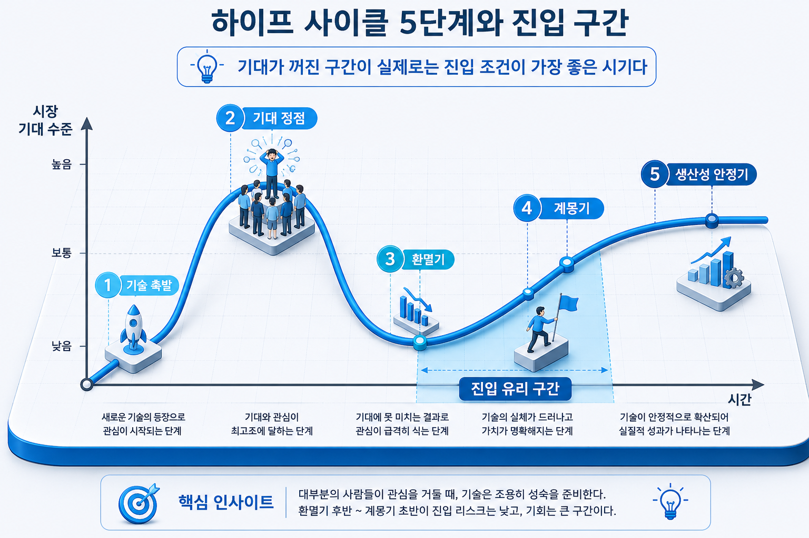
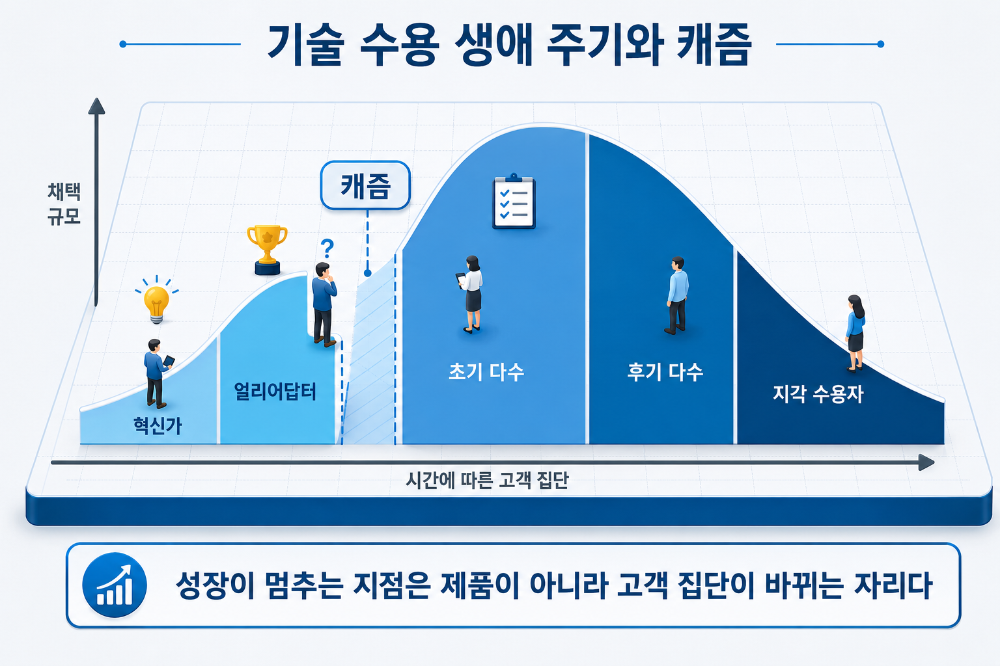

# I-4. 기술·시장 변화의 특징과 유형 — 지금이 어느 시점인가

## 구조를 읽었다면 다음은 변화를 읽는다

여기까지 세 장에서 시장의 **구조**를 읽었다. 거시환경이 어떤 조건을 만드는지, 산업이 어떤 경쟁 구조인지, 얻을 수 있는 시장이 얼마인지를 차례로 좁혀 왔다.

그런데 이 세 가지는 모두 **지금 이 순간의 사진이다.** 사진에는 빠진 정보가 있다. 이 시장이 어디에서 와서 어디로 가고 있는지, 그리고 그 흐름의 어느 지점에 서 있는지다.

같은 시장이라도 진입 시점에 따라 결과가 달라진다. 기술이 충분히 성숙하지 않은 시점에 들어가면 고객을 설득하는 데 자원을 소진하고, 이미 표준이 정해진 뒤에 들어가면 후발주자로 가격 경쟁에 갇힌다. **"왜 지금인가"라는 질문에 답하려면 시간 축이 필요하다.**

이 장에서는 시간 축에서 시장을 읽는 네 가지 진단 도구를 다룬다. 각각 보는 대상이 다르다.

| 도구 | 무엇의 변화를 보는가 |
|------|---------------------|
| **S커브** | 기술 자체의 성능 |
| **하이프 사이클** | 시장의 기대 수준 |
| **기술수용주기와 캐즘** | 고객 집단의 수용 순서 |
| **제품수명주기** | 제품·시장의 매출 국면 |

네 도구는 경쟁 관계가 아니라 보완 관계다. 하나만으로는 판단이 한쪽으로 기운다.

## S커브 — 기술의 성능은 어떻게 변하는가

기술의 성능은 일정한 속도로 좋아지지 않는다. 초기에는 투자 대비 개선이 더디다가, 임계점을 넘으면 급격히 향상되고, 물리적 한계에 가까워지면 다시 완만해진다. 이 궤적이 S자를 그려 S커브라고 부른다.

| 단계 | 특징 | 이 시점의 선택 |
|------|------|---------------|
| 도입기 | 원리 증명 수준, 개선 속도 느림 | 탐색적 투자, 얼리어답터 확보 |
| **성장기 초입** | 임계점 돌파, 급성장 시작 | **집중 투자·선점 — 진입 효율이 가장 높은 구간** |
| 성장기 | 확산 가속, 경쟁자 진입 | 공격적 확장, 차별화 |
| 성숙기 | 개선 둔화, 경쟁 심화 | 원가 절감, 틈새 공략 |
| 쇠퇴기 | 새로운 기술 원리로 대체 | 전환 또는 철수 |

S커브는 두 가지 다른 판단에 쓰인다. 하나는 **시장에 언제 들어갈 것인가**이고, 다른 하나는 **다음 기술로 언제 전환할 것인가**다. 앞의 것은 진입 타이밍 문제이고, 뒤의 것은 기존 기술이 성숙기에 접어들 때 다음 S커브로 이행하는 전환 문제다. 전환이 늦으면 이미 수익이 줄어드는 영역에 계속 투자하게 된다.

### 단계 판단은 수치로 한다

실무에서 가장 흔한 실수는 **근거 없이 "우리 기술은 성장기"라고 선언하는 것이다.** 이 문장은 주장일 뿐 근거가 되지 못한다. 다음 네 가지 수치가 같은 방향을 가리키면 단계 판단이 설득력을 얻는다.

| 지표 | 확인처 | 읽는 법 |
|------|--------|---------|
| 특허 출원 건수 추이 | 특허정보넷(KIPRIS) | 연평균 증가율이 두 자릿수면 성장기 신호 |
| 기술이전·라이선스 건수 | 한국과학기술기획평가원(KISTEP) | 상용화 진입 수준 판단 |
| 시장 성장률 | 산업연구원(KIET) 등 | 연 20% 이상이면 성장기, 한 자릿수면 성숙기 |
| 정부 R&D 투자 추이 | 국가과학기술지식정보서비스(NTIS) | 정책적 집중 투자는 성장기 초입 신호 |


> 그림 1 — S커브와 기술 전환 시점. 기존 기술이 성숙기에 접어들 때 다음 곡선으로 이행해야 한다.

## 하이프 사이클 — 시장의 기대는 어떻게 변하는가

S커브가 기술의 실제 성능을 추적한다면, 하이프 사이클은 **시장이 그 기술에 품는 기대**를 추적한다. 가트너(Gartner — 미국의 IT 시장조사 기관)가 1995년부터 발표해 온 모형으로, 기대가 실제 성능보다 먼저 부풀었다가 꺼지고 다시 현실 수준으로 회복하는 패턴을 다섯 단계로 그린다.

```
① 기술 촉발 → ② 기대 정점 → ③ 환멸기 → ④ 계몽기 → ⑤ 생산성 안정기
                  (거품)      (기회 구간)   (주류 진입)
```

이 도구가 유용한 이유는 **기술의 우수성과 진입 시점은 별개라는 사실이 이 곡선에서 드러나기 때문이다.** 기대 정점에서는 경쟁자와 투자가 집중되어 진입 비용이 최고조에 이른다. 반대로 환멸기 후반에서 계몽기 초반 사이에는 관심이 식어 경쟁이 줄고, 동시에 실제 적용 사례가 쌓이기 시작한다. 이 구간이 선점 효과가 가장 큰 지점이다.

기대 정점에서 진입해 거품이 꺼질 때 자원을 소진하는 패턴은 반복적으로 관찰된다. 특정 기술이 언론에 집중적으로 다뤄지는 시기에 사업을 시작했다가, 관심이 옮겨 간 뒤 후속 투자를 받지 못하는 경우가 여기에 해당한다.

S커브와 함께 보면 판단이 정교해진다. **기술 성능은 올라가는데 시장 기대는 꺼진 구간**이 있다. 하이프 사이클의 환멸기가 S커브의 성장기와 겹치는 지점인데, 실질적으로 가장 유리한 진입 조건이다.


> 그림 2 — 하이프 사이클 5단계와 진입 구간. 기대가 꺼진 구간이 실제로는 진입 조건이 가장 좋은 시기다.

## 기술수용주기와 캐즘 — 고객은 순서대로 움직인다

앞의 두 도구가 기술과 시장 분위기를 봤다면, 이 도구는 **고객**을 본다.

새로운 기술은 모든 고객에게 동시에 팔리지 않는다. Geoffrey Moore가 정리한 기술수용주기에 따르면 고객은 다섯 집단으로 나뉘어 순서대로 움직인다.

| 집단 | 성향 | 구매 이유 |
|------|------|-----------|
| 혁신가 | 기술 자체에 열광 | 새로운 것을 먼저 써 보려고 |
| **얼리어답터** | 전략적 가치를 알아봄 | 경쟁 우위를 먼저 차지하려고 |
| **— 캐즘 —** | — | **수요가 끊기는 구간** |
| 초기 다수 | 실용주의자 | 검증된 해법이라서 |
| 후기 다수 | 의심이 많음 | 표준이 되었고 쓰기 쉬워서 |
| 지각수용자 | 마지막에 채택 | 다른 선택지가 없어서 |

### 캐즘은 왜 생기는가

얼리어답터와 초기 다수 사이에 수요가 끊기는 구간이 있다. 이것을 캐즘(Chasm — 본래 지형의 깊은 틈을 뜻하는 말)이라고 부른다.

원인은 **두 집단이 제품을 사는 이유가 근본적으로 다르다**는 데 있다. 얼리어답터는 기술의 가능성에 반응한다. 제품이 불완전해도 스스로 부족한 부분을 메워 가며 쓴다. 반면 초기 다수는 완성도와 신뢰성을 본다. 자기와 비슷한 조건의 기업이 이미 성공적으로 쓰고 있다는 증거를 원한다.

그래서 얼리어답터에게 잘 팔리던 제품이 그 다음 단계에서 갑자기 멈춘다. 파일럿 고객 서너 곳에서 좋은 반응을 얻고 시장이 열렸다고 판단해 마케팅을 확대했다가 성과가 나오지 않는 상황이 전형적인 캐즘이다. 성장의 정체가 제품 품질 문제가 아니라 **고객 집단이 바뀌었다는 사실을 인식하지 못한 데서** 오는 경우다.

캐즘을 넘는 방법은 이 장의 범위를 넘어선다. 니치(틈새) 시장 선정과 완전한 해결책 구성을 다루는 별도의 전략이 필요하며, 이는 캐즘 극복 전략 장(→ [I-9장](I-09_캐즘_극복.md))에서 다룬다. 이 장에서는 **캐즘이라는 현상을 알아보는 것**까지가 목적이다.


> 그림 3 — 기술수용주기와 캐즘 위치. 성장이 멈추는 지점은 제품이 아니라 고객 집단이 바뀌는 자리다.

## 제품수명주기 — 매출은 어떤 곡선을 그리는가

마지막 도구는 제품과 시장의 매출 국면이다. 도입기·성장기·성숙기·쇠퇴기 네 단계로 나뉘며, 단계마다 경쟁 양상과 필요한 전략이 달라진다.

S커브와 혼동하기 쉬운데 보는 대상이 다르다. **S커브는 기술의 성능을, 제품수명주기는 매출 규모를 추적한다.** 기술 성능이 이미 성숙했어도 시장에서는 이제 막 매출이 늘기 시작하는 경우가 있다. 기술 개발이 끝난 뒤 상용화까지 시차가 있기 때문이다.

이 시차를 인식하면 판단이 달라진다. 기술적으로는 새로울 것이 없는 분야인데 시장은 이제 열리는 중이라면, 기술 개발보다 사업화 실행에 자원을 두는 것이 맞다.

## 네 도구를 함께 읽는 방법

네 개를 따로 보면 서로 다른 답이 나온다. 함께 읽어야 하나의 판단이 된다.

| 질문 | 확인하는 도구 |
|------|--------------|
| 기술이 쓸 만한 수준에 도달했는가 | S커브 |
| 시장의 관심이 과열됐는가, 식었는가 | 하이프 사이클 |
| 자사의 고객은 어느 집단인가 | 기술수용주기 |
| 매출이 늘어나는 국면인가 | 제품수명주기 |

가장 유리한 조합은 **기술은 성장기에 들어섰고, 시장 기대는 정점을 지나 식었으며, 초기 다수가 움직이기 시작한 시점이다.** 기술 위험은 낮아졌고 경쟁은 아직 적으며 고객은 검증된 해법을 찾기 시작한 상태이기 때문이다.

반대로 가장 불리한 조합은 기술은 도입기인데 시장 기대만 정점에 있는 경우다. 자금은 집중되지만 제품이 기대를 충족하지 못해, 거품이 꺼질 때 함께 도태된다.

사업계획서에서 "왜 지금인가"를 쓸 때는 이 네 가지 중 최소 두 가지 근거를 연결하는 것이 좋다. 하나만으로는 해석의 여지가 남는다.

## 시장을 읽는 네 장의 구성

여기까지가 시장을 읽는 과정이다. 네 장이 하나의 순서를 이룬다.

| 순서 | 장 | 답하는 질문 |
|------|-----|-------------|
| 1 | (→ [I-1장](I-01_환경분석.md)) 환경분석 — PEST·PESTLE | 통제할 수 없는 외부 조건은 무엇인가 |
| 2 | (→ [I-2장](I-02_산업분석.md)) 산업분석 — Five Forces·가치사슬 | 어떤 경쟁 구조에 놓여 있는가 |
| 3 | (→ [I-3장](I-03_시장분석.md)) 시장분석 — TAM·SAM·SOM | 실제로 얻을 수 있는 시장은 얼마인가 |
| 4 | 변화 패턴 (이 장) | 지금이 어느 시점인가 |

앞의 세 장은 **구조**를 읽고, 이 장은 **변화**를 읽는다. 구조만 알면 정확하지만 시점을 놓치고, 변화만 보면 흐름은 알지만 근거가 얕아진다. 네 장을 함께 쓸 때 "왜 이 사업을, 왜 지금"이라는 문장이 완성된다.

이어지는 장들(I-5~I-7)에서는 시선을 시장에서 고객으로 옮긴다. 고객이 실제로 무엇을 필요로 하는지 정의하고, 그 문제에서 아이디어를 도출하고, 가치를 설계하는 방법을 다룬다.

> 시장 분석에서 자주 빠지는 것이 시간 축이다. 구조를 아무리 정밀하게 그려도 "그래서 왜 지금인가"에 답하지 못하면 계획은 설득력을 갖지 못한다. 네 도구 중 두 가지만 연결해도 이 질문에 답할 수 있다.

## 시점 판정을 기록하는 양식 — 근거와 출처를 함께 적는다

본문의 네 도구로 각각 판단 하나를 얻는다. 실무에서 필요한 것은 그 판단들을 **근거·출처와 함께 한 표에 모으는 일**이다. "우리 기술은 성장기"라는 문장은 표의 판정 열에 들어갈 결론일 뿐이고, 근거 열과 출처 열이 채워져야 계획의 재료가 된다.

| 도구 | 판정 | 근거(수치·사실) | 출처 | 판정이 바뀌는 조건 |
|------|------|---------------|------|------------------|
| S커브 | 성장기 초입 | 관련 특허 출원 연평균 31% 증가(2022~) · 핵심 모듈 단가 65% 하락(2020~2024) | 특허정보넷 · 부품 공급사 견적 | 출원 증가율이 한 자릿수로 둔화되면 성장기 후반 |
| 하이프 사이클 | 환멸기 후반 | 언론 보도량 정점 2021년, 이후 감소 · 실증 적용 사례 누적 시작 | 뉴스 검색 건수 추이 · 업계 사례 목록 | 후속 투자 뉴스가 다시 집중되면 기대 재과열 |
| 기술수용주기 | 얼리어답터 구간 | 첫 도입 후보가 기술 가능성에 반응 — 미완성 감수 의사 확인 | 고객 인터뷰 6건 | 후보가 동종 레퍼런스를 요구하기 시작하면 초기 다수 진입 |
| 제품수명주기 | 도입기 | 국내 매출 발생 기업 소수, 성장률 수치 미확정 | 산업 보고서 | 연간 시장 성장률이 두 자릿수로 확인되면 성장기 |

(가상 사례 — LiDAR 기반 실내 자율이동 로봇)

표의 마지막 열이 이 양식의 핵심이다. 시점 판정은 한 번 내리고 끝내는 것이 아니라 **바뀌는 조건을 미리 적어 두고 주기적으로 갱신하는 판단**이다. 조건이 적혀 있으면 갱신 시점에 무엇을 다시 확인해야 하는지가 분명하다.

### 하이프 사이클 위치를 확인하는 두 가지 방법

S커브 근거는 본문의 네 지표로 확보되지만, 하이프 사이클은 확인처가 상대적으로 불분명하다. 방법은 두 가지다.

1. **가트너 보고서에서 해당 기술의 위치를 직접 확인한다.** 매년 발표되는 신흥 기술 하이프 사이클에 우리 기술 분야가 등재되어 있으면 그 위치를 인용한다. 단, 보고서의 기술 명칭이 우리 기술과 같은 범위인지를 먼저 대조한다 — "제조 AI"와 "공정 이상 감지"는 같은 위치에 있지 않을 수 있다.
2. **언론 보도량의 정점 시점과 현재를 비교한다.** 보고서에 없는 기술이라면, 관련 키워드의 연도별 보도 건수를 확인해 정점이 지났는지, 지난 뒤 실제 적용 사례가 늘고 있는지를 확인한다. 정점 이후 보도는 줄고 적용 사례는 늘고 있다면 환멸기 후반에서 계몽기 초반 사이로 판정할 근거가 된다.

두 방법 모두 판정의 확실성은 S커브보다 낮다. 그래서 하이프 사이클 판정은 단독으로 쓰지 않고 S커브 판정과 겹쳐 "기술 성능은 오르고 있고 시장 기대는 식었다"는 조합을 확인하는 데 쓴다.

## 사업계획에 적용하기

"왜 지금인가"의 서술은 위 표의 두 행 이상을 한 문단으로 잇는 것이다. 판정 결과만 나열하지 않고, 근거 → 판정 → 사업에서의 함의 순서로 쓴다.

**서술 예시 — 두 도구를 연결한 "왜 지금인가"**

```
[기술 단계]
LiDAR 기반 실내 자율이동 기술은 2022년 이후 관련 특허 출원이 연평균 31% 증가하고 있으며(특허정보넷),
소형 LiDAR 모듈 단가는 2020~2024년 사이 65% 하락했다(공급사 견적 기준). 성능 향상과 원가 하락이 동시에
진행되는 성장기 초입으로 판정한다.

[시장 기대]
관련 보도량은 2021년을 정점으로 감소했고, 같은 기간 국내 실증 적용 사례는 늘고 있다. 기대는 식었으나
적용은 시작된 환멸기 후반으로 판정한다.

[함의]
기술 위험은 낮아졌고 경쟁 진입은 아직 적은 조합이다. 첫 도입 후보는 기술 가능성에 반응하는 얼리어답터
(캠퍼스 내 소규모 매장 운영자)이며, 이 집단에서 레퍼런스를 확보한 뒤 실용주의 집단으로 확장한다(→ [I-9장](I-09_캐즘_극복.md)).
판정 갱신 시점: 반기마다 출원 증가율과 보도량을 재확인한다.
```

**흔한 오류**

| 오류 | 계획이 성립하지 않는 이유 | 방향 |
|------|------------------------|------|
| 근거 없이 "현재 성장기"라고 단언한다 | 판정은 결론이지 근거가 아니며, 어떤 수치로 판단했는지가 없으면 반박에 답할 수 없다 | 특허 추이·단가 변화·적용 사례 같은 기술 지표를 출처와 함께 적는다 |
| 시장 성장률을 S커브의 근거로 쓴다 | 시장 성장률은 매출 국면(제품수명주기)의 지표이지 기술 성능 향상 속도의 지표가 아니다 | S커브는 기술 지표로, 매출 국면은 시장 지표로 각각 뒷받침한다 |
| 도구 하나로 "왜 지금"을 끝낸다 | 도구 하나로는 한 방향의 판단만 얻으므로 해석의 여지가 남는다 | 최소 두 도구의 판정을 근거와 함께 연결한다 |
| 기대 정점에 있다는 사실을 기회로 적는다 | 정점은 경쟁과 진입 비용이 최고조인 구간이며, 거품이 꺼질 때 자원이 소진된다 | 정점이라면 진입 시점을 늦추거나 거품 이후를 견딜 자금 계획을 붙인다 |
| 개발 완료 후의 단계를 현재 단계로 적는다 | 현재 위치가 아니라 목표 위치를 현재처럼 쓰면 시점 판정 전체가 어긋난다 | "현재 → 목표" 두 시점을 구분해 적는다 |
| 판정에 갱신 조건이 없다 | 시점 판정은 시간이 지나면 유효하지 않게 되며, 갱신 조건이 없으면 언제 다시 확인할지 알 수 없다 | 판정마다 바뀌는 조건과 재확인 주기를 적는다 |

## 사업계획에서의 위치

시점 판정은 사업계획에서 "왜 이 사업을, 왜 지금"이라는 문장의 근거가 된다.

| 사업계획 구성 요소 | 이 장의 내용이 답하는 것 |
|------|------|
| 시장 진입 시점의 근거 | S커브·하이프 사이클 판정의 조합 — 왜 지금인가 |
| 초기 고객 정의 | 기술수용주기에서 첫 고객이 속한 집단과 그 집단의 구매 이유 |
| 기술 개발 방향 | 현재 S커브의 단계와 다음 곡선으로의 전환 시점 |
| 매출 계획의 전제 | 제품수명주기 국면 — 도입기인가 성장기인가 |
| 리스크 | 기대 정점 진입·거품 붕괴 시나리오와 판정 갱신 조건 |

## 연결 장

- 선행: (→ [I-3장](I-03_시장분석.md)) 시장분석 — TAM·SAM·SOM
- 후행: (→ [I-5장](I-05_고객이해_문제정의.md)) 고객 이해와 문제 정의
- 참조: (→ [I-9장](I-09_캐즘_극복.md)) 캐즘 극복 전략 / (→ [II-1장](II-01_기술예측_기술로드맵.md)) 기술예측·기술로드맵 — S커브의 예측 활용
