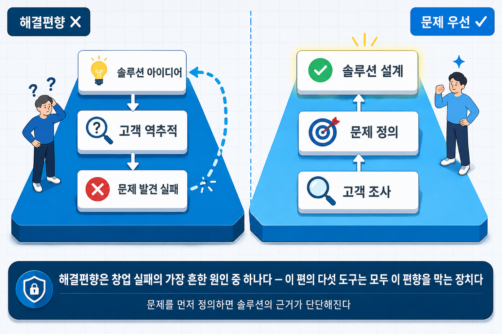
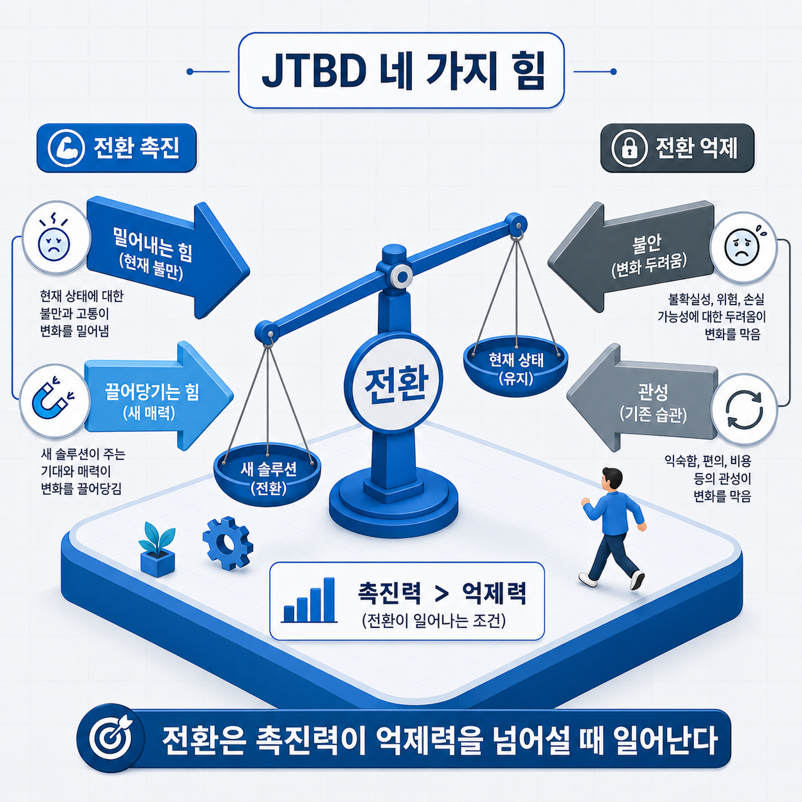
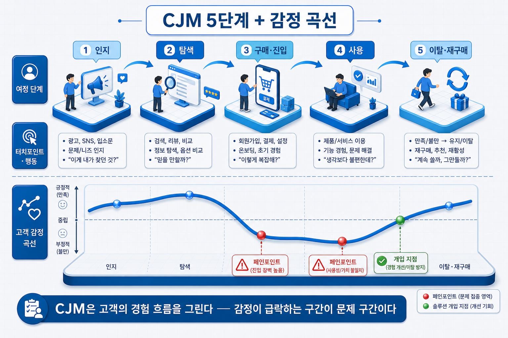
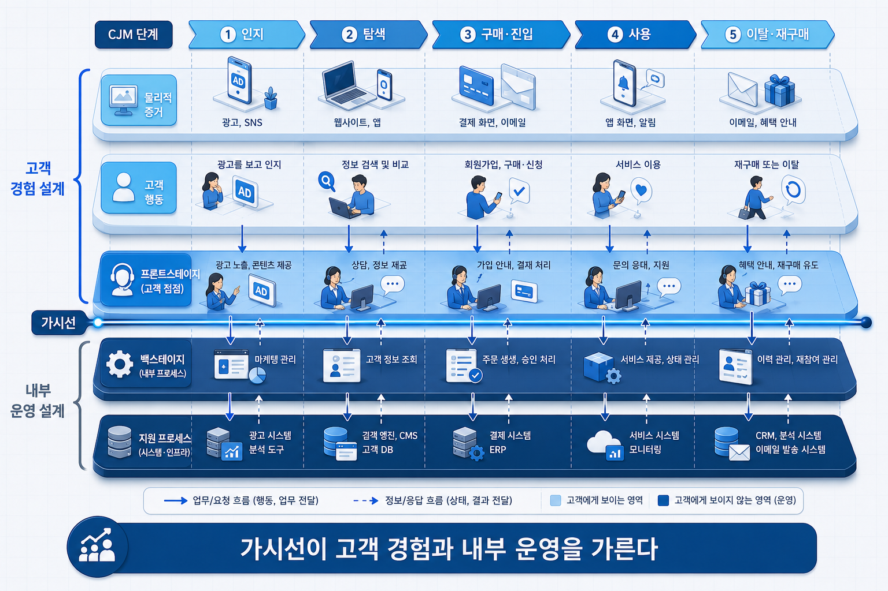
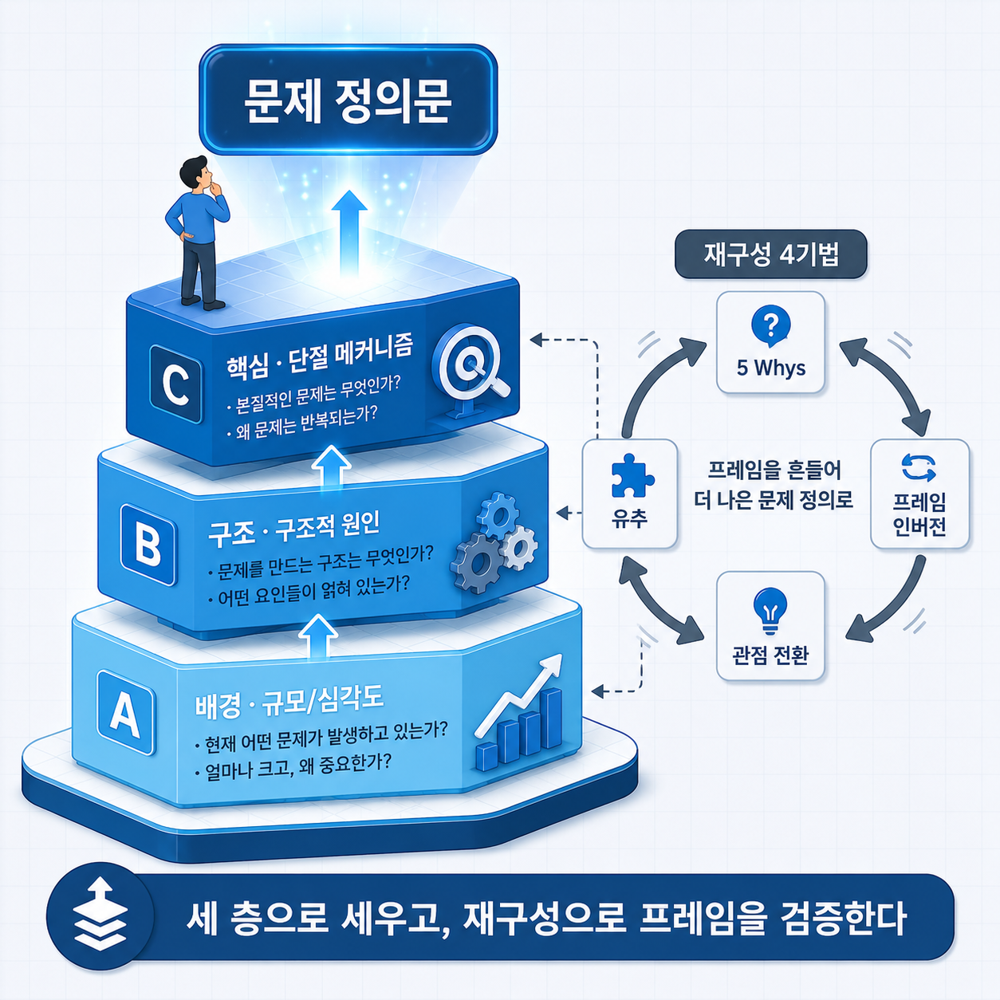

# I-5. 고객 이해와 문제 정의 — 실제 문제를 찾는 다섯 가지 도구

## 고객을 이해한다는 것 — 왜 문제부터 읽는가

기술이 아무리 우수해도 "누구의 어떤 문제를 푸는가"에 답하지 못하면 사업은 성립하지 않는다. 고객 이해는 이 질문에 답하는 출발점이다.

실제로 사업계획의 문제 정의를 쓸 때 작성자들이 가장 오래 머무는 지점이 여기다. 기술은 분명한데 "그래서 누구의 어떤 문제를 푸는가"를 한 문장으로 적기가 어렵기 때문이다.

초기 창업자가 가장 흔히 빠지는 함정이 해결편향(Solution Bias)이다. 문제를 충분히 이해하기 전에 솔루션부터 떠올리는 인지 패턴이다. 해결편향에 빠진 사업계획은 이렇게 시작한다. "AI 기반 ○○ 플랫폼을 개발합니다. 타깃은 ○○ 기업입니다."

이 문장을 읽는 사람은 곧바로 되묻는다.

> *"그 시장의 누가, 어떤 상황에서, 무엇 때문에 이것을 필요로 하는가?"*

이 질문에 답하지 못하면 이후 서술이 아무리 정교해도 근거가 취약해진다. 문제를 먼저 정의한다는 것은 솔루션 설계에 앞서 고객이 실제로 겪는 문제를 조사하고, 기존 대안이 왜 작동하지 않는지를 구조로 밝히는 과정이다.

이 장은 그 과정을 다섯 개의 도구로 나눠 다룬다. **누구의 문제인가**(페르소나) → **그 사람이 무엇을 이루려 하는가**(JTBD) → **어떤 경험을 거치는가**(고객 여정 지도) → **그 경험을 무엇이 지탱하는가**(서비스 블루프린트) → **그래서 핵심 문제는 무엇인가**(문제정의). 뒤로 갈수록 문제의 해상도가 높아진다.

> 그림 1 — 해결편향 vs 문제 우선 접근. 해결편향은 창업 실패의 가장 흔한 원인 중 하나다 — 이 장의 다섯 도구는 모두 이 편향을 막는 장치다.

## 페르소나 — 누구의 문제인가

문제를 정의하려면 먼저 그 문제를 겪는 사람을 한 명으로 좁혀야 한다. 페르소나(Persona)는 타깃 고객을 대표하는 구체적 가상 인물이다.

핵심 원칙은 하나다. **한 명으로 특정한다.** "20~40대 중소기업 담당자 전반"처럼 넓게 설정하면 경험이 추상화되고 문제가 흐릿해진다. 가장 핵심적인 페르소나 1인을 깊이 있게 그리는 것이 원칙이고, 두 번째 페르소나가 중요하다면 핵심 애로만 한두 줄로 덧붙인다.

페르소나는 상상으로 창작하는 것이 아니라 데이터에서 도출한다. 세 단계로 구성한다.

| 순서 | 방법 | 목적 |
|------|------|------|
| 1차 | 통계·설문에서 공통 패턴 추출 | 데이터 기반 현실성 확보 |
| 2차 | 공통 애로사항 클러스터링 | 개별 사례 → 구조적 특성으로 추상화 |
| 3차 | 실제 발화·대표 목소리 반영 | 감각적 현실감 부여 |

여기서 얻은 페르소나는 다음 도구들의 기준점이 된다. 뒤에서 다룰 고객 여정 지도도, 문제정의도 모두 "이 사람"을 기준으로 작성한다. 생태계형 사업이라면 주 대상(1차)뿐 아니라 공급자·정책 담당자 같은 보조 페르소나(2·3차)까지 포함해야 구조적 솔루션이 설계된다.

❌ **실수 — 페르소나를 인구통계 요약으로 끝낸다**
"35세, 제조업 종사, 월 매출 5억"처럼 속성만 나열하고 마치는 경우다.
→ 이렇게 읽힌다: *"이 사람이 무엇 때문에 힘든지가 없다. 속성은 알겠는데 문제가 보이지 않는다."*

✓ **올바른 방향**: 인구통계는 최소한으로 두고, 이 사람이 **어떤 상황에서 무엇을 하려다 좌절하는지**를 중심에 둔다. 그 지점이 다음 도구들의 입력이 된다.

## JTBD란 무엇인가 — 고객은 무엇을 "고용"하는가

페르소나가 "누구"라면, JTBD(Jobs-to-be-Done)는 그 사람이 "무엇을 이루려 하는가"를 밝힌다. 고객은 제품을 사는 것이 아니라, **해결해야 할 일(Job)을 이루기 위해 제품을 고용(hire)한다**는 관점이다.

질문을 바꾸는 것이 핵심이다. "왜 이 제품을 샀나요?" 대신 "어떤 상황에서 어떤 진전을 원했나요?"를 묻는다. 이 전환이 표면적 기능 요구가 아니라 심층 동기를 드러낸다.

> 고전적 사례: 맥도날드는 왜 아침에 밀크셰이크가 많이 팔리는지 조사했다. 고객이 원한 것은 음료가 아니라 "지루한 출근길을 달래 줄 무언가"였다. 이 Job을 발견하자 제품 개선 방향이 완전히 달라졌다.

JTBD는 한 사람이 만든 단일 이론이 아니라 세 갈래로 발전했다. 셋을 구분해 두면 상황에 맞는 도구를 고를 수 있다.

| 학파 | 핵심 도구 | 언제 쓰나 |
|------|----------|----------|
| Christensen (이론) | 고용·해고 관점·상황 중심 인터뷰 | 동기의 본질을 이해할 때 |
| Ulwick ODI (정량) | 업무 지도(Universal Job Map)·성과 지표 | 어느 니즈가 충족되지 않았는지 측정·우선순위 |
| Moesta (전환 심리) | 스위치 인터뷰·네 가지 힘 | 왜 지금 전환하는가를 설명할 때 |

이 표에서 창업자가 가장 먼저 활용할 것은 세 번째, Moesta의 **네 가지 힘(Four Forces)**이다. 고객이 쓰던 것을 버리고 새 솔루션으로 전환하는 순간에 네 개의 힘이 맞부딪친다.

| 힘 | 방향 | 의미 |
|----|------|------|
| 밀어내는 힘(Push) | 전환 촉진 | 지금 쓰는 방식의 불만 |
| 끌어당기는 힘(Pull) | 전환 촉진 | 새 솔루션의 매력 |
| 불안(Anxiety) | 전환 억제 | 바꿨을 때의 두려움 |
| 관성(Habit) | 전환 억제 | 기존 습관을 유지하려는 힘 |

전환은 앞의 두 힘(밀기+당기기)이 뒤의 두 힘(불안+관성)을 넘어설 때 일어난다. 사업계획에서 "기존 대안의 한계"를 쓸 때, 이 네 힘의 크기를 구체적으로 서술하면 "왜 고객이 우리 것으로 넘어오는가"가 논증된다. 막연히 "더 편리하다"가 아니라, 무엇이 고객을 밀어내고(불만) 무엇이 고객을 붙잡고 있는지(불안·관성)를 짚는 것이다.

더 정량적으로 니즈를 다뤄야 한다면 Ulwick의 방식이 있다. 그는 하나의 Job을 여러 단계로 분해하고(정의·준비·실행·점검·완료 등), 각 단계에서 고객이 바라는 성과를 측정 가능한 문장으로 적어 어느 지점이 가장 덜 충족됐는지를 찾는다. 우선순위를 수치로 다뤄야 하는 B2B·기술 제품에서 특히 유용하다.

> Job은 이렇게 적는다: **[상황] + [동기] + [기대 결과]**. 예 — "피크타임에(상황) 홀 인력이 부족한 상태에서도(동기) 배달이 지연 없이 처리되기를 원한다(기대 결과)."

> 그림 2 — JTBD 네 가지 힘. 전환은 미는 힘이 붙잡는 힘을 넘어설 때 일어난다.

❌ **실수 — Job을 기능 요구로 적는다**
"빠른 배달 처리 기능이 필요하다"처럼 원하는 기능을 Job으로 쓰는 경우다. 기능은 이미 솔루션 방향이다.
→ 이렇게 읽힌다: *"고객의 동기가 아니라 개발 명세를 적었다. 결국 해결편향이다."*

✓ **올바른 방향**: 최소 5건의 현장 인터뷰에서 공통으로 나타나는 "상황 + 동기 + 기대 결과"를 Job으로 쓴다. 기능은 그 Job을 이루는 여러 수단 중 하나일 뿐이다.

## 고객 여정 지도(CJM)란 무엇인가 — 경험을 시간축으로 읽기

JTBD가 고객의 동기를 정지 화면으로 본다면, 고객 여정 지도(Customer Journey Map, CJM)는 그 고객이 시간의 흐름에 따라 어떻게 경험하는지를 추적한다. 특정 페르소나가 서비스를 처음 알게 된 순간부터 반복 사용·이탈까지의 전 경험을 단계로 나눠 시각화한 도구다.

다섯 단계로 본다.

| 단계 | 핵심 질문 | 고객이 겪는 일 |
|------|---------|-----------|
| ① 인지 | 어떻게 알게 되는가 | 광고·검색·추천으로 존재를 처음 앎 |
| ② 탐색 | 무엇을 비교하는가 | 리뷰·경쟁사·가격·기능 검토 |
| ③ 구매·진입 | 첫 진입 장벽은 무엇인가 | 가입·구매·설치의 마찰 |
| ④ 사용 | 어디서 가치를 느끼고 어디서 이탈하는가 | 핵심 기능 사용, 기대와 현실의 간극 |
| ⑤ 이탈·재구매 | 왜 남고 왜 떠나는가 | 습관화·충성 또는 경쟁 서비스로 이탈 |

각 단계에는 네 가지를 채운다. 고객이 접촉하는 지점(터치포인트), 실제 행동, 그때의 생각·감정, 그리고 **경험이 기대에 못 미치는 지점(페인포인트)**이다. 이 페인포인트가 문제정의의 핵심 근거이자 솔루션이 개입할 지점이다.

여기에 감정 곡선을 더하면 문제의 심각도가 한눈에 보인다. 각 단계의 감정 고저를 선으로 그리면, 어느 구간에서 경험이 급락하는지가 드러난다. 감정이 가장 낮은 지점이 곧 가장 시급한 문제 구간이다.

앞서 다룬 JTBD·페르소나가 "이 고객은 무엇을 원하는가"라는 정적 구조를 본다면, CJM은 "그 고객이 시간 속에서 어떻게 겪는가"라는 동적 흐름을 본다. 두 시선을 함께 쓰면 문제인식 항목의 완성도가 크게 올라간다.

> 그림 3 — CJM 5단계 + 감정 곡선. CJM은 고객의 경험 흐름을 그린다 — 감정이 급락하는 구간이 문제 구간이다.

## 서비스 블루프린트 — 가시선 아래를 그린다

고객 여정 지도가 고객이 겪는 표면을 그린다면, 서비스 블루프린트(Service Blueprint)는 그 경험을 만들어 내는 내부 운영까지 함께 그린다. G. Lynn Shostack이 1984년 하버드 비즈니스 리뷰에 제안한 도구로, CJM 위에 기업 내부 구조를 덧그린 확장판이다.

블루프린트를 CJM과 구분하는 핵심 개념이 **가시선(Line of Visibility)**이다. 가시선은 고객이 볼 수 있는 것과 볼 수 없는 것의 경계선이다. 이 선을 기준으로 위쪽은 고객 경험의 표면, 아래쪽은 그것을 지탱하는 운영이 된다.

| 레이어 | 내용 | 가시선 |
|------|------|------|
| 물리적 증거 | 고객이 접촉하는 물리·디지털 증거물 | 위 |
| 고객 행동 | 각 단계에서 고객이 하는 행동 | 위 |
| 프론트스테이지 | 고객에게 보이는 직원·시스템의 행동 | 위 |
| 백스테이지 | 고객에게 보이지 않는 내부 활동 | 아래 |
| 지원 프로세스 | 서비스를 떠받치는 시스템·기술·인프라 | 아래 |

이 표에서 얻을 핵심은 하나다. 고객이 느끼는 하나의 불편(가시선 위)이, 사실은 보이지 않는 운영(가시선 아래)의 문제에서 비롯된다는 것을 짚어 주는 도구라는 점이다. 기술 창업이라면 지원 프로세스 레이어가 곧 기술 개발의 근거가 된다. 다만 블루프린트의 상세 운영 설계는 사업계획서의 서비스 운영 계획·기술 개발 계획 항목에서 본격적으로 다루므로, 여기서는 "고객 경험과 내부 운영을 가시선으로 연결한다"는 원리까지만 정리해 둔다.

> 그림 4 — 서비스 블루프린트 5레이어와 가시선. 가시선이 고객 경험과 내부 운영을 구분한다.

## 문제를 정의하는 법 — 3층 구조와 재구성

여기까지 고객을 이해했다면, 이제 흩어진 관찰을 한 문장의 문제로 압축할 차례다. 좋은 문제 정의는 세 개의 층을 갖춘다.

| 층 | 묻는 것 | 채우는 내용 |
|----|--------|-----------|
| A — 배경 | 왜 이 문제가 중요한가 | 규모·심각도를 수치로 증명 |
| B — 구조 | 왜 해결되지 않는가 | 제도·설계 등 구조적 원인 |
| C — 핵심 | 실제로 무슨 일이 벌어지는가 | 현장에서 작동하는 단절 메커니즘 |

세 층을 갖추면 문제가 "시장이 크다"는 막연한 서술에서 "이 사람이 이 지점에서 이 메커니즘 때문에 반복 실패한다"는 구체적 진단으로 좁혀진다. 사업계획에서 보여야 할 것도 바로 이 좁혀짐이다.

문제가 잘 좁혀지지 않을 때는 문제 자체를 다시 프레이밍(reframing)한다. 같은 상황도 어떻게 규정하느냐에 따라 답이 완전히 달라지기 때문이다. 실무에서 자주 쓰는 재구성 기법은 네 가지다.

- **5 Whys**: "왜"를 다섯 번 되물어 표면 증상에서 근본 원인으로 내려간다. 토요타 생산방식에서 나온 기법으로, 도구는 단순하지만 근본 원인까지 추적하는 규율이 핵심이다.
- **프레임 인버전**: "문제가 A가 아니라 그 반대라면?"으로 전제를 뒤집는다. 예를 들어 "가입 절차가 불편하다"를 "애초에 가입이 필요 없다면?"으로 바꿔 보는 방식이다.
- **유추 재구성**: 전혀 다른 분야가 같은 문제를 어떻게 푸는지 빌려 온다. 병원 응급실의 환자 분류를 콜센터 대기열 설계에 옮겨 오는 방식이다.
- **관점 전환**: 같은 문제를 다른 이해관계자(공급자·규제기관·최종 사용자)의 눈으로 다시 본다.

세 층으로 문제를 세우고 필요하면 재구성으로 프레임을 검증해 보면, 문제 정의문 하나가 남는다. 이 문장이 다음 장의 출발점이 된다. 정의된 문제를 아이디어로 발산하는 방법은 아이디어 발상 장(→ [I-6장](I-06_아이디어_발상.md))에서, 그 아이디어를 고객 가치로 연결하는 방법은 가치 설계 장(→ [I-7장](I-07_가치설계.md))에서 이어진다.

> 그림 5 — 문제정의 3층 + 재구성. 문제는 세 층으로 세우고, 재구성으로 프레임을 검증한다.

## 사업계획에서의 위치

이 장의 다섯 도구는 사업계획의 다음 요소에 직접 연결된다.

| 사업계획 구성 요소 | 이 장의 내용이 답하는 것 |
|------|------|
| 문제 정의(고객·문제) | 누구의(페르소나) 어떤 문제를(JTBD·CJM) 왜(문제정의 3층) |
| 솔루션 설계의 출발점 | 솔루션이 개입할 지점(CJM 페인포인트·블루프린트) |
| 기술 개발의 근거 | 기술 개발의 고객·현장 근거 |
| 외부 제시 | "왜 지금 이 고객인가"의 근거 |

정리하면, 페르소나로 대상을 좁히고, JTBD로 동기를 밝히고, 고객 여정 지도로 경험을 짚고, 서비스 블루프린트로 그 경험의 뒷면을 살피고, 문제정의 3층으로 한 문장을 세운다. 다섯 도구를 순서대로 지나면 "그래서 누구의 어떤 문제인가"에 근거를 갖춰 답할 수 있다.

다음은 이렇게 정의한 문제를 실제 아이디어로 펼치는 단계다. 아이디어 발상 장(→ [I-6장](I-06_아이디어_발상.md))에서 디자인 씽킹과 발상 기법으로 이어진다.

## 연결 장

- 선행: (→ [I-4장](I-04_기술시장_변화.md)) 기술·시장 변화의 특징과 유형
- 후행: (→ [I-6장](I-06_아이디어_발상.md)) 아이디어 발상
- 참조: (→ [I-7장](I-07_가치설계.md)) 가치 설계 — 발굴 결과의 구조화
