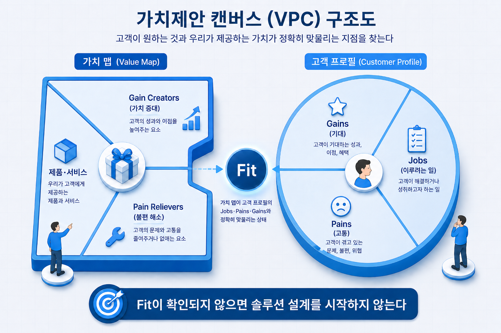
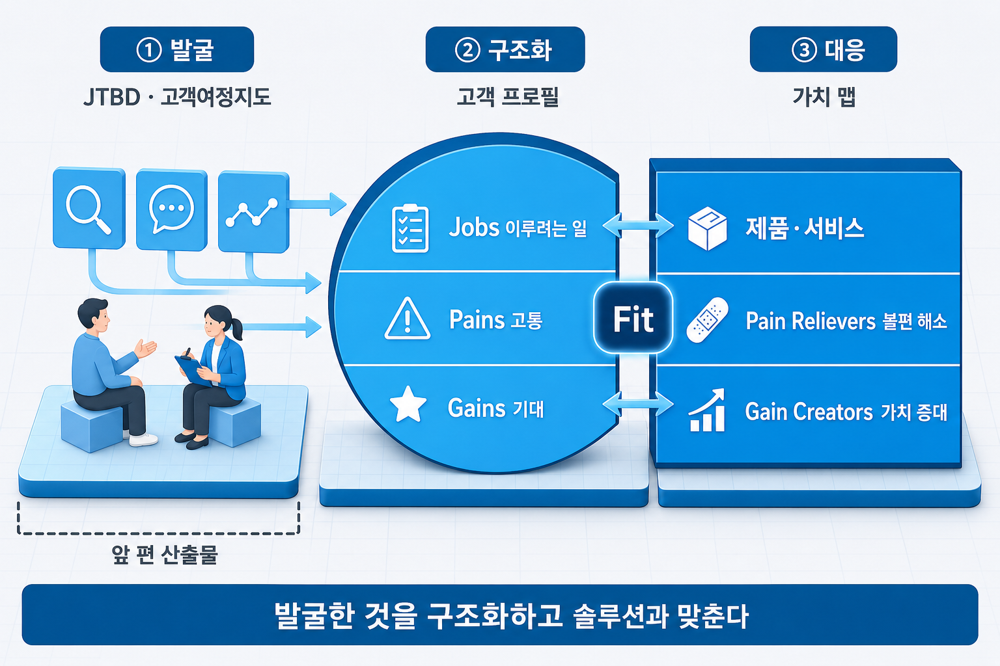
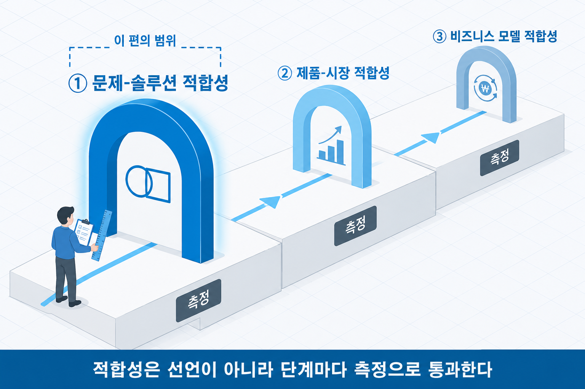
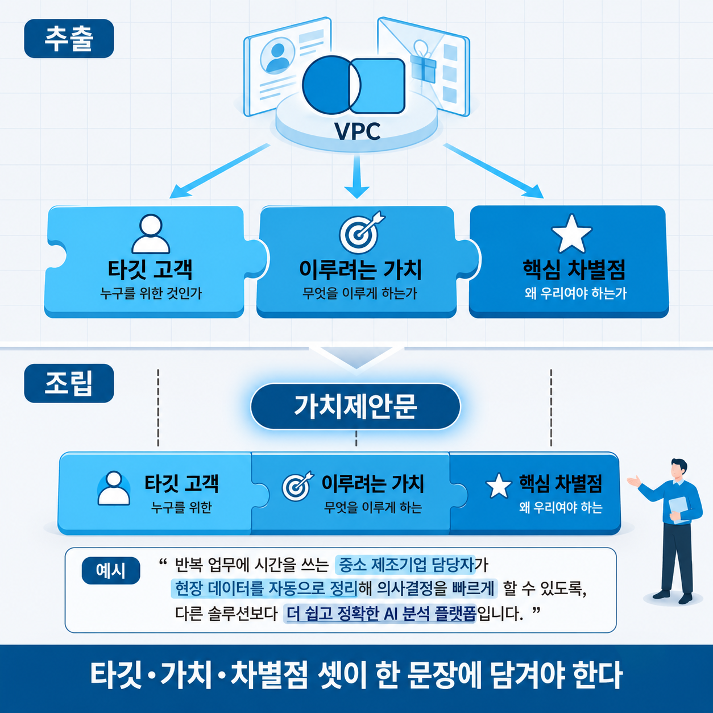

# I-7. 가치 설계 — 가치제안 캔버스로 문제와 솔루션을 맞추다

## 좋은 아이디어가 왜 가치가 되지 못하는가

앞 장(→ [I-6장](I-06_아이디어_발상.md))에서 문제를 풀 아이디어를 발산하고 하나로 좁혔다면, 마지막 질문이 남는다. 그 아이디어가 고객에게 정말 가치가 되는가다.

많은 창업자가 이 지점을 건너뛴다. 좋은 아이디어라고 확신하는 순간 곧장 개발로 넘어가기 때문이다. 그런데 가치는 만드는 쪽이 정하는 것이 아니라 **고객이 정한다.** 아무리 정교한 기능을 넣어도, 고객이 이루려는 일과 연결되지 않으면 그 기능은 가치가 아니라 비용이다.

가치 설계는 이 연결을 눈으로 확인하는 작업이다. 고객이 원하는 것과 제공하려는 것을 나란히 놓고, 둘이 맞물리는지(Fit)를 점검한다. 이 장은 그 도구인 가치제안 캔버스(VPC)를 다루고, 그것이 실제 시장의 검증으로 이어지는 과정(적합성)과 한 문장으로 정리된 결과물(가치제안문)까지 이어 간다.

## 가치제안 캔버스(VPC)란 무엇인가

가치제안캔버스(Value Proposition Canvas, VPC)는 알렉산더 오스터왈더(Alexander Osterwalder)가 개발한 도구다. 비즈니스 모델 캔버스(BMC)를 만든 사람으로, VPC는 BMC의 여러 요소 중 고객 세그먼트와 가치 제안 두 칸을 더 깊게 검토하기 위한 도구다.

VPC는 두 개의 반쪽으로 이뤄진다. 한쪽은 **고객 프로필**(고객이 원하는 것), 다른 쪽은 **가치 맵**(제공하는 것)이다. 두 반쪽이 정확히 맞물리는 상태를 적합성(Fit)이라 부른다.

| 고객 프로필 (고객이 원하는 것) | ↔ | 가치 맵 (제공하는 것) |
|------------------------------|:---:|------------------------------|
| 고객 과업(Jobs) — 이루려는 일 | ↔ | 제품·서비스 |
| 고객 불편(Pains) — 지금 겪는 어려움 | ↔ | 불편 해소 요소(Pain Relievers) |
| 고객 기대효과(Gains) — 바라는 긍정 결과 | ↔ | 가치 증대 요소(Gain Creators) |

이 표의 왼쪽은 앞의 두 장에서 이미 만들었다. 고객 프로필의 과업·불편·기대효과는 고객 이해·문제정의 장(→ [I-5장](I-05_고객이해_문제정의.md))에서 JTBD와 고객 여정 지도로 발굴한 내용이 그대로 들어간다. VPC는 그 발굴 결과를 구조로 정리하고, 오른쪽에 솔루션을 맞춰 보는 틀이다.


> 그림 1 — 가치제안캔버스(VPC) 구조도. Fit이 확인되지 않으면 솔루션 설계를 시작하지 않는다.

## 고객 프로필 — 과업·불편·기대효과

고객 프로필은 반드시 과업(Jobs)부터 채운다. 순서가 중요하다. 고객이 이루려는 일이 정해져야 그 과정의 불편과 기대효과가 의미를 갖기 때문이다.

- **과업(Jobs)**: 고객이 처한 상황에서 이루려는 것. 기능이 아니라 목적이다.
- **불편(Pains)**: 그 일을 이루는 과정에서 겪는 장애·위험·불편.
- **기대효과(Gains)**: 그 일이 잘 풀렸을 때 바라는 긍정적 결과.

여기서 가장 흔한 실수 두 가지를 짚어야 한다.

❌ **실수 1 — 과업을 비우고 불편만 채운다**
"배달이 느리다, 인력이 부족하다"처럼 불편만 나열하고 고객이 실제로 이루려는 것을 빠뜨리는 경우다.
→ 이렇게 읽힌다: *"불편은 알겠는데 이 고객이 무엇을 하려는 사람인지가 없다. 솔루션 방향이 표류할 것이다."*

❌ **실수 2 — 불편을 기능 요구로 채운다**
"더 빠른 처리 속도"처럼 원하는 기능을 불편으로 적는 경우다. 불편은 지금의 어려움이지 원하는 기능이 아니다.
→ 이렇게 읽힌다: *"이미 답을 정해 놓고 거꾸로 문제를 적었다. 왜 그 기능이 필요한지 근거가 없다."*

✓ **올바른 방향**: 앞 장의 인터뷰·고객 여정 지도에서 나온 실제 관찰을 과업 → 불편 → 기대효과 순으로 옮긴다. 가설이 아니라 발굴된 내용을 채우는 것이 원칙이다.

## 가치 맵 — 불편 해소 요소·가치 증대 요소

고객 프로필이 완성된 뒤에야 가치 맵을 그린다. 순서를 뒤집어 솔루션부터 그리면, 고객 문제와 무관한 기능 목록이 되기 쉽다.

- **제품·서비스**: 제공하는 것의 목록.
- **불편 해소 요소(Pain Relievers)**: 고객의 어떤 불편을 어떻게 덜어 주는가.
- **가치 증대 요소(Gain Creators)**: 고객의 어떤 기대효과를 어떻게 채워 주는가.

핵심은 대응이다. 가치 맵의 각 항목이 고객 프로필의 어느 불편, 어느 기대효과에 정확히 대응하는지를 선으로 이어 보는 것이다. 이을 곳이 없는 기능은, 아무리 잘 만들어도 이 고객에게는 가치가 아니다. 반대로 대응이 없는 불편은 아직 해결하지 못한 과제다.

여기서 한 가지 원칙이 더 필요하다. **모든 것을 다 풀려 하지 않는다.** 고객 프로필에 적힌 과업·불편·기대효과는 중요도가 제각각이다. 그래서 캔버스를 채운 다음에는 중요한 것부터 순서를 매기고, 가치 맵은 그 상위 몇 개에 집중해 설계한다. 모든 불편을 조금씩 덜어 주는 제품보다, 가장 큰 불편 하나를 확실히 해소하는 제품이 선택받기 때문이다.

이 원칙은 사업계획 서술에도 그대로 적용된다. "여러 문제를 종합적으로 해결한다"는 문장은 초점이 없어 보이지만, "이 고객의 가장 중요한 문제 하나를 이렇게 해결한다"는 문장은 판단의 근거를 준다. 나머지 항목은 버리는 것이 아니라, 우선순위 뒤로 미뤄 두고 이후 단계에서 다루면 된다.


> 그림 2 — 발굴에서 구조화, 대응까지. 고객 이해에서 발굴한 것을 VPC로 구조화하고 솔루션과 맞춘다.

## 적합성(Fit)은 선언이 아니라 측정이다

가치 맵과 고객 프로필이 잘 맞물려 보이면 적합성을 얻은 것 같지만, 여기에 함정이 있다. 종이 위에서 맞물리는 것과 고객이 실제로 그렇게 반응하는 것은 다르다. 오스터왈더가 강조하는 원칙이 이것이다. **적합성은 선언하는 것이 아니라 측정하는 것이다.**

가치제안 설계는 세 단계의 적합성을 차례로 통과한다.

| 단계 | 무엇을 확인하는가 |
|------|------------------|
| 문제-솔루션 적합성 | 고객이 그 과업·불편·기대효과를 정말 중요하게 여기고, 가치제안이 그것을 겨냥하는가 |
| 제품-시장 적합성 | 실제 제품이 고객 가치를 만들어 내고 시장에서 반응(구매·재사용·추천)을 얻는가 |
| 비즈니스 모델 적합성 | 그 가치가 지속 가능한 수익 구조 안에서 작동하는가 |

이 장에서 다루는 VPC는 첫 단계인 **문제-솔루션 적합성**을 설계하고 점검하는 도구다. 종이 위에서 대응을 맞춘 뒤에는, 그 가정이 맞는지 고객에게 물어 확인해야 한다. "이 불편이 정말 당신에게 중요한가", "이 해소 방식이 실제로 도움이 되는가"를 소규모로라도 검증한 흔적이 있으면 사업계획의 설득력이 크게 올라간다. 여기서 얻은 근거가 다음 단계인 제품-시장 적합성 측정으로 이어진다. 제품-시장 적합성의 지표와 측정법은 PMF 측정 장(→ [I-16장](I-16_PMF_측정.md))에서 다룬다.


> 그림 3 — 세 단계 적합성 관문. 적합성은 선언이 아니라 단계마다 측정으로 통과한다.

## 가치제안을 한 문장으로

VPC를 채우고 적합성을 점검했다면, 그 결과를 한 문장으로 압축할 수 있어야 한다. 이 문장이 사업계획의 첫 줄, 회사 소개의 표지, 홈페이지의 헤드라인이 된다. 흩어진 캔버스를 한 문장으로 세우지 못하면, 정작 상대에게 전달할 때 초점이 흐려진다.

한 문장 가치제안은 이런 골격으로 쓴다.

```
[타깃 고객]이 [이루려는 Job]을 하도록,
우리 [제품]은 [핵심 Pain 해소 / Gain 창출]로 돕는다.
기존 [대안]과 달리, [핵심 차별점] 덕분이다.

예:
피크타임에 주문 처리를 놓치지 않으려는 캠퍼스 내 소규모 점주가,
추가 고용이나 배달 앱 수수료 없이도 지연 없이 배달을 마치도록,
자율 배달 로봇 공유 서비스가 돕는다.
기존 대안과 달리, 고정비가 아니라 사용한 만큼만 내는 구조이기 때문이다.
```

좋은 가치제안문은 세 가지를 담는다. 누구를 위한 것인지(타깃), 어떤 진전을 돕는지(Job·가치), 왜 기존 대안보다 나은지(차별점)다. 셋 중 하나라도 비면 문장이 막연해진다. 다만 "누구에게 어떤 위치로 보이게 할 것인가"라는 시장 내 포지셔닝은 이 문장을 입력으로 삼아 시장진입 전략 장(→ [I-8장](I-08_시장진입_전략.md))에서 다룬다. 여기서는 VPC에서 도출한 가치의 핵심을 한 문장으로 세우는 데까지 집중한다.


> 그림 4 — 가치제안문 작성 공식. 타깃·가치·차별점 셋이 한 문장에 담겨야 한다.

## 사업계획에서의 위치

이 장의 도구는 사업계획의 다음 요소에 직접 연결된다.

| 사업계획 구성 요소 | 이 장의 내용이 답하는 것 |
|------|------|
| 문제 정의·솔루션 | 고객 가치와 솔루션의 대응(VPC Fit) |
| 가치제안 | 한 문장 가치제안문 |
| 기술의 사용자 가치·차별성 | 기술이 고객 과업에 대응하는 지점 |

여기까지가 고객에서 출발해 가치에 이르는 과정이다. 세 장이 하나의 순서를 이룬다.

| 순서 | 장 | 답하는 질문 |
|------|-----|-------------|
| 1 | (→ [I-5장](I-05_고객이해_문제정의.md)) 고객 이해와 문제 정의 | 누구의 어떤 문제인가 |
| 2 | (→ [I-6장](I-06_아이디어_발상.md)) 아이디어 발상 | 어떤 솔루션이 가능한가 |
| 3 | 가치 설계 (이 장) | 그 솔루션이 정말 가치가 되는가 |

문제를 정의하고(I-5), 아이디어로 펼치고(I-6), 고객 가치로 맞춰 검증하는(I-7) 흐름을 지나면 "누구에게 어떤 가치를 주는가"에 근거를 갖춰 답할 수 있다.

이어지는 장들(I-8~I-10)에서는 이렇게 세운 가치를 시장에 어떻게 알리고 파는지로 넘어간다. 목표 고객을 정하고(STP), 시장에 진입하는 전략과 가격을 다룬다.

## 연결 장

- 선행: (→ [I-6장](I-06_아이디어_발상.md)) 아이디어 발상
- 후행: (→ [I-8장](I-08_시장진입_전략.md)) 시장진입 전략
- 참조: (→ [I-5장](I-05_고객이해_문제정의.md)) 고객 이해와 문제 정의 — 고객 프로필의 발굴 원천 / (→ [I-16장](I-16_PMF_측정.md)) PMF 측정 / (→ [I-11장](I-11_비즈니스모델_설계.md)) 비즈니스 모델 설계 — BMC와의 관계
