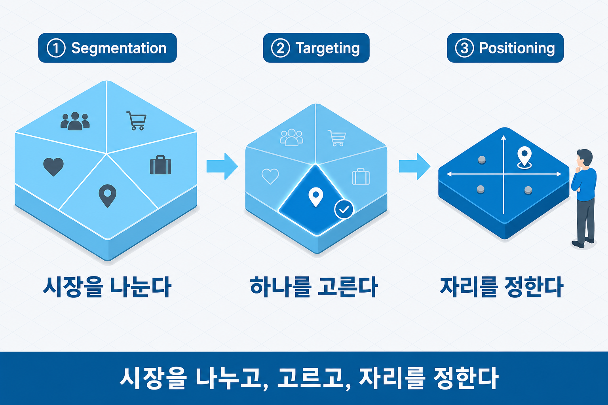
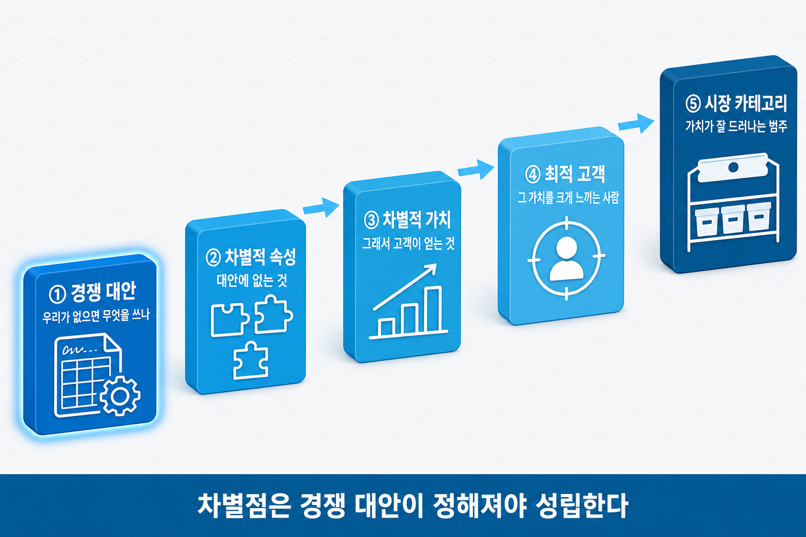
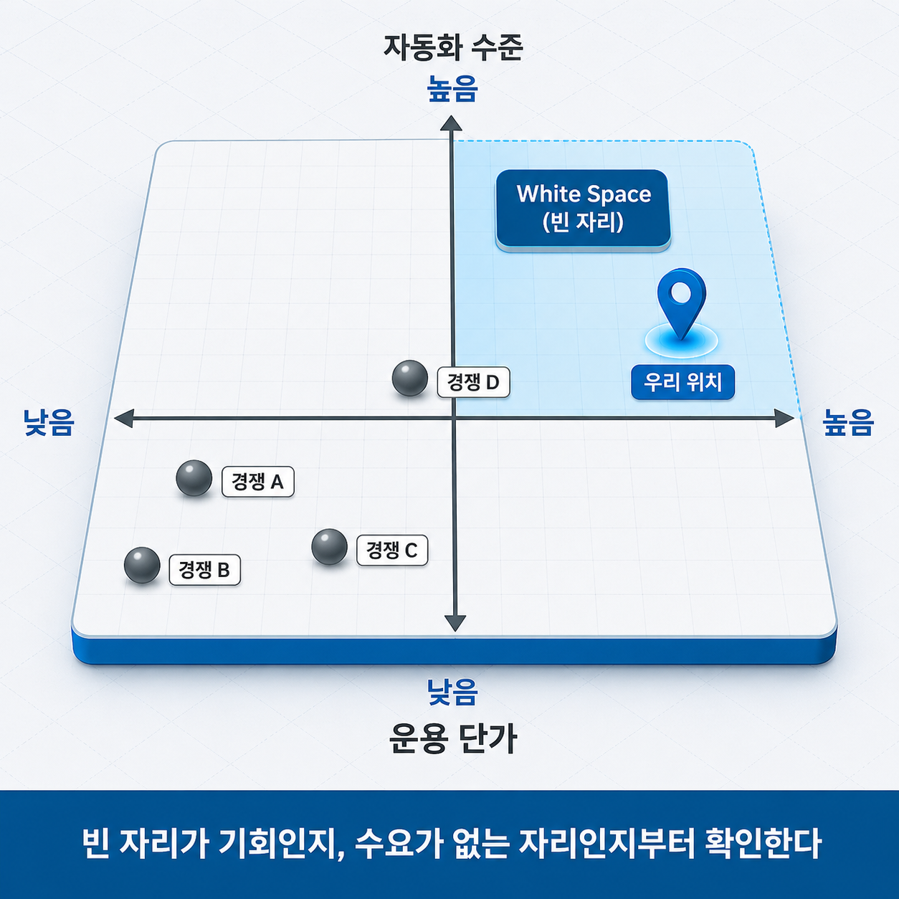
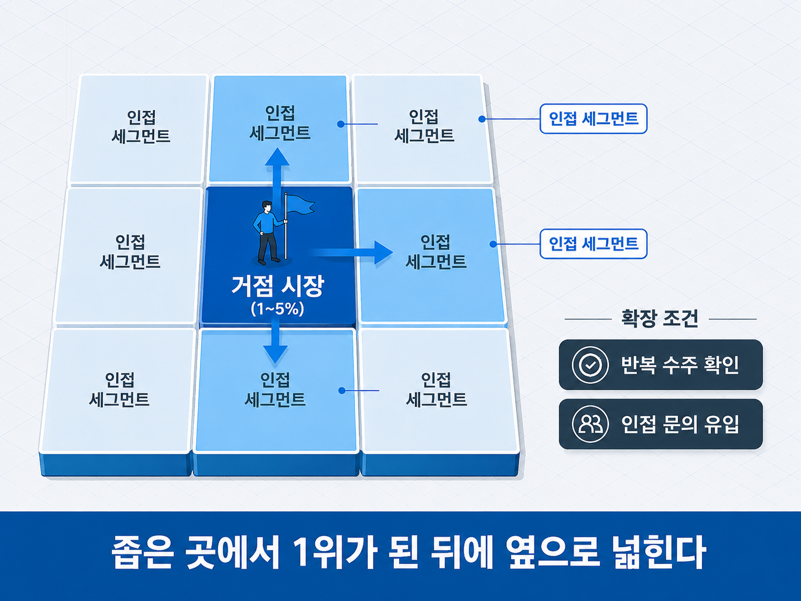
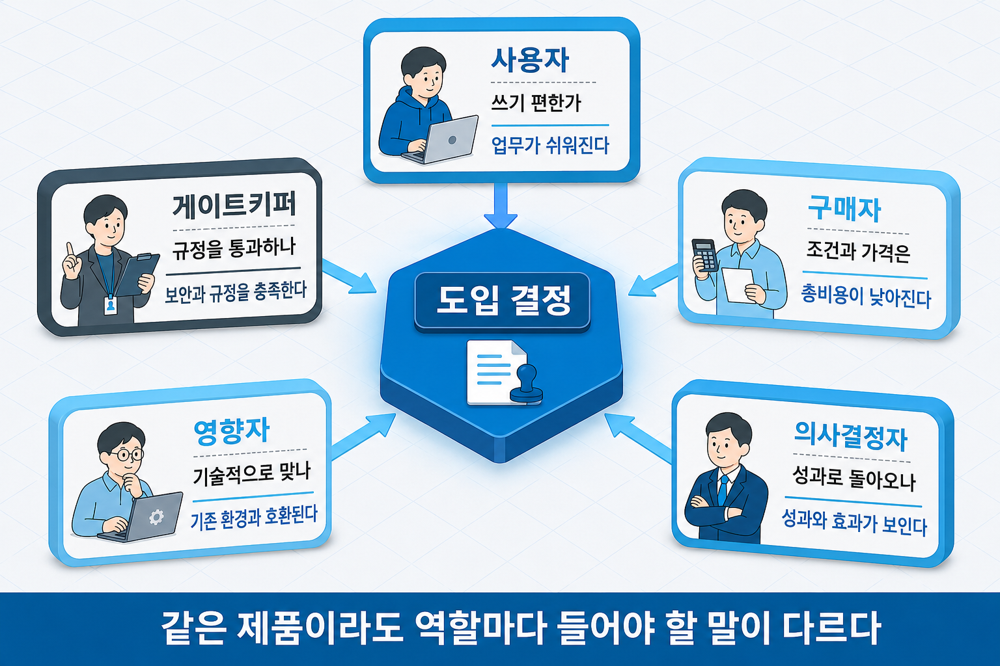

# I-8. 시장진입 전략 — 어디에, 어떤 자리로 들어갈 것인가

## 좋은 기술이 왜 팔리지 않는가

앞 장(→ [I-7장](I-07_가치설계.md))에서 고객이 원하는 가치를 설계했다면, 이제 그 가치를 실제 시장에 내놓을 차례다. 그런데 여기서 기술 기업이 자주 건너뛰는 단계가 있다. "기술이 좋으면 알아보고 사겠지"라는 전제다.

시장은 그렇게 작동하지 않는다. 고객은 제품을 진공 상태에서 보지 않고, **이미 쓰고 있는 방식과 비교해서** 본다. 우리 제품이 어떤 범주의 물건이고, 누구를 위한 것이며, 지금 쓰는 것보다 무엇이 나은지를 고객이 스스로 알아내 주지 않는다. 그 자리를 정해 주는 것이 시장진입 전략이다.

가치 설계와 시장진입은 다른 질문에 답한다. 앞 장의 가치제안이 **무엇을 주는가**였다면, 이 장은 **어떤 자리로 인식되게 할 것인가**다. 좋은 가치를 만들고도 엉뚱한 범주에 놓이면 비교 대상이 잘못 정해지고, 그 순간 강점이 강점으로 읽히지 않는다.

이 장은 진입을 다섯 갈래로 나눠 다룬다. 시장을 나누고 고를 것인가(STP) → 어떤 자리로 설 것인가(포지셔닝) → 그 자리를 어떻게 그릴 것인가(포지셔닝 맵) → 어디부터 이길 것인가(거점) → 누구를 설득할 것인가(B2B 구매 구조), 그리고 마지막으로 언제 들어갈 것인가다.

## STP — 누구에게 어떤 자리로 갈 것인가

STP는 마케팅 전략의 표준 골격이다. 시장을 나누고(Segmentation), 그중 하나를 고르고(Targeting), 그 시장에서의 자리를 정하는(Positioning) 세 단계다.

| 단계 | 묻는 것 | 산출물 |
|------|--------|--------|
| **S**egmentation | 이 시장은 어떤 기준으로 나뉘는가 | 의미 있는 세그먼트 목록 |
| **T**argeting | 그중 어디를 먼저 공략할 것인가 | 목표 세그먼트 1개 |
| **P**ositioning | 그 안에서 어떤 자리로 인식될 것인가 | 포지셔닝 정의 |

기술 기업이 자주 하는 실수는 세 단계를 통째로 건너뛰고 "우리 기술이 필요한 모든 기업"을 시장이라고 적는 것이다. 시장을 넓게 정할수록 안전해 보이지만, 실제로는 메시지가 누구에게도 도달하지 않고 영업 자원이 흩어진다.

세분화의 기준은 업종·규모 같은 외형보다 **문제의 성격**이 낫다. 같은 제조업이라도 "품질 불량으로 반품이 잦은 곳"과 "인력이 없어 야근이 잦은 곳"은 완전히 다른 고객이다. 앞서 다룬 고객 문제 정의(→ [I-5장](I-05_고객이해_문제정의.md))와 시장 규모 산정(→ [I-3장](I-03_시장분석.md))이 여기서 입력으로 쓰인다.

세 단계 중 뒤의 두 개(Targeting·Positioning)가 이 장의 본론이다. 포지셔닝부터 살펴본다.

> 그림 1 — STP 3단계 좁힘. 시장을 나누고, 고르고, 자리를 정한다.

## 포지셔닝이란 무엇인가 — 다섯 요소로 자리를 정한다

포지셔닝은 제품이 고객의 인식 속에서 **어떤 범주의, 누구를 위한, 무엇이 나은 물건인지**를 정하는 작업이다. 로고나 슬로건을 다듬는 일이 아니라, 비교의 기준을 정하는 일이다.

여기서 흔한 오해를 먼저 짚어야 한다. 많은 창업자가 포지셔닝을 "포지셔닝 스테이트먼트의 빈칸을 채우는 일"로 이해한다. `[타깃]에게 [제품]은 [범주]이며 [차별점]을 제공한다` 같은 양식이다. 그런데 양식은 결과를 담는 형식일 뿐이고, **빈칸에 들어갈 답을 무엇을 근거로 정하는가**가 실제 문제다. 양식부터 채우면 그럴듯한 문장은 나오지만 근거는 없다.

포지셔닝은 다섯 개의 요소를 순서대로 풀어 나갈 때 근거를 갖춘다.

| 요소 | 묻는 것 |
|------|--------|
| 경쟁 대안 | 우리 제품이 없으면 고객은 대신 무엇을 쓰는가 |
| 차별적 속성 | 그 대안에는 없고 우리에게만 있는 것은 무엇인가 |
| 차별적 가치 | 그 속성이 고객에게 만들어 내는 가치는 무엇인가 |
| 최적 고객 | 그 가치를 유난히 크게 느끼는 고객은 어떤 특성을 가졌는가 |
| 시장 카테고리 | 그 가치가 가장 잘 드러나는 시장 범주는 어디인가 |

이 순서에는 이유가 있다. 차별점은 **경쟁 대안이 정해져야만** 성립한다. 비교 대상이 없으면 "빠르다"도 "정확하다"도 의미가 없기 때문이다.

첫 요소인 경쟁 대안부터 실무에서 자주 틀린다. 경쟁 대안은 같은 업종의 경쟁 제품만이 아니다. 고객이 우리 제품을 쓰지 않을 때 실제로 하는 모든 것 — 엑셀로 수기 관리하기, 사람을 더 뽑기, 참고 견디기 — 이 모두 경쟁 대안이다. 기술 창업의 실제 경쟁자가 "아무것도 하지 않기"인 경우는 대단히 흔하다.

마지막 요소인 시장 카테고리는 강력한 결정 변수다. 같은 제품도 어느 범주에 놓느냐에 따라 비교 대상과 기대 가격이 달라진다. **자사의 강점이 그 범주의 핵심 평가 기준이 되는 범주**를 고르는 것이 핵심이다. 다만 유행하는 범주에 억지로 편승하면(이를테면 모든 제품을 "AI 플랫폼"이라 부르면) 그 범주의 강자들과 비교되어 오히려 불리해진다.

❌ **실수 — 경쟁 대안에 "경쟁사 없음"이라고 적는다**
"국내에 동일 솔루션이 없습니다"로 경쟁 항목을 마무리하는 경우다.
→ 이렇게 읽힌다: *"경쟁이 없는 것이 아니라 시장을 모르는 것이다. 고객은 지금 무언가로 이 문제를 처리하고 있을 텐데 그것이 무엇인지 파악되지 않았다."*

✓ **올바른 방향**: 고객이 우리 제품 없이 문제를 처리하는 방식을 그대로 적는다. 수작업·기존 장비·외주·방치까지 포함해 나열하면, 그 대비에서 차별점이 저절로 드러난다.

> 그림 2 — 포지셔닝 5요소. 차별점은 경쟁 대안이 정해져야 성립한다.

## 포지셔닝 맵과 White Space — 빈 자리를 찾는 법

포지셔닝을 정했다면 그것을 한 장의 그림으로 확인할 수 있다. 포지셔닝 맵은 고객이 실제로 중요하게 여기는 기준 두 가지를 축으로 정하고, 경쟁자들의 위치를 좌표에 표시하는 도구다. 아무도 없는 구역이 **White Space**다.

축을 잘못 정하면 그림 전체가 의미를 잃는다. 좋은 축은 세 조건을 충족한다.

- 고객이 **구매를 결정할 때 실제로 검토하는** 요인일 것
- 측정하거나 비교할 수 있을 것
- 경쟁자들 사이에서 **실제로 차이가 나는** 요인일 것

세 번째 조건이 특히 중요하다. 모두가 비슷한 값을 갖는 기준을 축으로 삼으면 점들이 한 덩어리로 밀집해 아무것도 보이지 않는다.

빈 공간을 찾았을 때 반드시 한 번 더 물어야 할 것이 있다. **그 자리가 비어 있는 이유**다. 아직 아무도 만들지 못해서 비어 있는 것과, 고객이 원하지 않아서 비어 있는 것은 완전히 다르다. 후자에 들어가면 경쟁 없는 시장을 홀로 차지하는 것이 아니라 수요 없는 자리에 홀로 서게 된다. 그래서 White Space 주장은 고객 인터뷰나 조사로 뒷받침될 때만 설득력을 갖는다.

> ⚠️ 용어 주의: 여기서 말하는 White Space는 **시장의 빈 자리**다. 특허 분석에서 쓰는 White Space(아직 출원되지 않은 기술 영역 — → II-9장)와는 다른 개념이므로, 문서에서 함께 쓸 때는 구분해 표기해야 한다.

> 그림 3 — 포지셔닝 맵과 White Space. 빈 자리가 기회인지, 수요가 없는 자리인지부터 확인한다.

## 거점(Beachhead) — 어디부터 이길 것인가

포지셔닝이 "어떤 자리"라면 거점은 "어디부터"다. 거점 시장은 전체 시장의 아주 작은 일부, 흔히 1~5% 수준의 세그먼트를 골라 **그곳에서만큼은 압도적 1위가 되는** 전략이다.

작게 시작하는 이유는 자원이 부족해서만이 아니다. 좁은 시장에서 1위가 되면 그 안에서 입소문과 레퍼런스(선행 도입 사례)가 형성되기 시작하고, 그것이 인접 시장으로 넘어갈 때의 자산이 된다. 반대로 넓은 시장에서 10등이면 어디에서도 언급되지 않는다.

거점을 고를 때 보는 기준은 다섯 가지다.

| 기준 | 확인할 것 |
|------|----------|
| 극심한 페인 | 이 세그먼트에게 이 문제가 절박한가 |
| 접근 용이성 | 이 고객들에게 닿을 수 있는가 |
| 짧은 영업 사이클 | 결정이 빨리 나는가 |
| 지불 의사 | 돈을 낼 수 있고 낼 의향이 있는가 |
| 전략적 인접성 | 여기서 이기면 다음 시장으로 이어지는가 |

마지막 기준이 자주 빠진다. 팔기 쉬운 곳을 골랐는데 그 시장이 다른 어디와도 이어지지 않으면, 거점이 아니라 고립된 시장이 된다.

거점을 넓힐 시점을 알려 주는 신호도 있다. 그 세그먼트에서 영업 승률이 안정적으로 높아지고, 인접 세그먼트에서 먼저 문의가 들어오기 시작하면 확장을 검토할 때다. 다만 거점을 완전히 장악하기 전에 확장하면 어느 쪽에서도 1위가 되지 못한다.

> 그림 4 — 거점에서 인접 시장으로. 좁은 곳에서 1위가 된 뒤에 인접으로 확장한다.

## B2B는 한 사람이 사지 않는다 — 구매 구조

기업 고객을 상대한다면 진입 전략에 한 층이 더 필요하다. B2B(기업 간 거래) 구매는 한 사람이 결정하지 않기 때문이다. 하나의 도입 건에 여러 명이 관여하고, 각자 다른 것을 걱정한다.

이 집단을 구매 센터(Buying Center)라고 부르며, 역할은 대개 다섯으로 나뉜다.

| 역할 | 관심사 |
|------|--------|
| 사용자 | 실제로 쓰기 편한가, 내 업무가 늘어나지 않는가 |
| 구매자 | 조건과 가격, 계약이 문제없는가 |
| 의사결정자 | 이 투자가 성과로 돌아오는가 |
| 영향자 | 기술적으로 타당한가, 기존 시스템과 맞는가 |
| 게이트키퍼 | 우리 규정·보안·절차를 통과하는가 |

같은 제품을 설명하더라도 사용자에게는 편의를, 의사결정자에게는 성과를, 게이트키퍼에게는 규정 적합성을 말해야 한다. 하나의 자료로 모두를 설득하려 하면 아무도 완전히 설득되지 않는다. 기술 우수성만 강조한 제안이 진전되지 않는 지점이 대개 여기다.

이 구조에 대응하는 방식은 두 갈래로 구분된다. 고객사가 소수이고 계약 규모가 크다면 **목표 계정 기반 마케팅(Account-Based Marketing, ABM)**이 맞다. 불특정 다수에게 알리는 대신 목표 기업을 정해 놓고 그 회사의 역할별 관심사에 맞춘 접점을 설계하는 방식이다.

반대로 제품이 셀프서비스로 쓸 수 있는 형태라면 **제품 주도 성장(Product-Led Growth, PLG)**이 대안이다. 영업이 먼저 만나는 대신 무료 체험이나 셀프 가입의 제품 사용 경험이 고객 유입으로 이어지게 하는 구조다. 구매자들이 데모 요청과 영업 통화를 점점 피하는 흐름과도 맞는다. 다만 도입 결정에 보안 검토나 예산 승인이 필요한 제품이라면 결국 구매 센터를 통과해야 하므로, 두 방식은 배타적이지 않고 함께 쓰이는 경우가 많다.

> 그림 5 — 구매 센터의 다섯 역할. 같은 제품이라도 역할마다 들어야 할 말이 다르다.

## 언제 들어갈 것인가 — 그리고 어디에 쓰는가

마지막 변수는 시점이다. 먼저 들어가는 것이 항상 유리하지는 않다.

**선발 진입**은 표준을 먼저 정하고 고객의 전환 비용을 쌓을 수 있다는 이점이 있다. 대신 시장을 교육하는 비용을 혼자 부담하고, 고객이 무엇을 원하는지 아직 불확실한 상태에서 제품을 정해야 한다.

**신속 추격**은 선발자가 치른 교육 비용과 시행착오를 피해 간다. 수요가 확인된 뒤 더 나은 형태로 들어가는 방식이다. 대신 이미 정착한 표준과 레퍼런스를 상대해야 한다.

기술 창업에서 "우리가 최초입니다"가 강점처럼 쓰이지만, 계획에서 실제로 답해야 할 것은 최초 여부가 아니라 **왜 지금 들어가는 것이 맞는가**다. 시장의 변화 시점을 읽는 방법은 변화 패턴 장(→ [I-4장](I-04_기술시장_변화.md))에서 다뤘다.

정리하면 시장진입 전략은 사업계획의 다음 요소에 직접 연결된다.

| 사업계획 구성 요소 | 이 장의 내용이 답하는 것 |
|------|------|
| 진입·성장 전략 | 목표 시장·진입 경로·확장 순서(STP·거점) |
| 목표 고객 | 타깃 고객의 구체화(세분화·최적 고객) |
| 경쟁·포지셔닝 | 포지셔닝 맵으로 경쟁 구도와 자사 위치 제시 |

자리를 정했다고 해서 곧바로 주류 시장이 열리지는 않는다. 초기 고객에게 유효하던 설득이 다음 집단에게는 작동하지 않는 단절이 남아 있다. 그 단절을 넘는 방법은 캐즘 극복 전략 장(→ [I-9장](I-09_캐즘_극복.md))에서, 가격을 정하는 방법은 가격 전략 장(→ [I-10장](I-10_가격_전략.md))에서 이어진다.

## 연결 장

- 선행: (→ [I-7장](I-07_가치설계.md)) 가치 설계
- 후행: (→ [I-9장](I-09_캐즘_극복.md)) 캐즘 극복 전략
- 참조: (→ [I-3장](I-03_시장분석.md)) 시장분석 / (→ [I-4장](I-04_기술시장_변화.md)) 변화 패턴 — 진입 타이밍 / (→ [I-5장](I-05_고객이해_문제정의.md)) 고객 이해와 문제 정의 / (→ [II-9장](II-09_특허정보분석.md)) 특허 정보분석 — White Space 용어 구분
