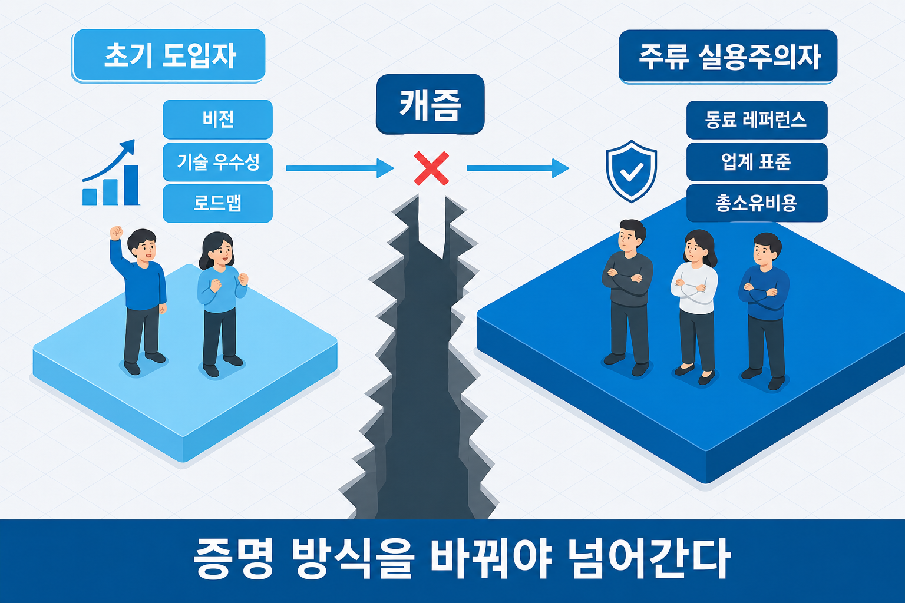
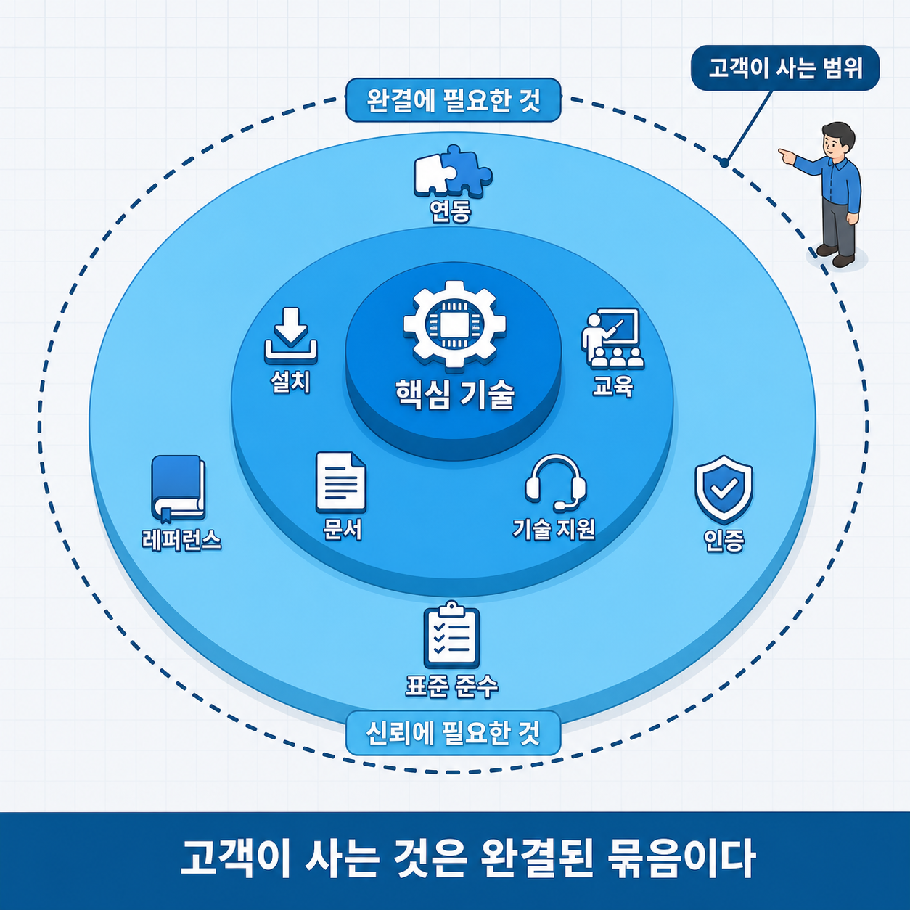
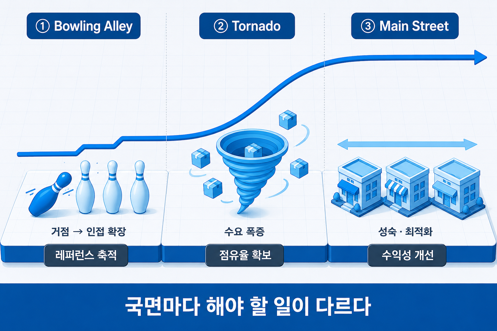
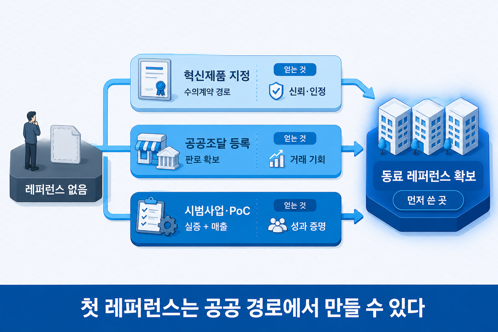

# I-9. 캐즘 극복 전략 — 초기 시장에서 주류 시장으로

## 초기 반응이 좋았는데 왜 멈추는가

시연에서 반응이 좋았고, 초기 고객 몇 곳이 먼저 도입했고, 언론에도 한두 번 소개됐다. 그런데 그 뒤로 매출이 늘지 않는다. 같은 방식으로 영업하는데 어느 순간부터 반응이 확연히 달라진다.

이것이 캐즘(Chasm)이다. 새로운 기술을 앞장서 받아들이는 초기 집단과, 그 뒤를 잇는 주류 집단 사이에 있는 단절이다. 두 집단은 이어져 있는 것처럼 보이지만 **구매 이유가 근본적으로 다르다.** 그래서 앞 집단을 설득한 방식이 뒤 집단에는 유효하지 않다.

캐즘이라는 현상 자체와 기술수용주기 다섯 구간은 변화 패턴 장(→ [I-4장](I-04_기술시장_변화.md))에서 다뤘다. 이 장은 그다음, **어떻게 넘는가**를 다룬다.

## 캐즘을 넘는다는 것 — 설득 논리가 바뀐다

캐즘 앞뒤의 두 집단을 나란히 놓으면 왜 같은 설득이 유효하지 않은지가 분명해진다.

| | 캐즘 앞 (초기 도입자) | 캐즘 뒤 (주류 실용주의자) |
|---|---|---|
| 원하는 것 | 남보다 앞선 경쟁 우위 | 확실하게 작동하는 해결책 |
| 위험 태도 | 위험을 감수함 | 위험을 회피함 |
| 미완성 수용 | 감수하고 함께 만들어 감 | 받아들이지 않음 |
| 설득되는 근거 | 비전·기술적 우수성·로드맵 | 같은 처지의 동료 레퍼런스·업계 표준·총소유비용 |

표에서 얻을 핵심은 하나다. 초기 고객에게 유효하던 "국내 최초", "차세대 기술", "혁신적 접근" 같은 표현이 주류 고객에게는 **오히려 위험 신호로 읽힌다**는 것이다. 실용주의자에게 최초는 곧 검증되지 않았다는 뜻이기 때문이다.

그래서 캐즘을 넘는 일은 제품을 더 좋게 만드는 문제가 아니라 **증명의 방식을 바꾸는 문제**다. 성능 수치를 더 올리는 대신, 비슷한 규모·업종의 회사가 실제로 쓰고 있고 문제없이 운영된다는 사실을 제시해야 한다. 주류 고객이 가장 신뢰하는 근거는 개발사의 설명이 아니라 **자기와 같은 처지에 있는 회사의 사용 경험**이다.


> 그림 1 — 캐즘 앞뒤의 설득 논리. 제품을 바꾸는 문제가 아니라 증명 방식을 바꾸는 문제다.

## 완전완비제품 — 기술 완성이 제품 완성은 아니다

실용주의자가 사지 않는 이유를 하나만 꼽으면, 제품이 아직 **완결되지 않았기** 때문이다. 여기서 완결은 성능이 아니라 범위의 문제다.

기술 기업은 보통 핵심 기능이 목표 성능에 도달하면 제품이 완성됐다고 생각한다. 그러나 고객이 실제로 도입할 때 필요한 것은 그보다 넓다. 기존 시스템과의 연동, 설치와 초기 설정, 사용 교육, 장애 대응 체계, 문서, 그리고 무엇보다 먼저 써 본 회사의 사례다. 이 전체 묶음을 완전완비제품(Whole Product)이라고 부른다.

| 구분 | 포함되는 것 |
|------|-----------|
| 핵심 제품 | 우리가 만든 기술·기능 그 자체 |
| 완결에 필요한 것 | 연동·설치·설정·교육·문서·기술 지원·장애 대응 |
| 신뢰에 필요한 것 | 동종 업계 레퍼런스·인증·표준 준수 |

실무적으로 중요한 점은, **이 전부를 직접 만들 필요는 없다**는 것이다. 설치와 교육은 파트너가 맡을 수 있고, 연동은 기존 사업자와의 제휴로 해결할 수 있으며, 인증은 외부 기관을 거치면 된다. 고객 입장에서 완결된 형태로 도착하기만 하면 된다. 캐즘을 넘는 기업이 이 시기에 파트너십과 생태계 구축을 서두르는 이유가 여기에 있다.

❌ **실수 — 핵심 기능 완성을 제품 완성으로 적는다**
"목표 성능을 달성해 제품 개발을 완료했다"로 사업화 준비가 끝난 것처럼 서술하는 경우다.
→ 이렇게 읽힌다: *"기술은 됐다는 것이고, 파는 준비는 아직 되지 않았다는 뜻이다. 도입 고객이 무엇을 더 필요로 하는지 파악되지 않았다."*

✓ **올바른 방향**: 핵심 기술 외에 도입에 필요한 항목(연동·설치·교육·지원·레퍼런스)을 나열하고, 각각을 자체 개발할지 파트너로 채울지까지 밝힌다. 이 구분이 있으면 사업화 계획이 구체적으로 읽힌다.


> 그림 2 — 완전완비제품의 범위. 고객이 사는 것은 핵심 기술이 아니라 완결된 묶음이다.

## 볼링앨리에서 토네이도로 — 캐즘 이후의 지도

캐즘을 넘은 뒤의 성장은 한 번에 오지 않고 세 국면을 거친다. 각 국면에서 해야 할 일이 다르다.

| 국면 | 상태 | 할 일 |
|------|------|------|
| Bowling Alley (볼링앨리) | 거점 하나를 장악한 뒤 인접 세그먼트로 순차 확장 | 세그먼트별 완전완비제품 맞춤·레퍼런스 축적 |
| Tornado (토네이도) | 주류 집단이 한꺼번에 채택하며 수요 폭증 | 점유율 확보 최우선·공급과 배포 역량 확충 |
| Main Street (메인스트리트) | 성장 둔화·시장 성숙 | 수익성 개선·확장 상품·고객 유지 |

이름이 뜻하듯 Bowling Alley는 앞 핀을 쓰러뜨려 옆 핀을 넘어뜨리는 방식이다. 한 세그먼트에서 쌓은 레퍼런스가 인접 세그먼트 진입을 쉽게 만드는 연쇄를 노린다. 그래서 앞 장(→ [I-8장](I-08_시장진입_전략.md))에서 다룬 거점 선정에서 **전략적 인접성**이 중요했던 것이다.

Tornado 국면의 판단은 직관과 어긋난다. 수요가 집중될 때는 고객 한 곳 한 곳에 맞춤 대응하기보다 표준 제품을 최대한 많이 공급해 자리를 확보하는 것이 유리하다. 이 시기를 놓치면 표준이 다른 회사의 것으로 굳어진다.


> 그림 3 — 볼링앨리에서 메인스트리트까지. 국면마다 해야 할 일이 다르다.

## 지금도 유효한가 — 캐즘 이론의 현대적 적응

여기서 당연한 질문이 나온다. 캐즘은 1991년에 나온 개념인데 지금도 그대로 적용되는가다. 결론부터 말하면 **여전히 유효하되, 제품 유형에 따라 모습이 달라진다.**

가장 큰 변화는 도입 경로다. 과거에는 회사가 위에서 결정해 도입했지만, 지금은 실무자 개인이나 소규모 팀이 먼저 써 보고 조직으로 확산되는 방식이 흔하다. 이 경우 캐즘은 사라지지는 않지만 **좁아지거나 우회된다.** 개인 사용자가 스스로 검증하고 팀에 확산시키는 과정이 전통적인 레퍼런스 확보를 일부 대신하기 때문이다.

반대로 캐즘이 여전히 뚜렷한 영역도 있다. 도입에 보안 검토·규정 준수·예산 승인이 필요한 기업용 제품, 설비나 공정에 결합되는 제조 현장 기술, 공공 부문이 그렇다. 이런 곳에서는 개인이 먼저 써 보는 경로 자체가 막혀 있어 동료 레퍼런스의 무게가 그대로 유지된다.

그래서 실무적인 적응은 이렇게 정리된다.

- 셀프서비스로 쓸 수 있는 제품이라면 **개인·소규모 팀을 거점 세그먼트로 재해석**한다. 회사가 아니라 "이런 업무를 하는 담당자"가 거점이 된다.
- 고관여 제품이라면 캐즘 이론을 원래 형태로 적용한다. 레퍼런스·표준·총소유비용 논거를 먼저 갖춘다.
- 두 경로가 섞인 제품이라면 개인 도입으로 접점을 만들고, 조직 확산 단계에서 레퍼런스 논거를 준비한다.

이 단계가 실제로 얼마나 어려운지는 수치로도 나타난다. 한 분석에서는 초기 투자를 받은 기업 중 다음 단계 성장 궤도에 오르는 비율을 7곳 중 1곳 정도로 봤다(McKinsey 분석, 2022~23년 시장 조정 이전 기준). 시점과 표본에 따라 달라지는 수치이므로 절대값보다는 **대다수가 이 구간에서 멈춘다**는 신호로 읽는 것이 맞다.

## 한국에서 첫 레퍼런스 만들기

캐즘 극복의 처방은 결국 "같은 처지의 회사가 이미 쓰고 있다"를 만드는 일로 모아진다. 문제는 첫 레퍼런스가 없을 때 그것을 어떻게 시작하느냐다. 국내 기술 창업에는 이를 위한 몇 가지 경로가 있다.

| 경로 | 성격 | 얻는 것 |
|------|------|--------|
| 혁신제품 지정 | 지정 시 공공기관 수의계약 경로 확보 | 매출 실적 없이도 첫 공공 납품 가능 |
| 벤처나라·나라장터 | 공공조달 판로 등록 | 민간 경기와 무관한 판로 |
| 지자체 시범사업·PoC | 실증 과제 참여 | 레퍼런스·실증 데이터·매출 동시 |

이 경로들의 공통점은 **매출 이력이 없는 초기 기업도 진입할 수 있다**는 점이다. 민간 기업이 "먼저 쓴 곳이 있느냐"를 물을 때, 공공 납품 이력과 실증 결과가 그 답이 된다. 특히 지자체 시범사업은 제품 로드맵과 방향이 맞는 과제를 고르면 개발과 레퍼런스 확보를 동시에 진행할 수 있다. 혁신제품 지정·공공조달의 제도 구조는 규제샌드박스·혁신조달 장(→ [V-3장](V-03_규제샌드박스_혁신조달.md))에서 다룬다.

> ⚠️ 지원 제도의 금액 기준·자격 요건·신청 일정은 자주 바뀐다. 실제 준비 시에는 반드시 **해당 연도 조달청·지자체 공고문**을 기준으로 확인해야 한다.


> 그림 4 — 첫 레퍼런스 확보 경로. 첫 레퍼런스는 공공 경로에서 만들 수 있다.

## 예비창업 단계에서 이 장을 쓰는 시점

캐즘은 제품이 팔리기 시작한 뒤에 나타나는 현상이다. 그러므로 아직 첫 고객이 없는 팀에게 이 장의 도구 전부가 지금 필요한 것은 아니다. 다만 캐즘을 넘는 계획의 절반은 첫 고객을 고르는 시점에 이미 결정된다 — 첫 고객이 확산 연쇄의 출발점이 되는 위치인지가 여기서 정해지기 때문이다. 도구별로 적용 시점을 나눈다.

| 도구 | 적용 시점 | 이 시점에 해야 할 일 |
|------|----------|------------------|
| 첫 진입 시장(교두보) 선정 | 지금 — 고객 정의(→ [I-5장](I-05_고객이해_문제정의.md)) 직후 | 확산 연쇄의 출발점이 될 첫 고객 집단을 특정한다 |
| 완전완비제품 목록 | 개발 계획 수립 시점 | 핵심 기능 외에 도입에 필요한 항목을 나열하고 자체·파트너를 구분한다 |
| 설득 논리 전환 | 첫 고객 확보 이후 | 비전·기술 우수성 논거를 레퍼런스·총소유비용 논거로 바꾼다 |
| 첫 레퍼런스 경로 | 제품이 시연 가능한 시점 | 공공 경로 후보에서 확인 항목을 점검한다 |

### 첫 진입 시장은 큰 시장 안의 좁은 지점이다

"소상공인 시장을 대상으로 한다"는 서술은 넓다. 소상공인 안에는 음식점·카페·미용실·학원·공방·온라인 판매자가 모두 들어간다. "혼자 학원을 운영하면서 수강 문의와 반복 행정에 시간을 많이 쓰는 소규모 학원"이라고 적으면 대상은 좁아지지만 문제와 상황이 확인되고, 인터뷰할 사람·관찰할 장면·검증할 기준이 함께 정해진다. 첫 진입 시장은 작은 시장이 아니라 **첫 고객·문제·가치·실행 가능성이 겹치는 지점**이다.

실제 사례로 당근이 있다. 이 서비스는 2015년 7월 판교테크노밸리에서 '판교장터'라는 이름으로, 회사 인증을 거친 직장인만 쓸 수 있는 서비스로 출발했다. 같은 해 10월 이름을 바꾸고 다른 지역으로 범위를 넓혔으며, 2018년 1월 가입자 100만 명에 이르렀다. 출발점이 작았다는 사실보다 중요한 것은 **고객 범위와 사용 맥락이 선명했다**는 점이다. 같은 지역에서 일하는 사람, 회사 인증을 거친 사용자, 신뢰가 필요한 가까운 사람 사이의 거래라는 구체적 상황이 있었다. 중고거래라는 아이디어가 새롭지 않아도, 첫 고객 정의가 좁으면 풀어야 할 문제가 달라진다.

첫 진입 시장의 서술은 세 가지를 갖춘다. 누가 가장 먼저 반응하는가, 그 고객은 어떤 상황에서 문제를 겪는가, 그리고 **그 집단에서 확보한 레퍼런스가 어느 인접 집단으로 이어지는가**다. 세 번째가 빠지면 첫 시장은 교두보가 아니라 고립된 시장이 된다.

```
[첫 진입 시장 — 서술 예]
첫 고객: 대학 캠퍼스 안에서 소규모 음식점을 운영하며 점심 시간대 배달 인력이 부족한 운영자
문제 상황: 피크 시간 주문 지연 — 아르바이트 추가 채용(인건비)과 배달 앱(수수료) 두 대안 모두 비용 부담
첫 18개월: 캠퍼스 3곳에서 파일럿 운영, 실증 데이터(배달 건수·지연율·운영자 평가)를 레퍼런스로 확보
인접 확장: 캠퍼스 레퍼런스 → 대형 오피스 구내 매장 → 병원·공항 — "폐쇄 구역 실내 배달" 조건을 공유하는 순서
```

### 공공 경로 — 이름이 아니라 확인 항목

본문의 세 경로는 첫 레퍼런스가 없는 팀에게 열려 있는 통로다. 다만 경로의 이름을 나열하는 것은 계획이 아니다. 각 경로에서 무엇을 확인해야 하는지를 적어야 실행 항목이 된다.

| 경로 | 확인할 것 | 계획에 적을 것 |
|------|----------|--------------|
| 혁신제품 지정 | 우리 제품이 지정 대상에 해당하는가 · 지정을 위해 준비할 자료와 시점(현행 공고 기준) | 준비 항목과 시점, 지정 후 첫 납품 대상 기관 후보 |
| 공공조달 등록 | 등록 절차와 제품 규격의 적합 여부 · 등록 이후 실제 구매 요청이 발생하는 구조인가 | 등록 시점과 등록 후 영업 대상 |
| 지자체 시범사업·PoC | 과제 방향이 제품 로드맵과 일치하는가 · 실증 결과 데이터의 소유와 공개 범위 · 실증 이후 계약 전환 조건 | 참여 과제의 선택 기준과 실증 결과의 활용 계획 |

세 경로 공통으로 확인할 것이 하나 더 있다. **공공 레퍼런스가 민간 고객에게 유효한가**다. 민간 실용주의자가 요구하는 것은 자기와 같은 처지의 회사 사례이므로, 공공 납품 이력이 그 요구를 대체하는지, 아니면 민간 첫 고객을 별도로 확보해야 하는지를 제품 유형별로 판단한다.

## 사업계획에 적용하기

캐즘 극복의 계획은 순서가 있는 세 문단으로 구성된다 — 첫 진입 시장, 완전완비제품의 자체·파트너 구분, 확산 순서다.

**서술 예시 — 첫 진입 시장에서 확산까지**

```
[첫 진입 시장]
캠퍼스 내 소규모 음식점 운영자(피크 시간 배달 인력 부족). 캠퍼스 3곳 파일럿으로 첫 18개월 집중.
근거 — 기술 가능성에 반응하는 집단이며, 미완성 기능을 감수하고 함께 개선할 의사를 인터뷰 6건에서 확인.

[완전완비제품]
자체: 자율주행 모듈, 운영 대시보드, 장애 대응 매뉴얼
파트너: 로봇 하드웨어 제조(국내 제조사 1곳 협의 중), 캠퍼스 내 설치·교육(시설관리 업체)
외부 확인: 실내 로봇 안전 인증(인증 기관 — 시점 M+8)

[확산 순서]
캠퍼스 레퍼런스 3건 → 대형 오피스 구내 매장(같은 폐쇄 구역 조건) → 병원.
각 단계 진입 조건: 직전 세그먼트 레퍼런스 2건 이상 + 해당 세그먼트 완전완비제품 항목 점검 완료.
설득 논리 전환: 오피스 단계부터 "국내 최초" 표현을 제거하고 캠퍼스 운영 데이터(가동률·지연율)를 근거로 제시.
```

**흔한 오류**

| 오류 | 계획이 성립하지 않는 이유 | 방향 |
|------|------------------------|------|
| 출시 즉시 전체 시장을 목표로 잡는다 | 레퍼런스 없이 실용주의 집단에 진입하면 설득 근거가 없어 비용만 소진된다 | 첫 진입 시장 → 인접 확장의 순서를 조건과 함께 적는다 |
| 첫 고객을 "기술에 관심 있는 초기 고객"으로 적는다 | 누구에게 어떤 상황에서 접근하는지가 없으면 인터뷰 대상도 검증 기준도 정해지지 않는다 | 집단의 특성·상황·접촉 경로를 특정한다 |
| 첫 고객과 확산 경로가 끊겨 있다 | 첫 시장에서 얻은 레퍼런스가 다음 집단에 유효하지 않으면 교두보가 아니라 고립된 시장이다 | 첫 시장이 어느 인접 집단과 조건을 공유하는지 적는다 |
| 완전완비제품 항목을 전부 자체 개발로 둔다 | 1~5인 팀이 연동·설치·교육·지원을 모두 직접 하면 개발 일정과 자금이 그만큼 늘어난다 | 항목별로 자체·파트너·외부 기관을 구분한다 |
| 공공 경로 이름만 나열한다 | 무엇을 확인하고 언제 준비하는지가 없으면 실행 항목이 아니다 | 경로별 확인 항목과 준비 시점을 적는다 |
| 주류 단계에서도 "국내 최초"를 근거로 쓴다 | 실용주의자에게 최초는 검증되지 않았다는 뜻이다 | 확산 단계마다 논거 전환 시점을 명시한다 |

## 사업계획에서의 위치

캐즘 극복 논리는 사업계획에서 "이미 잘 팔리고 있다"가 아니라 **"어떻게 확산시킬 것인가"**를 묻는 요소에 대응한다.

| 사업계획 구성 요소 | 이 장의 내용이 답하는 것 |
|------|------|
| 성장 전략 | 초기 시장에서 주류로 넘어가는 단계별 확산 계획(볼링앨리) |
| 실행 계획 | 실증·레퍼런스 확보 계획, 완전완비제품 구성 |
| 판로·실증 | 시범사업·PoC 연계, 도입에 필요한 주변 요소 |
| 초기 실적 | 레퍼런스 고객과 확산 경로 |

정리하면, 캐즘을 넘는 일은 성능을 더 올리는 문제가 아니라 **증명 방식을 바꾸고(설득 논리), 제품의 범위를 넓히고(완전완비제품), 순서대로 확장하는(볼링앨리)** 문제다. 그리고 그 출발점인 첫 레퍼런스는 공공 경로에서 만들 수 있다.

이제 남은 것은 가격이다. 얼마를, 어떤 단위로 받을지는 가격 전략 장(→ [I-10장](I-10_가격_전략.md))에서 이어진다.

## 연결 장

- 선행: (→ [I-8장](I-08_시장진입_전략.md)) 시장진입 전략
- 후행: (→ [I-10장](I-10_가격_전략.md)) 가격 전략
- 참조: (→ [I-4장](I-04_기술시장_변화.md)) 변화 패턴 — 캐즘 현상 / (→ [V-3장](V-03_규제샌드박스_혁신조달.md)) 규제샌드박스·혁신조달 — 공공 레퍼런스 경로의 제도 구조
