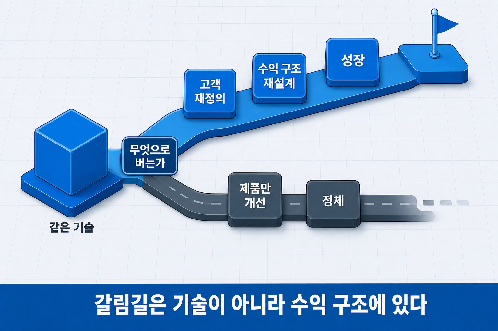
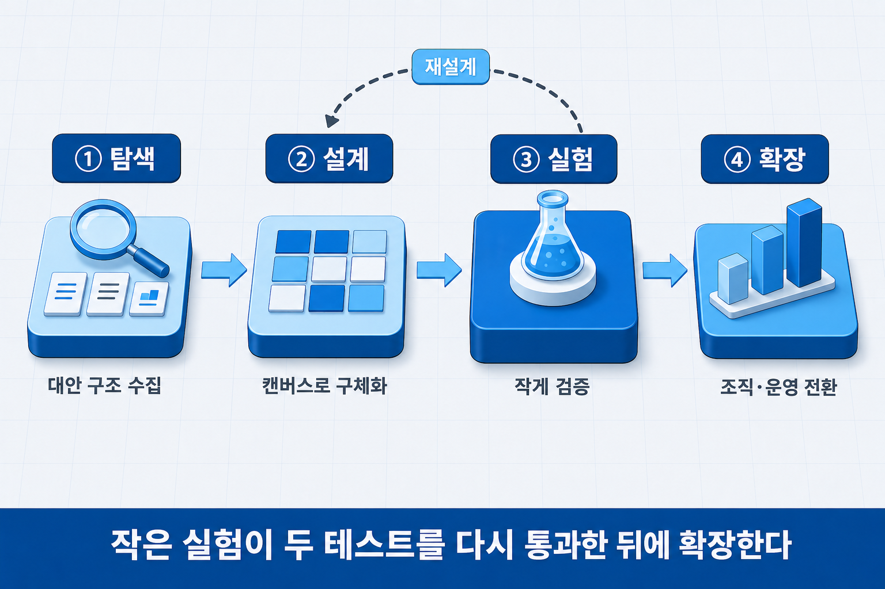
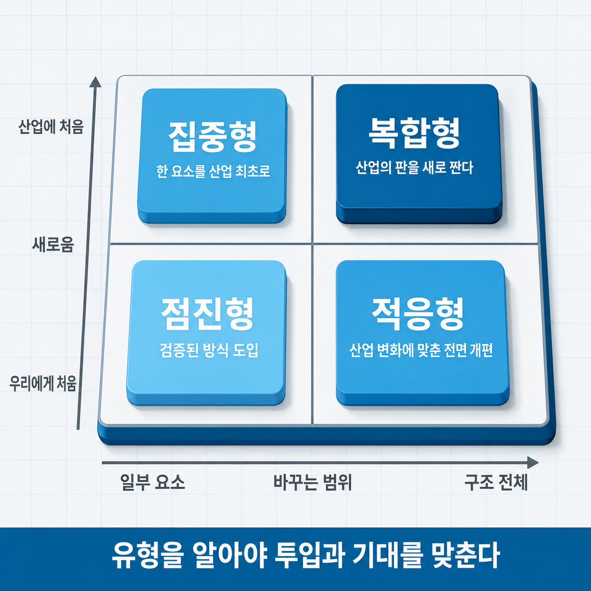

# I-12. 비즈니스 모델 혁신 — 같은 기술로 다른 결과를 만드는 법

## 같은 기술을 보유하고도 결과가 나뉜다

디지털 카메라를 세계에서 가장 먼저 만든 회사는 코닥이었다. 1975년, 자사 연구소에서였다. 그런데 디지털 사진으로 가장 크게 쇠락한 회사도 코닥이었다. 기술이 없어서가 아니라, 필름을 팔아 버는 구조를 대체할 새 수익 구조를 제때 세우지 못해서였다.

같은 기술을 보유한 두 회사의 결과가 나뉠 때, 차이는 대개 기술 격차가 아니라 **그 기술로 수익을 내는 구조**에 있다. 기술 혁신과 비즈니스 모델 혁신은 별개의 축이고, 하나가 다른 하나를 보장하지 않는다. 오히려 실증 연구들은 평범한 기술과 뛰어난 모델의 조합이 뛰어난 기술과 평범한 모델의 조합을 이기는 경우를 반복해서 보고한다.

앞 장(→ [I-11장](I-11_비즈니스모델_설계.md))에서 모델의 종류를 나열하고 캔버스로 그리는 법을 다뤘다면, 이 장은 그 구조를 **바꾸는 일**을 다룬다. 무엇을 바꿔야 혁신인지(정의), 어떤 순서로 바꾸는지(단계), 어느 방향으로 바꿀지(유형), 그리고 기술 기업이 실제로 고르는 모델들이 무엇인지(원형)다.

한 가지 경계를 먼저 긋는다. 여기서 다루는 것은 비즈니스 모델의 혁신이지, 파괴적 혁신·존속적 혁신 같은 **기술 혁신의 유형론이 아니다.** 그쪽은 혁신 유형 장(→ [III-3장](III-03_혁신유형_파괴적혁신.md))에서 따로 다룬다.


> 그림 1 — 같은 기술, 두 갈래 결말. 갈림길은 기술이 아니라 수익 구조에 있다.

## 비즈니스 모델 혁신이란 — 세 축을 함께 바꾸는 일

비즈니스 모델 혁신(Business Model Innovation, BMI)의 학술적 정의는 Foss와 Saebi(2017)의 정리가 널리 쓰인다. 지난 15년의 연구를 종합한 이들의 결론에서 핵심은 **"모델의 구성 요소 하나를 바꾸는 것이 아니라, 가치를 만들고(창출) 전하고(전달) 남기는(포착) 방식의 조합을 새로 설계하는 것"**이라는 점이다.

이 정의가 실무에서 중요한 이유는 흔한 착각 하나를 걸러 주기 때문이다.

가격을 구독제로 바꾸는 것만으로는 모델 혁신이 아니다. 요금 방식은 포착의 한 조각일 뿐이다. 구독으로 바꾸는 순간 고객과의 관계가 일회 거래에서 지속 관계로 바뀌고(전달), 지속적으로 새 가치를 공급할 운영 체계가 필요해지며(창출), 매출 인식과 현금 흐름 구조가 달라진다(포착). **세 축이 연동해서 바뀌어야 구조가 실제로 작동하고, 한 축만 바꾸면 나머지 두 축이 새 구조와 충돌한다.** 구독제를 선언하고도 조직·개발·지원 체계는 일회 판매 시절 그대로여서 해지가 쌓이는 경우가 전형적이다.

앞 장의 언어로 옮기면, 캔버스에서 칸 하나를 고쳐 쓰는 것이 아니라 **칸들 사이의 연결을 다시 긋는 일**이다. 그래서 모델 혁신은 언제나 정합성 검산을 다시 요구한다.

## 어떻게 바꾸는가 — 네 단계

모델을 바꾸는 작업은 대체로 네 단계로 정리된다.

| 단계 | 하는 일 | 흔한 함정 |
|------|--------|----------|
| ① 탐색 | 현재 모델의 한계 진단, 대안 구조 후보 수집 | 지금 모델의 문제를 정의하지 않고 유행 모델부터 수집 |
| ② 설계 | 후보 구조를 캔버스로 구체화, 정합성 검산 | 한 칸만 바꾸고 연쇄 효과를 그리지 않음 |
| ③ 실험 | 작은 범위에서 새 구조를 실제 검증 | 전면 전환부터 단행 |
| ④ 확장 | 검증된 구조로 조직·운영 전환 | 실험 성공 후에도 기존 모델 관성에 회귀 |

이 중 성패를 좌우하는 단계는 ③ 실험이다. 모델 전환은 제품 기능 추가와 달리 되돌리는 비용이 크다. 일부 고객군·일부 지역·일부 제품선에서 새 구조를 먼저 적용해 보고, 앞 장의 두 테스트 — 이야기가 말이 되는가, 숫자가 맞는가 — 를 새 구조에 대해 다시 통과시킨 뒤에 확장하는 순서가 위험을 줄인다.

여기서 탐색 단계의 재료로 앞 장의 두 카탈로그가 쓰인다. 일반 유형 여덟 가지는 대안 구조의 후보 목록이고, 패턴형 기법은 다른 산업의 검증된 형태를 빌려 오는 통로다.


> 그림 2 — 비즈니스 모델 혁신 4단계. 전면 전환 전에, 작은 실험이 두 테스트를 다시 통과해야 한다.

## 어느 방향으로 바꿀 것인가 — 네 가지 유형

모든 모델 혁신이 같은 크기의 일은 아니다. Foss와 Saebi(2017)는 혁신을 두 축으로 나눠 네 유형으로 정리했다. 한 축은 **바꾸는 범위** — 모델의 일부 요소만 바꾸는가, 요소들 사이의 구조 전체를 바꾸는가. 다른 축은 **새로움의 기준** — 우리 회사에 처음인가, 산업 전체에 처음인가.

| | 일부 요소만 | 구조 전체 |
|---|---|---|
| **우리에게 처음** | 점진형 — 검증된 방식의 도입 (예: 업계 표준인 구독제 채택) | 적응형 — 산업 변화에 맞춘 전면 개편 |
| **산업에 처음** | 집중형 — 한 요소의 산업 최초 재설계 (예: 새로운 과금 단위 고안) | 복합형 — 산업 구조를 새로 설계하는 모델 |

이 분류의 실무적 유용성은 **자기 인식**에 있다. 지금 하려는 변화가 점진형이라면 남들이 이미 검증한 방식이므로 실행 속도가 관건이고, 복합형이라면 검증 자체가 없으므로 실험 단계에 훨씬 오래 머물러야 한다. 유형을 착각하면 투입과 기대가 어긋난다 — 점진형 변화에 복합형의 자원을 투입하거나, 복합형 도전을 점진형의 일정으로 추진하는 식이다.


> 그림 3 — 모델 혁신의 네 유형. 유형을 알아야 투입과 기대를 맞출 수 있다.

## 기술 기업이 실제로 고르는 모델들

방향을 정했다면 이제 목적지 후보들이다. 여기 나오는 다섯 가지는 앞 장(→ [I-11장](I-11_비즈니스모델_설계.md))의 일반 유형 여덟 가지와 다른 층이다 — 일반 유형이 모든 사업에 적용되는 기본형이라면, 아래는 **기술 기업이 그 기본형들을 조합해 실제로 도달하는 원형**들이다.

| 원형 | 구조 | 성립 조건 | 해자(방어 기반) |
|------|------|----------|----------------|
| 딥테크 하이브리드 | 장비 판매 + 구독 + 서비스 결합 | 설치 후에도 이어지는 서비스 접점 | 높은 전환 비용 |
| 플랫폼·양면 시장 | 두 집단 연결, 수수료 수익 | 양쪽 모두 최소 규모 확보 | 네트워크 효과 |
| 서비스화 | 제품 판매 → 결과 판매로 전환 | 원격 모니터링·데이터 수집 | 관계와 데이터의 누적 |
| AI 네이티브 | 데이터→예측→행동→성과의 순환 | 데이터의 소유권과 품질 | 쓸수록 좋아지는 순환 |
| API 기반 | 기능을 호출 단위로 외부 판매 | 명확한 과금 단위·안정성 보장 | 개발자 생태계 이식 비용 |

세 가지만 상세히 살펴본다.

**딥테크 하이브리드**는 장비를 팔고 끝내지 않고, 판매·구독·서비스·성과 과금을 한 계약에 결합한다. 고객 입장에서는 큰 초기 투자가 매달의 운영비로 바뀌어 도입 장벽이 낮아지고, 공급자 입장에서는 일회 매출이 반복 매출로 바뀐다. 성립 조건이 까다롭다 — 장비가 설치된 뒤에도 데이터·유지보수·개선으로 계속 개입할 접점이 있어야 하고, 그 접점을 운영할 체계가 조직에 있어야 한다.

**서비스화**는 제품을 파는 대신 제품이 만들어 내는 결과를 판다. 압축기를 파는 대신 압축 공기를 시간당으로 파는 방식이 고전적인 예다. 고객의 구매 결정이 "이 장비가 좋은가"에서 "이 결과가 필요한가"로 바뀌므로 영업의 성격까지 달라진다. 원격으로 상태를 읽을 수 없으면 성립하지 않는 구조라서, 뒤에 나올 공진화의 대표 사례이기도 하다.

**AI 네이티브**는 인공지능 기능을 제품에 붙이는 것과 다르다. 데이터가 들어와 예측을 만들고, 예측이 행동을 바꾸고, 행동의 결과가 다시 데이터로 돌아오는 **순환 자체가 사업 구조**인 경우를 말한다. 이 순환이 작동하기 시작하면 쓰는 고객이 많을수록 제품이 좋아지므로, 데이터의 소유권과 품질이 곧 경쟁력의 원천이 된다. 무엇을 단위로 과금할지는 가격 전략 장(→ [I-10장](I-10_가격_전략.md))의 사용량·성과 기반 논의와 이어진다.

다섯 원형의 공통점이 하나 있다. 전부 **일회 판매를 반복 관계로 바꾸는 방향**을 향한다는 점이다. 기술 기업의 모델 혁신은 대부분 "만들어 판다"에서 "계속 관여하며 번다"로 이행하는 방향 위에 있다.

## 기술과 비즈니스 모델은 서로를 끌어당긴다

모델 혁신의 계기는 두 방향에서 온다.

**기술이 모델을 미는 경우.** 새 기술이 이전에 불가능하던 수익 방식을 열어 준다. 저렴한 센서와 통신이 없던 시절에는 장비 상태를 원격으로 읽을 수 없었으므로 서비스화 모델 자체가 성립하지 않았다. 기술이 먼저 오고, 모델이 따라온다.

**모델이 기술을 당기는 경우.** 반대로, 먼저 약속한 수익 구조가 기술 개발의 방향을 결정한다. 시간당 결과를 팔기로 계약하는 순간, 장비의 가동률을 실시간으로 읽고 예측하는 기술이 사업의 생존 조건이 된다. 모델이 먼저 오고, 기술이 따라온다.

실제 사업에서는 두 방향이 번갈아 작동하며 서로를 강화한다. 그래서 기술 로드맵과 모델 설계를 따로 세우면 어긋난다 — 다음 분기의 기술 투자가 어떤 수익 구조를 여는지, 목표한 수익 구조가 어떤 기술을 전제하는지를 한 표에서 대조하는 습관이 필요하다. 기술이 미는 힘과 시장이 당기는 힘이라는 더 일반적인 구도는 기술경영 개론 장(→ [III-1장](III-01_기술경영_개론.md))에서 다룬다.

## 초기 스타트업의 모델 혁신 — 무엇을 바꿀 수 있는가

본문의 네 단계와 네 유형은 이미 운영 중인 모델이 있는 조직에 맞춰 정리된 것이다. 초기 팀에는 바꿀 "현재 모델"이 아직 없다. 그러나 첫 모델을 정하는 시점에 팀은 같은 질문에 답해야 한다 — 일회 판매로 시작할 것인가, 처음부터 반복 관계로 설계할 것인가. 아래는 초기 팀이 실제로 내리는 첫 결정이다.

**초기 구매 비용을 운영비로 바꾸는 결정(CAPEX→OPEX)** — 고객이 도입을 망설이는 가장 큰 이유가 초기 비용이라면, 판매 대신 구독·월정액·성과 기반으로 제공하는 것이 도입 장벽을 낮춘다. 방식은 세 가지다.

| 방식 | 구조 | 적합한 제품 | 성립 조건 |
|------|------|-----------|----------|
| 소프트웨어 구독(SaaS) | 월정액 이용료 | 분석·소프트웨어 솔루션 | 매달 해지할 이유를 넘어서는 가치 갱신 |
| 장비 구독(RaaS) | 장비 임대 + 소프트웨어 월정액 | 자동화 설비·로봇 | 장비 자금을 공급자가 먼저 부담할 자금 계획, 설치 후 유지·개선 접점 |
| 성과 기반 과금 | 불량 감소율·에너지 절감액에 비례 | 품질·에너지 관리 솔루션 | 공급자와 고객이 합의한 방식으로 성과를 측정할 수단 |

```
[가상 사례 — AI 불량 검사 솔루션, 개발 3인 팀]

기존 방식(CAPEX): 검사 장비 3,000만 원 일시 구매 + 소프트웨어 연 500만 원
  → 고객 초기 지출 3,500만 원, 도입 결정에 6~12개월

전환(OPEX/RaaS): 장비 임대 + 소프트웨어 월 200만 원, 최소 계약 12개월, 설치비 100만 원
  → 고객 초기 지출 100만 원, 연간 비용 2,400만 원(기존 대비 31% 절감), 결정 2~4주

공급자 측 변화: 장비 원가를 선지출 — 계약 12건 시점까지 장비 자금 별도 조달 필요.
                설치 후 월 1회 모델 갱신·점검 접점을 운영 체계로 확보해야 구독 유지.
```

이 사례에서 확인할 것은 요금 방식 하나를 바꾸자 세 축이 함께 바뀌었다는 점이다. 고객 관계가 일회 거래에서 지속 관계로 바뀌고(전달), 매달 가치를 갱신하는 운영 체계가 필요해지며(창출), 매출 인식이 12개월에 걸쳐 분산되고 장비 자금은 공급자가 먼저 부담한다(포착). 세 번째 변화를 자금 계획에 반영하지 않은 OPEX 전환은 고객의 도입 장벽을 공급자의 자금 공백으로 옮긴 것에 지나지 않는다(→ [I-13장](I-13_기술사업화_경로.md)).

### 다섯 원형 — 초기 팀의 선택 기준

본문의 다섯 원형 표에는 성립 조건과 해자가 정리되어 있다. 초기 팀이 원형을 고를 때는 그 조건이 **지금 팀 안에 있는가**를 확인해야 한다. 조건이 없는 원형을 이름만 택하면 모델은 서류에만 존재한다.

| 원형 | 지금 선택 가능한 조건 | 선택하지 않을 신호 |
|------|------------------|----------------|
| 딥테크 하이브리드 | 장비 설치 후 이어지는 데이터·유지보수 접점이 설계되어 있고 운영 인력이 있다 | 설치 후 접점이 없다 — 판매 후 고객과 만날 이유가 없다 |
| 플랫폼·양면 시장 | 두 집단 중 한 집단을 먼저 모을 구체적 방법과 자금이 있다 | 두 집단 모두 규모가 없고, 어느 집단을 먼저 모을지 정해지지 않았다 |
| 서비스화 | 장비 상태를 원격으로 읽는 수단이 있고, 결과 단위(시간당·건당)가 정의된다 | 원격 데이터가 없다 — 결과를 측정할 수 없다 |
| AI 네이티브 | 데이터의 소유권이 자사에 있고, 사용 결과가 다시 데이터로 돌아오는 순환이 설계되어 있다 | 데이터가 고객 소유이거나, 학습에 쓸 수 없는 계약 조건이다 |
| API 기반 | 과금 단위(호출·건)가 명확하고 안정성을 보장할 운영 역량이 있다 | 기능이 단독으로 완결되지 않아 외부 개발자가 연동할 이유가 없다 |

## 사업계획에 적용하기

초기 팀의 모델 결정은 "어떤 원형인가"의 선언이 아니라 **세 축이 함께 설계되었는가**로 서술한다. 아래 체크리스트는 본문의 정의(세 축 연동)를 실행 항목으로 옮긴 것이다.

| 축 | 확인 항목 | 위 사례의 답 |
|----|----------|------------|
| 창출 | 반복 관계에서 매달 새로 공급하는 가치가 무엇인가 · 그것을 만드는 운영 체계가 팀에 있는가 | 월 1회 모델 갱신·현장 점검 — 개발 3인 중 1인이 운영 담당 |
| 전달 | 고객 관계가 거래에서 유지로 바뀔 때 계약·지원·해지 절차가 준비되어 있는가 | 12개월 최소 계약, 설치 후 30일 내 성능 미달 시 해지 조건 |
| 포착 | 매출 인식 시점과 현금 흐름이 달라진 구조를 자금 계획이 반영하는가 | 장비 선지출 12건분 — 공공 지원과 유상 PoC로 조달(→ [I-13장](I-13_기술사업화_경로.md)) |
| 실험 범위 | 전면 전환 전에 어느 고객군·지역에서 먼저 검증하는가 | 파트너 제조사 2곳에서 6개월 — 두 테스트 재통과 후 확대 |

**서술 예시 — 원형 선택과 세 축**

```
[수익 구조]
장비 구독(RaaS) — 장비 임대 + 소프트웨어 월 200만 원, 최소 12개월. 딥테크 하이브리드 원형.
선택 근거: 설치 후 월 1회 모델 갱신·점검 접점이 있어 구독 가치가 유지되고, 고객 초기 지출이
3,500만 원에서 100만 원으로 줄어 결정 기간이 2~4주로 단축된다.

[세 축의 변화]
창출 — 월간 모델 갱신을 운영 체계로 편성(운영 담당 1인).
전달 — 12개월 계약·30일 성능 보증·해지 조건 명문화.
포착 — 장비 원가 선지출 12건분을 유상 PoC 수익과 공공 지원으로 조달, 월 구독 수익은 M+7부터 인식.

[실험]
파트너 제조사 2곳에서 6개월 운영 후 해지율·갱신 의사·운영 부하를 확인하고 확대 여부를 결정한다.
```

**흔한 오류**

| 오류 | 계획이 성립하지 않는 이유 | 방향 |
|------|------------------------|------|
| 원형의 이름만 적고 성립 조건을 확인하지 않는다 | "AI 네이티브"라 쓰고 데이터 소유권이 고객에게 있으면 순환이 작동하지 않는다 | 원형별 성립 조건이 지금 팀 안에 있는지 표로 대조한다 |
| 구독제로 바꾸면서 공급자의 자금 변화를 계획하지 않는다 | 고객의 초기 비용이 사라진 만큼 공급자가 장비·개발비를 먼저 부담하며, 그 자금이 없으면 계약이 늘수록 현금이 부족해진다 | 선지출 규모와 조달 방법을 자금 계획에 명시한다 |
| 성과 기반 과금을 택하고 성과 측정 방법이 없다 | 공급자와 고객이 합의한 측정 수단이 없으면 청구 근거가 없어 분쟁이 된다 | 측정 지표·기준선·측정 주체를 계약 전에 정한다 |
| 반복 관계로 바꾸고 운영 체계는 일회 판매 구조 그대로 둔다 | 매달 가치를 갱신하지 못하면 해지가 누적된다 | 창출 축의 운영 항목과 담당자를 적는다 |
| 첫 계약부터 전면 전환한다 | 모델 전환은 되돌리는 비용이 크고, 검증되지 않은 구조에 전체 자원을 투입하면 실패 시 복구가 어렵다 | 고객군·지역을 한정한 실험 범위와 확대 조건을 적는다 |
| 산업에 처음인 구조를 검증된 방식의 일정으로 추진한다 | 유형을 착각하면 투입과 기대가 어긋난다 — 복합형은 실험 단계에 오래 머문다 | 네 유형 중 어디인지 자기 인식을 먼저 적는다 |

## 사업계획에서의 위치

모델 혁신의 언어는 사업의 차별성과 확장성을 설명하는 모든 자리에서 쓰인다.

| 사업계획 구성 요소 | 이 장의 내용이 답하는 것 |
|------|------|
| 성장 전략 | 사업 모델의 차별성·확장 구조 |
| 사업화 계획 | 개발 기술이 여는 수익 구조의 변화 |
| 경쟁 우위의 방어 | 원형 선택의 근거와 방어 기반 |

구조를 그리는 법(I-11)과 바꾸는 법(이 장)까지 왔다. 남은 것은 그 구조를 들고 실제로 시장까지 가는 길이다. 기술에서 사업으로 가는 경로에는 어떤 갈래가 있고, 그 길의 어디에서 가장 많이 멈추는가 — 다음 장(→ [I-13장](I-13_기술사업화_경로.md))에서 다룬다.

## 연결 장

- 선행: (→ [I-11장](I-11_비즈니스모델_설계.md)) 비즈니스 모델 설계
- 후행: (→ [I-13장](I-13_기술사업화_경로.md)) 기술사업화 경로
- 참조: (→ [I-10장](I-10_가격_전략.md)) 가격 전략 — 과금 단위 / (→ [III-1장](III-01_기술경영_개론.md)) 기술경영 개론 — 테크 푸시 vs 마켓 풀 / (→ [III-3장](III-03_혁신유형_파괴적혁신.md)) 혁신 유형·파괴적 혁신 — 기술 혁신 유형론과의 경계
