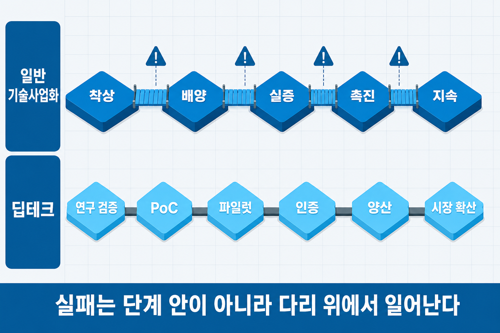
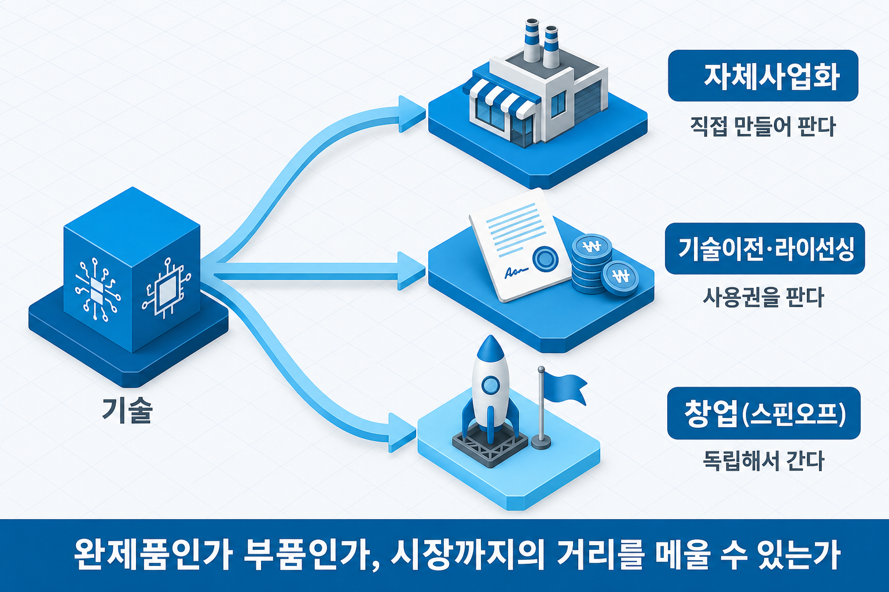
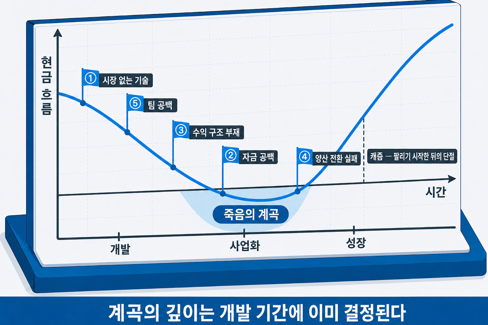

# I-13. 기술사업화 경로 — 기술에서 사업까지, 어디로 가고 어디서 멈추는가

## 제품은 나왔는데 시장에 닿지 못한다

개발은 끝났다. 시제품이 작동하고, 논문이 나왔고, 특허도 출원했다. 그런데 매출은 없다. 시연을 보여 주면 모두 훌륭하다고 하는데, 그 감탄이 계약으로 바뀌지 않은 채 시간이 간다.

기술을 완성하는 일과 기술을 사업으로 만드는 일은 서로 다른 작업이다. 앞 장(→ [I-12장](I-12_비즈니스모델_혁신.md))이 어떤 수익 구조로 갈지를 다뤘다면, 이 장은 그 구조를 들고 **실제로 시장까지 가는 길**을 다룬다. 길은 몇 단계로 이루어져 있는지, 갈래는 몇 개인지, 그리고 그 길의 어디에서 가장 많이 멈추는지다.

## 기술사업화 프로세스 — 단계로 보기

기술사업화를 단계로 그린 모델 가운데 가장 오래 인용되는 것은 Vijay Jolly(1997)의 5단계다. 착상(Imagining) → 배양(Incubating) → 실증(Demonstrating) → 촉진(Promoting) → 지속(Sustaining). 기술의 가능성을 발견하고, 키우고, 작동을 증명하고, 시장의 수용을 만들고, 수익이 유지되는 구조에 이르는 과정이다.

이 모델의 핵심은 단계 자체보다 **단계 사이**에 있다. Jolly는 각 단계 사이의 이행 구간을 다리(bridge)라고 부르며, 사업화가 실패하는 지점은 단계의 내부가 아니라 이 다리 위라고 지적했다. 다리를 건너려면 매번 새로운 자원과 이해관계자 — 다음 단계에 필요한 자금, 파트너, 초기 고객 — 를 끌어모아야 하는데, 기술을 잘하는 조직이 이 결집에는 서툰 경우가 많기 때문이다.

한편 장비·소재·바이오처럼 물리 세계를 다루는 기술이라면 단계가 더 잘게 나뉜다. 딥테크 분야에서는 연구 검증 → 개념 실증(PoC) → 파일럿 → 인증 → 양산 → 시장 확산의 여섯 단계로 보는 관점이 쓰인다. 소프트웨어와 달리 인증과 양산 전환이라는 관문이 별도로 존재하고, 각 관문이 시간과 자본을 크게 요구하기 때문이다.

두 모델을 나란히 놓는 이유는 하나다. **우리 기술이 어느 축의 과정인지**를 먼저 판정해야 일정과 자금 계획의 기준이 맞는다. 소프트웨어 중심이라면 다리 결집이 관건인 다섯 단계의 과정에 가깝고, 물리 제품이라면 인증·양산이 낀 여섯 단계의 긴 과정을 감수해야 한다. 개발 단계의 성숙도를 측정하는 척도(TRL)는 별도의 척도이며, 기술 성숙도 평가 장(→ [II-8장](II-08_기술성숙도.md))에서 다룬다.


> 그림 1 — 기술사업화 단계 모델 두 축. 실패는 단계 안이 아니라 다리 위에서 일어난다.

## 사업화 3경로 — 어떤 방식으로 시장에 연결할 것인가

단계를 알았다면 다음은 갈래다. 기술을 시장에 연결하는 방식은 크게 세 갈래로 나뉜다.

| 경로 | 방식 | 유리한 조건 | 감수하는 것 |
|------|------|------------|------------|
| 자체사업화 | 직접 제품을 만들어 판매 | 시장 접근성과 자본·조직을 갖춤 | 가장 큰 투자와 가장 긴 시간 |
| 기술이전·라이선싱 | 사용권을 팔고 로열티 수익 | 기술은 강하나 제조·판매 기반이 없음 | 수익 규모의 상한, 권리 보호 부담 |
| 창업(스핀오프) | 기술을 들고 독립해 신설 법인으로 | 모조직 안에서는 성장하기 어려운 기술 | 사업 전 영역의 위험을 직접 부담 |

선택 기준은 세 가지 질문으로 압축된다. 첫째, **이 기술은 완제품인가 부품인가** — 다른 제품에 들어가야 가치가 나는 기술이라면 라이선싱이 자연스럽고, 독립 제품이 되는 기술이라면 자체사업화나 창업이 가능해진다. 둘째, **시장까지의 거리를 우리가 메울 수 있는가** — 제조·유통·영업 기반이 없다면 그것을 가진 상대에게 넘기는 것이 빠를 수 있다. 셋째, **기술의 시간 창이 얼마나 열려 있는가** — 경쟁 기술이 따라오는 속도가 빠르다면, 오래 걸리는 경로는 그 자체로 위험이다.

세 경로는 배타적이지 않다. 핵심 시장은 직접 공략하고 원거리 시장은 라이선싱으로 여는 병행 구조도 흔하다. 어느 경로든 앞 장(→ [I-12장](I-12_비즈니스모델_혁신.md))에서 고른 수익 구조와 맞물려야 하며, 라이선싱 계약의 실무 구조는 기술이전·라이선싱 계약 장(→ [IV-3장](IV-03_기술이전_라이선싱.md))에서 다룬다.


> 그림 2 — 사업화 3경로 분기. 완제품인가 부품인가, 시장까지의 거리를 메울 수 있는가.

## Death Valley — 기술 창업이 가장 많이 멈추는 구간

### 무엇이, 왜 일어나는가

경로를 골라 진행하기 시작하면, 대부분의 기술 사업이 같은 구간에서 위기를 맞는다. 연구개발 자금은 소진됐는데 매출은 아직 없는 구간 — 현금 흐름 곡선이 가장 깊이 가라앉는 이 구간을 **죽음의 계곡(Death Valley)**이라고 부른다. 개발이 끝났다는 사실이 곧 팔린다는 뜻이 아니기 때문에, 개발 완료와 첫 매출 사이에는 생각보다 긴 무수익 구간이 존재한다.

계곡에 빠지는 원인은 다섯 가지로 정리된다.

| 원인 | 무엇이 어긋났는가 |
|------|------------------|
| 시장 없는 기술 | 수요 검증 없이 개발 완료 — 만든 뒤에 살 사람을 찾기 시작 |
| 자금 공백 | 연구개발 자금과 사업화 자금은 다른 자금인데, 후자의 계획이 없음 |
| 수익 구조 부재 | 무엇으로 수익을 낼지(→ [I-11장](I-11_비즈니스모델_설계.md))가 개발 완료 시점까지 미정 |
| 양산 전환 실패 | 시제품 한 대와 팔 수 있는 제품 사이의 간극 — 원가·품질·인증 |
| 팀 구성의 공백 | 개발 인력만 있고 시장을 여는 사람이 없음 |

다섯 원인의 공통점은 **기술 완성 이후에 시작한 것들이 사실은 기술 개발과 동시에 시작됐어야 할 일**이라는 점이다. 계곡의 깊이는 개발 기간에 결정되고, 계곡에서 드러날 뿐이다.

용어 하나를 구분해 둔다. 캐즘(→ [I-9장](I-09_캐즘_극복.md))도 단절의 은유이지만 가리키는 구간이 다르다. **죽음의 계곡은 제품이 시장에 닿기 전** — 자금과 수요가 비는 구간이고, **캐즘은 제품이 팔리기 시작한 뒤** — 초기 고객과 주류 고객 사이에서 수용이 끊기는 구간이다. 계곡은 자원의 문제이고 캐즘은 설득 논리의 문제이므로, 처방도 서로 다르다.

### 계곡을 건너는 수단 — 여섯 전략과 조합

원인을 진단했다면 수단은 여섯 갈래로 정리된다. 각 수단의 상세 — 자금 조달의 구조(→ [IV-5장](IV-05_IP금융.md)·[IV-6장](IV-06_투자유치_밸류에이션.md)·[IV-7장](IV-07_VC_CVC_정책금융.md)), 공공 지원의 유형(→ [V-2장](V-02_창업_사업화_지원제도.md)) — 는 해당 장에서 다루고, 여기서는 선택의 틀만 정리한다.

| 전략 | 핵심 내용 | 적용 조건 |
|------|----------|----------|
| ① 단계적 리스크 제거 | 마일스톤마다 핵심 불확실성을 하나씩 제거해 다음 단계의 자금 조달 비용을 낮춘다 | 기술·시장 불확실성이 모두 높을 때 |
| ② 디자인 파트너(유상 PoC) | 초기 고객이 개발에 참여하고 비용을 부담한다 — 현금 확보와 수요 검증을 동시에 얻는다 | B2B 기술 솔루션 |
| ③ 하이브리드 자금 조달 | 지분 희석이 없는 공공 지원으로 개발을 마치고, PoC 결과를 근거로 민간 투자를 유치하는 순서 | 사업화 자금 계획이 비어 있을 때 |
| ④ 수익 구조 전환(CAPEX→OPEX) | 초기 구매 대신 구독·월정액으로 고객의 진입 장벽을 낮춘다(→ [I-12장](I-12_비즈니스모델_혁신.md)) | 하드웨어·고가 솔루션 |
| ⑤ 팀 확장 | 개발 인력에 영업·사업개발 담당을 더한다 | 기술 편중 팀 |
| ⑥ 수직 집중 피벗 | 범용 솔루션을 특정 산업·고객군에 특화한다 | 초기 시장 반응이 낮을 때 |

여섯을 모두 쓰는 계획은 없다. 자금 잔여 기간·팀 구성·초기 고객 확보 여부를 먼저 진단하고, 그 상황에 맞는 두세 가지를 골라 각각에 "누구와, 언제, 얼마의 현금을 확보한다"는 수치를 붙인다. 이름만 나열한 전략은 계획이 아니다.

예를 들어 알고리즘 개발을 마쳤고(TRL 4), 자금은 여섯 달분이 남았으며, 초기 고객이 없고 팀 3인이 전원 개발자인 제조 AI 솔루션이라면 — 1차 목표 고객 두 곳과 유상 PoC를 진행해 현금과 검증을 동시에 얻고(②), 지분 희석이 없는 공공 지원으로 개발비를 메운 뒤 PoC 레퍼런스를 근거로 투자 유치에 나서며(③), PoC 기간 안에 영업 담당 한 사람을 더하는(⑤) 조합이 자연스럽다.

### 어디서 막히고, 어디로 가야 하는가

이 장은 계곡의 진단과 수단 선택의 틀까지를 다룬다. 수단의 상세 — 사업화 자금의 조달, 공공 지원의 활용, 투자 유치 — 는 각각 별도의 체계가 있는 주제라서, 제IV부(IP·자금)와 제V부(제도·정책)에서 본격적으로 다룬다. 다섯 원인 중 자신이 어느 원인으로 계곡에 접근 중인지 판정하는 것이 먼저이고, 수단의 선택은 그 진단에서 따라 나온다.


> 그림 3 — 죽음의 계곡과 다섯 가지 원인. 계곡의 깊이는 개발 기간에 이미 결정된다.

## 한국에서 기술을 사업으로 — 경로 지도

대학과 공공 연구기관의 기술이라면, 앞의 세 경로가 제도화된 통로를 가지고 있다. 구조만 정리해 둔다.

**기술이전전담조직(TLO)**은 대학·연구기관 안에서 보유 기술의 특허 관리와 이전 계약을 담당하는 조직이다. 라이선싱 경로의 제도화된 창구로, 외부 기업이 대학 기술을 도입할 때 만나는 상대이기도 하다.

**기술지주회사**는 대학·연구기관이 기술을 출자해 자회사를 만들고 육성하는 구조다. 창업(스핀오프) 경로의 제도판으로, 연구자가 단독으로 감당하기 어려운 법인 설립·초기 투자·경영 지원을 조직이 분담한다.

**연구소기업**은 공공 연구기관의 기술을 출자받아 설립되는 기업 형태로, 공공 기술의 직접 사업화를 위한 통로다.

세 통로 모두 세부 요건과 지원 내용이 시기마다 바뀌므로, 실제 추진 시점에는 각 기관과 현행 공고를 확인해야 한다. 지원 제도의 전체 지도는 창업·기술사업화 지원 제도 지도 장(→ [V-2장](V-02_창업_사업화_지원제도.md))에서 유형별로 다룬다.

**대학·연구기관에 속하지 않은 개인과 초기 창업팀**에게는 이런 제도화된 통로가 없다. 대부분은 자체사업화를 선택하며, 이때 경로의 타당성은 조직이 아니라 **팀이 시장 실행 역량을 갖추었는가**로 판정된다. 기술 역량(개발 완료 단계·권리 상태)과 별도로, 영업·고객 접점·채널 역량이 팀 안에 있는지가 기준이다. 대표자의 해당 산업 영업 경력, 목표 고객군과의 사전 접촉, 유상 PoC 협의 같은 사실이 그 근거가 된다. 실행 역량이 없는 채로 자체사업화를 선언하면 계곡의 다섯 번째 원인(팀 구성의 공백)이 계획에 처음부터 내장된 것이며, 그런 경우에는 기술이전이나 공동 사업화가 열등한 선택이 아니라 합리적 선택이 된다. 창업 초기의 자금·공간·멘토링을 제공하는 공공 지원의 유형도 같은 장(→ [V-2장](V-02_창업_사업화_지원제도.md))에서 다룬다.

## 사업계획에 적용하기

이 장의 내용은 사업계획의 사업화 계획과 실행 계획 요소로 들어간다. 사업화 계획이 약한 계획은 세 가지 패턴을 보인다 — 사업화 경로가 "B2B 영업"처럼 막연하고, 개발 완료 후 수익 발생까지의 현금 흐름 계획이 없으며, 계획이 어긋났을 때의 대응이 없다. 세 가지를 갖추는 순서를 정리한다.

**경로를 정하기 전의 다섯 질문** — 아이디어를 사업화 경로에 올리기 전에 고객·문제·가치·시장·실행 조건이 서로 연결되어 있는지 확인한다.

| 구분 | 확인 질문 |
|------|----------|
| 고객 | 이 아이디어를 가장 먼저 필요로 할 고객은 누구인가 |
| 문제 | 그 고객은 어떤 상황에서 어떤 불편을 겪고 있는가 |
| 가치 | 이 아이디어는 고객의 상태를 어떻게 바꾸는가 |
| 시장 | 이 아이디어가 들어갈 첫 시장이나 사용 맥락은 어디인가 |
| 실행 | 지금 가진 자원과 조건으로 무엇을 검증할 수 있는가 |

다섯 질문에 완벽하게 답할 필요는 없으나, 어느 부분이 비어 있는지는 알아야 한다. 비어 있는 부분이 곧 경로 선택의 리스크가 된다.

**경로 선택의 세 기준** — 경로는 하나를 고르고 그 근거를 세 기준으로 짧게 적는다.

| 기준 | 확인할 것 | 결론 |
|------|----------|------|
| 팀 역량 | 기술 역량 외에 시장 실행 역량(영업·고객 접점·채널)이 있는가 | 있으면 자체사업화, 없으면 기술이전·공동 사업화 |
| 목표 고객 | 첫 고객이 특정되어 있고 접촉 경로가 있는가 | 없으면 경로 선택 이전에 고객 정의(→ [I-5장](I-05_고객이해_문제정의.md)·[I-8장](I-08_시장진입_전략.md))로 돌아간다 |
| 기술 특성 | 완제품인가 부품인가, 시간 창은 얼마나 열려 있는가 | 부품이거나 시간 창이 짧으면 라이선싱이 우세 |

세 경로를 모두 검토하겠다는 서술은 결정을 미룬 것이며, 계획으로 읽히지 않는다. 병행이 필요하면 조건과 시점을 붙여 적는다.

**서술 예시 — 경로·계곡 통과·리스크의 통합 구조**

```
[사업화 경로]
자체사업화. 개발한 AI 불량 감지 모델을 구독형 소프트웨어로 제조 중소기업에 직접 공급한다.
근거 — 기술: 알고리즘 개발 완료(TRL 4), 특허 출원 1건 진행 중
      시장 실행: 대표자의 제조업 영업 경력 3년, B2B 고객 발굴·PoC 운영 경험
      초기 접점: 협회 회원사 12곳 대상 사전 수요 확인 완료

[계곡 통과 전략]
개발 완료(M+6) 이후 수익 발생 전까지 세 가지로 대응한다.
① 유상 PoC(M+4~M+7): 부품사 두 곳과 각 3개월 유상 PoC. 완료 후 계약 전환 조건(정확도 기준)을 사전 합의.
② 자금 조달(M+1~M+12): 지분 희석이 없는 공공 지원으로 개발비를 메우고, PoC 레퍼런스 확보 후 M+10에 투자 유치 착수.
③ 수익 구조(출시 시점): 초기 도입 부담을 낮추기 위해 월 구독형으로 출시, 최소 약정 12개월.

[리스크 시나리오]
PoC에서 목표 정확도 미달 시: 알고리즘 재학습(3주) + 특정 산업군으로 수직 집중 피벗.
초기 고객 전환 실패 시: 기술이전 경로 병행 검토(TRL 6 달성 후).
```

**흔한 오류** — 오류마다 계획이 성립하지 않는 이유가 있다.

| 오류 | 계획이 성립하지 않는 이유 | 방향 |
|------|------------------------|------|
| "자체사업화를 한다"고 선언하고 실행 역량 서술이 없다 | 기술은 있어도 팔 역량이 확인되지 않으면 팀 구성의 공백이 계획에 내장된 것이다 | 팀 역량·목표 고객·기술 특성 세 기준으로 경로의 근거를 적는다 |
| 세 경로를 모두 나열한다 | 결정이 없으면 일정·자금 계획의 기준이 정해지지 않는다 | 하나를 고르고, 병행은 조건과 시점을 붙여 적는다 |
| 극복 전략 여섯을 전부 나열한다 | 상황과 무관한 전략까지 넣으면 선택 기준이 없다는 뜻이고, 작동 방식의 설명도 희석된다 | 상황을 진단하고 두세 가지를 골라 각각에 수치를 붙인다 |
| 전략 이름만 적고 작동 방식이 없다 | 누구와, 언제, 어떤 조건으로, 얼마의 현금을 확보하는지가 없으면 실행할 수 없다 | 각 전략을 주체·시점·조건·금액으로 서술한다 |
| "개발 완료 후 B2B 영업으로 고객을 확보한다"로 마무리한다 | 개발 완료와 첫 매출 사이의 무수익 구간 전체가 계획에서 빠져 있다 | 개발 → 계곡 통과 전략 → 첫 유료 고객 계약의 흐름을 잇는다 |
| 리스크 시나리오 없이 모든 단계가 계획대로 된다고 가정한다 | 계획이 어긋났을 때의 대응이 없으면 첫 이탈에서 계획 전체가 무효가 된다 | 핵심 지점마다 "미달 시 대응"을 한두 줄 붙인다 |

기술이전 경로를 고른다고 해서 계획이 약해지는 것은 아니다. 팀 역량의 부족이 아니라 **기술의 시장 가치와 라이선싱 수익이 자체사업화보다 큰 구조**임을 근거로 설명할 수 있으면, 그 선택은 전략적 판단으로 성립한다.

## 사업계획에서의 위치

사업화 경로는 개발 이후의 계획을 묻는 모든 요소의 골격이 된다.

| 사업계획 구성 요소 | 이 장의 내용이 답하는 것 |
|------|------|
| 사업화 전략 | 사업화 단계 설정과 경로 선택의 근거 |
| 개발 이후 계획 | 개발 종료 후 시장 도달 계획 |
| 로드맵·마일스톤 | 단계별 이정표와 자금 소요 구간 |

여기까지가 비즈니스 모델·사업화 과정이다. 세 장이 하나의 순서를 이룬다.

| 순서 | 장 | 답하는 질문 |
|------|-----|-------------|
| 1 | (→ [I-11장](I-11_비즈니스모델_설계.md)) 비즈니스 모델 설계 | 무엇으로 수익을 내는 구조인가 |
| 2 | (→ [I-12장](I-12_비즈니스모델_혁신.md)) 비즈니스 모델 혁신·유형 | 그 구조를 어떤 방향·원형으로 바꿀 것인가 |
| 3 | 기술사업화 경로 (이 장) | 그 구조를 들고 어떤 길로 시장까지 가는가 |

구조를 그리고(I-11), 구조를 고르고(I-12), 길을 정했다면(I-13) 남는 질문은 하나다 — 이 길 위에서 만날 고객이 정말 우리 가설대로 움직이는가. 고객을 만나 가설을 검증하는 방법은 고객개발·린스타트업 장(→ [I-14장](I-14_고객개발_린스타트업.md))에서 다룬다.

## 연결 장

- 선행: (→ [I-12장](I-12_비즈니스모델_혁신.md)) 비즈니스 모델 혁신·유형
- 후행: (→ [I-14장](I-14_고객개발_린스타트업.md)) 고객개발과 린스타트업
- 참조: (→ [I-9장](I-09_캐즘_극복.md)) 캐즘 극복 전략 — 계곡과 캐즘의 구분 / (→ [I-12장](I-12_비즈니스모델_혁신.md)) 비즈니스 모델 혁신 — 수익 구조 전환 / (→ [II-8장](II-08_기술성숙도.md)) 기술 성숙도 평가 — TRL / (→ [IV-3장](IV-03_기술이전_라이선싱.md)) 기술이전·라이선싱 계약 / (→ [IV-7장](IV-07_VC_CVC_정책금융.md)) VC·CVC·정책금융 — 하이브리드 자금 조달 / (→ [V-2장](V-02_창업_사업화_지원제도.md)) 창업·기술사업화 지원 제도 지도
