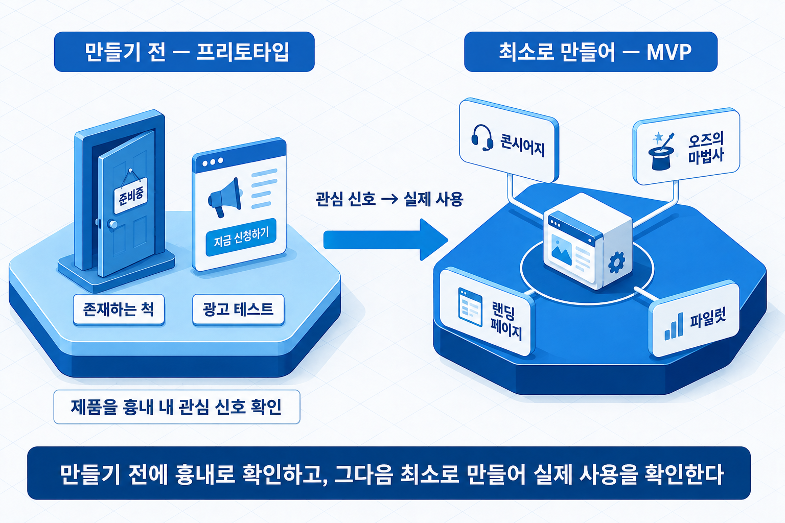
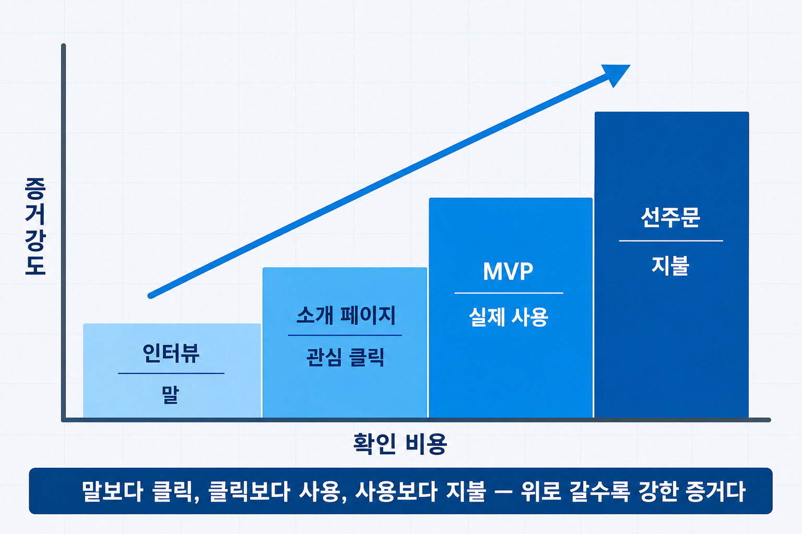

# I-15. 수요 검증 기법 — 고객 인터뷰·프리토타이핑·최소기능제품(MVP)

인터뷰에서는 모두가 긍정적으로 답했지만, 정작 아무도 사지 않는다. 수요를 확인했다고 믿고 제품을 만든 팀이 자주 마주치는 결과다. 앞 장(→ [I-14장](I-14_고객개발_린스타트업.md))이 "왜 검증하는가"의 골격을 세웠다면, 이 장은 그 위에서 **실제로 무엇을 묻고 무엇을 만드는가**를 다룬다. 고객 인터뷰 설계, 프리토타이핑(Pretotyping), 최소기능제품(Minimum Viable Product, MVP)이 그 도구다.

핵심 기준 하나를 먼저 세워 둔다. **긍정적인 답변은 약한 증거이고, 실제 지불은 강한 증거다.** 이 장의 모든 기법은 결국 "얼마나 강한 증거를 얻는가"로 정렬된다.

## 무엇을 검증할 것인가 — 가설의 세 종류

검증을 시작하기 전에, 무엇이 틀리면 사업이 성립하지 않는지부터 골라야 한다. 사업 가설은 대개 세 종류로 나뉜다.

- **수요 가설** — 고객이 이것을 원하는가
- **실현 가설** — 우리가 이것을 만들 수 있는가
- **생존 가설** — 이 구조로 수지가 맞는가

셋 중 가장 먼저 확인할 것은 **수요 가설**이다. 만들 수 있고 수지도 맞지만 아무도 원하지 않는 제품이 가장 흔한 실패이기 때문이다.

검증하려면 가설을 **확인 가능한 문장**으로 바꿔야 한다. "고객이 좋아할 것이다"는 참·거짓을 판별할 수 없다. 알베르토 사보이아(Alberto Savoia)는 이를 "적어도 대상의 몇 퍼센트가 어떤 행동을 할 것이다"라는 형식으로 적기를 권한다. 예를 들어 "소개 페이지를 본 방문자의 5% 이상이 사전 신청을 남길 것이다"처럼, **대상·비율·행동**을 분명히 정하면 결과로 참·거짓이 판별된다.

## 고객 인터뷰는 어떻게 묻는가

수요 가설을 확인하는 첫 도구는 인터뷰다. 그런데 인터뷰는 잘못 물으면 오히려 잘못된 확신을 준다.

가장 큰 함정은 **내 아이디어를 설명하고 "어떠세요?"라고 묻는 것**이다. 상대는 예의상 칭찬하고, 그 칭찬을 수요로 착각하게 된다. 롭 피츠패트릭(Rob Fitzpatrick)은 저서 『The Mom Test』(2013)에서, 어머니에게 물어도 거짓말이 나오지 않을 질문법을 세 원칙으로 정리했다.

- **내 아이디어가 아니라 상대의 삶을 묻는다** — "이런 제품 사시겠어요?"가 아니라 "지금 그 일을 어떻게 하고 계세요?"
- **미래의 가정이 아니라 과거의 행동을 묻는다** — "그런 게 있으면 쓰실래요?"가 아니라 "마지막으로 그 문제를 겪었을 때 어떻게 하셨어요?"
- **의견이 아니라 사실을 묻는다** — "좋은 아이디어 같아요?"가 아니라 실제로 무엇을 했고 얼마를 썼는지

미래·가정·의견을 물으면 상대는 상상 속의 답을 하고, 과거·행동·사실을 물으면 검증에 쓸 수 있는 증거가 남는다.

인터뷰의 마지막에는 **작은 약속을 요청**한다. 시간(다음 미팅), 평판(동료 소개), 돈(선입금·사전 예약) 중 하나를 부탁해 보는 것이다. 상대가 이를 거절할 수 있어야 유효한 신호가 된다. 말로는 누구나 긍정하지만, 무언가를 실제로 약속해 달라고 하면 실제 관심과 예의상 칭찬이 구분된다.

## 만들기 전에 확인하는 법 — 프리토타이핑

인터뷰로 관심을 확인했다면, 다음은 그 관심이 **행동으로 이어지는지**를 본다. 여기서 흔한 실수가 곧바로 제품을 만드는 것이다. 사보이아는 "제대로 만들기(Prototyping)" 이전에 "맞는 것을 만드는지(Pretotyping)"부터 확인하라고 말한다. 프리토타이핑은 **제품을 만들지 않고도 수요 신호를 얻는** 방법이다.

- **존재하는 척(Fake Door)** — 아직 없는 기능·제품을 있는 것처럼 소개 페이지·버튼으로 노출하고, 클릭·신청 수로 관심을 측정한다.
- **사람이 대신(Mechanical Turk)** — 자동화처럼 보이는 일을 뒤에서 사람이 수행해, 기술을 만들기 전에 반응을 확인한다.
- **자동인 척(Wizard of Oz)** — 겉은 완성된 서비스처럼 보이지만 내부는 수동으로 운영해, 사용 흐름을 검증한다.
- **소유한 척(Pretend-to-Own)** — 실제로 갖추기 전에 빌리거나 흉내 내어, 그 조건에서 사람들이 실제로 쓰는지 본다.

공통점은 **적은 비용으로 실제 행동을 관찰**한다는 것이다. "관심 있다"는 응답보다 소개 페이지의 신청 버튼을 누른 행동이 더 강한 증거다.

## 최소기능제품(MVP)이란 무엇인가

프리토타입으로 수요 신호를 확인했다면, 이제 **핵심 가치를 실제로 전달**해 본다. 이때 만드는 것이 최소기능제품(MVP)이다.

MVP는 에릭 리스(Eric Ries)가 대중화한 개념으로, **핵심 가설 하나를 검증하는 데 필요한 최소한의 기능만 갖춘 제품**이다. 완성품의 축소판이 아니다. 목적은 가능한 한 적은 노력으로 가능한 한 많은 검증된 학습을 얻는 것이다.

검증하려는 가설에 따라 MVP의 형태가 달라진다.

| MVP 유형 | 방식 | 무엇을 확인하는가 |
|---------|------|--------------|
| **콘시어지(Concierge)** | 기술 없이 사람이 직접 서비스를 수행 | 수요의 실재·지불 의향 |
| **오즈의 마법사(Wizard of Oz)** | 겉은 자동, 내부는 수동 운영 | 사용 흐름·UX 반응 |
| **랜딩 페이지(Landing Page)** | 소개 페이지와 신청만 제작 | 관심의 크기·전환율 |
| **파일럿(Pilot)** | 핵심 기능만 갖춘 실제 제품 | 핵심 가치 전달·사용 패턴 |

MVP의 원칙은 **가설 하나에 MVP 하나**다. 무엇을 확인하려는지 정하지 않고 만들면, 어떤 결과가 나와도 배우는 것이 없다. 만드는 것 자체가 목적이 되면 검증이 아니라 단순한 개발에 그친다.

MVP는 시제품(프로토타입)이나 파일럿 양산과는 다르다. 시제품은 **기술이 구현되는지**를 확인하고, MVP는 **고객이 원하는지**를 확인한다. 개발 단계의 시제품·파일럿 구분은 신제품 개발·양산·품질 장(→ [II-7장](II-07_신제품개발_양산_품질.md))에서 따로 다룬다.

> 그림 1 — 만들기 전 프리토타입에서 최소로 만드는 MVP로. 만들기 전에 흉내로 확인하고, 그다음 최소로 만들어 실제 사용을 확인한다.

## 실험을 어떻게 고르는가 — 증거 강도의 사다리

지금까지의 기법은 얻는 증거의 강도가 저마다 다르다. 데이비드 블랜드(David Bland)와 알렉산더 오스터왈더(Alexander Osterwalder)는 저서 『Testing Business Ideas』(2019)에서 실험을 크게 둘로 나눈다.

- **발견 실험** — 인터뷰·검색어 추이·소개 페이지처럼 **빠르고 저렴하지만 증거가 약한** 방법
- **검증 실험** — 선주문·사전 결제·유료 예약처럼 **느리고 비싸지만 증거가 강한** 방법

핵심은 **비용을 낮추면서 증거를 강하게** 만드는 조합이다. 처음에는 저렴한 발견 실험으로 방향을 좁히고, 유망한 가설만 비용이 드는 검증 실험으로 확인한다.

증거의 강도를 한 줄로 세우면 이렇게 된다. **구두의 호감(인터뷰) < 관심의 클릭(소개 페이지) < 실제 사용(MVP) < 실제 지불(선주문)**. 위로 갈수록 확인 비용은 커지지만 확신은 강해진다. "고객이 비용을 지불했다"는 그 무엇보다 강한 수요의 증거다.

> 그림 2 — 증거 강도의 사다리. 말보다 클릭, 클릭보다 사용, 사용보다 지불 — 위로 갈수록 강한 증거다.

## 사업계획에서의 위치

수요 검증 기법은 사업계획에서 "이 수요가 실재한다"를 증거로 보여야 하는 요소의 근거가 된다.

| 사업계획 구성 요소 | 이 장의 내용이 답하는 것 |
|------|------|
| 문제 정의·수요 확인 | 수요 확인 방법과 결과 |
| 실행 계획 | 시제품·검증 계획, 단계별 실증 계획 |
| 초기 검증 증거 | 사전 신청·선주문 등 |

이 장의 범위는 강한 증거를 얻는 기법까지다. 다음 장(→ [I-16장](I-16_PMF_측정.md))에서는 이렇게 모은 증거로 **"도달했다"를 어떻게 판정하는가** — 제품-시장 적합성(PMF)의 측정과 판단을 다룬다.

## 연결 장

- 선행: (→ [I-14장](I-14_고객개발_린스타트업.md)) 고객개발과 린스타트업
- 후행: (→ [I-16장](I-16_PMF_측정.md)) PMF 측정
- 참조: (→ [II-7장](II-07_신제품개발_양산_품질.md)) 신제품 개발·양산·품질 — 시제품·파일럿과의 구분
