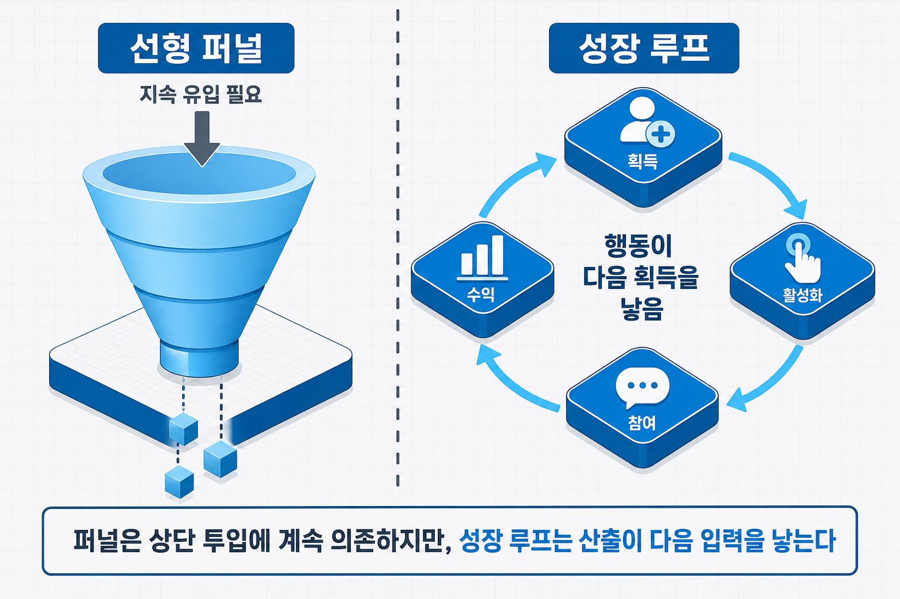
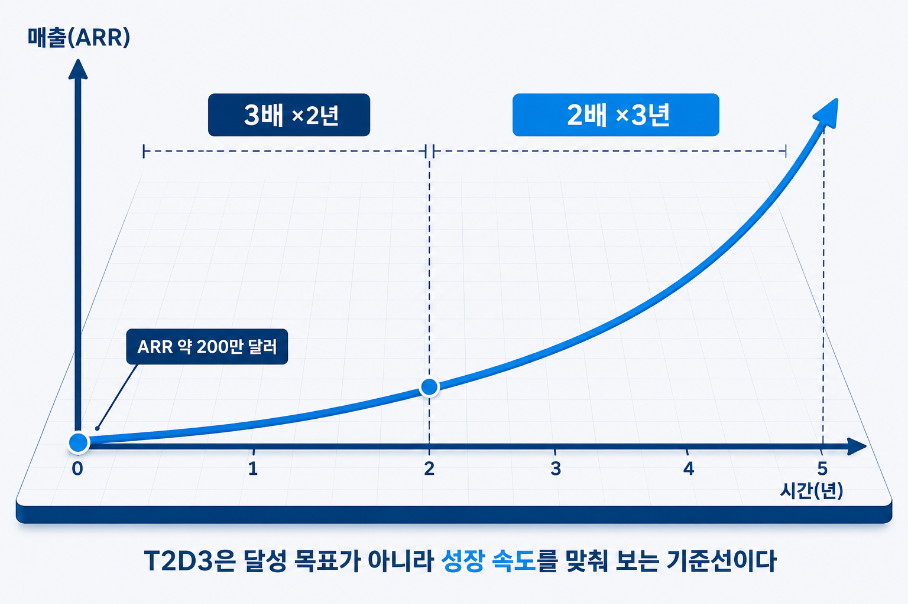

# I-17. 창업·스케일업 성장 전략 — 성장 루프·T2D3·블리츠스케일링

제품이 시장에 맞는다는 것을 확인했다면(PMF), 다음 물음은 하나로 좁혀진다 — **"이제 어떻게 키우는가"**다. 앞 장(→ [I-16장](I-16_PMF_측정.md))이 "성장해도 되는 시점인가"를 판정했다면, 이 장은 그다음 단계, 곧 검증된 사업을 확장하는 전략을 다룬다.

성장은 "판매를 더 늘리는 것"과 다르다. 어떤 구조로 성장하는가에 따라 같은 노력이 복리로 쌓이기도 하고, 투입을 멈추는 순간 멈추기도 한다. 이 장은 그 구조를 읽는 세 가지 틀 — 성장 루프, 성장 속도 벤치마크(T2D3), 블리츠스케일링을 정리한다.

## 스타트업과 스케일업은 어떻게 다른가

두 단어는 흔히 섞여 쓰이지만 가리키는 단계가 다르다.

- **스타트업** — 반복 가능한 사업 모델을 **탐색**하는 단계다. 무엇을 팔지, 누구에게 팔지가 아직 확정되지 않았다.
- **스케일업(Scale-up)** — 검증된 모델을 **확장**하는 단계다. 성장 엔진이 확인되었고, 이제 이를 본격적으로 성장시킨다.

경제협력개발기구(OECD)는 이 후자를 **고성장기업**으로 정의한다. 기점에 직원 10인 이상이면서, 이후 3년간 매출 또는 고용이 연평균 20% 이상 성장하는 기업이다. 영국 스케일업 연구기관(ScaleUp Institute)이 이 범주를 "스케일업"으로 재명명하면서 용어가 정착했다.

구분이 중요한 이유는 단계마다 경영의 초점이 다르기 때문이다. 탐색기에는 검증이 우선이고, 확장기에는 검증된 것을 빠르고 효율적으로 반복하는 일이 우선이다. 아직 모델이 확정되지 않았는데 확장부터 시작하면, 검증되지 않은 방향으로 자원이 흩어진다.

## 성장의 출발점은 왜 PMF 다음인가

성장 전략을 논하기 전에 전제를 확인해야 한다. **성장은 제품-시장 적합성(PMF) 위에서만 복리로 쌓인다.**

PMF에 이르지 못한 제품을 확장하는 것은 바닥에 구멍이 난 그릇에 물을 붓는 일과 같다. 유입을 아무리 늘려도, 남지 않는 사용자가 그만큼 빠져나간다. 획득에 쓴 비용은 회수되지 않고, 성장은 투입을 멈추는 순간 원점으로 돌아간다.

그래서 확장의 순서는 분명하다. 먼저 잔존이 뒷받침되는 상태(PMF)를 확인하고(→ [I-16장](I-16_PMF_측정.md)), 그 위에서 성장 엔진을 가동한다. 이 장이 다루는 성장 전략은 모두 "PMF 이후"를 전제로 한다.

## 퍼널에서 성장 루프로

성장을 어떻게 그리는가에 따라 전략이 달라진다. 오랫동안 표준이던 그림은 **퍼널(funnel — 깔때기형 전환 구조)**이다.

퍼널은 위에서 아래로 흐르는 선형 구조다. 상단에서 잠재 고객이 유입되면 단계를 거치며 일부가 남고, 아래에서 전환된다. 문제는 이 구조가 **상단 투입에 계속 의존**한다는 점이다. 광고를 멈추면 유입이 멈추고, 유입이 멈추면 성장도 멈춘다. 성장의 동력을 매번 외부에서 조달해야 한다.

**성장 루프(Growth Loop)**는 이 구조를 순환으로 바꾼다. 사용자의 행동이 다음 사용자의 획득을 낳는 자기강화 고리다. 한 사용자가 만든 결과가 다음 유입의 입력이 되므로, 성장이 안에서 재생산된다.

- **콘텐츠 루프** — 사용자가 만든 콘텐츠가 검색에 노출되어 새 사용자의 유입으로 이어진다
- **추천 루프** — 만족한 사용자가 다른 사용자를 초대하고, 초대받은 사용자가 다시 초대한다
- **네트워크 루프** — 사용자가 늘수록 제품의 가치가 커져 이탈이 줄고 유입이 는다

자사에 맞는 루프를 찾는 방법은 단순하다. **지금 확보한 사용자가 만들어 내는 산출물이 무엇인지**를 보고, 그 산출물이 다음 사용자의 유입으로 이어지도록 연결되는지를 확인하는 것이다. 콘텐츠가 쌓이는 제품이라면 콘텐츠 루프, 사용자끼리 초대가 자연스러운 제품이라면 추천 루프가 후보가 된다. 억지로 루프를 만드는 것이 아니라, 제품이 이미 만들어 내는 흐름 중 어느 것이 스스로 순환할 수 있는지를 찾는다.

퍼널과 루프는 대립하는 것이 아니라 층위가 다르다. 퍼널이 개별 전환 과정을 그린다면, 루프는 그 과정이 스스로를 다시 순환시키는 구조를 그린다. 지속 가능한 성장을 설계하려면, 외부 유입에만 의존하지 않고 **자기강화 고리를 하나라도 확보**하는 것이 관건이다.

> 그림 1 — 선형 퍼널과 성장 루프. 퍼널은 상단 투입에 계속 의존하지만, 성장 루프는 산출이 다음 입력을 낳는다.

## 얼마나 빨리 성장해야 하는가 — T2D3

성장 루프를 확보했다면, 다음 물음은 속도다. **T2D3**는 벤처투자사 배터리 벤처스(Battery Ventures)가 2015년 정리해 알려진, 고속 성장 사업이 참고하는 성장 벤치마크다.

이름은 성장 배수의 순서를 줄인 것이다. 연간 반복 매출(Annual Recurring Revenue, ARR)이 일정 궤도(약 200만 달러)에 오른 뒤, **2년 동안 매년 3배(Triple)**, 이어 **3년 동안 매년 2배(Double)** 성장하는 경로를 뜻한다. 기업 대상 소프트웨어(B2B SaaS) 분야에서 빠르게 성장한 기업들이 지나온 궤적을 정리한 기준이다.

T2D3의 효용은 "이 수치를 반드시 달성하라"가 아니라 **성장 기대치를 맞춰 보는 기준**에 있다. 자사의 성장 속도가 이 곡선과 어디에서 벌어지는지 보면, 지금 성장이 빠른지 느린지를 직관이 아니라 기준으로 판단할 수 있다.

다만 한계가 분명하다. 이 벤치마크는 소프트웨어 사업의 특성(낮은 한계비용·빠른 확장)을 전제로 한다. 제조·하드웨어처럼 확장에 물리적 투자가 필요한 사업에는 그대로 적용되지 않는다. 자사의 사업 구조에 맞게 배수와 기간을 조정해 읽어야 한다.

> 그림 2 — T2D3 성장 곡선. T2D3은 달성 목표가 아니라 성장 속도를 맞춰 보는 기준선이다.

## 속도를 효율보다 앞세울 때 — 블리츠스케일링

성장 전략에서 자주 인용되지만 자주 오해되는 개념이 **블리츠스케일링(Blitzscaling)**이다. 리드 호프먼(Reid Hoffman)이 정리한 이 전략은, 불확실성을 감수하고 **효율보다 속도를 앞세워** 시장을 선점하는 확장 방식이다.

일반적인 스케일링은 효율을 유지하며 성장한다. 반면 블리츠스케일링은 낭비와 불확실성을 감수하더라도 경쟁자보다 먼저 시장을 차지하는 데 자원을 집중한다. 속도를 위해 효율을 일시적으로 희생하는 선택이다.

핵심은 이 전략에 **전제 조건이 있다는 것**이다. 승자가 시장 대부분을 차지하는 구조(승자독식), 또는 먼저 규모를 확대한 쪽이 유리해지는 네트워크 효과가 작동하는 시장에서만 정당화된다. 이런 전제가 없는 시장에서 속도만 추구하면, 효율을 희생한 대가만 남고 선점의 이득은 얻지 못한다.

블리츠스케일링은 모든 사업이 따라야 할 규범이 아니라, **특정 시장 조건에서만 선택하는 전략**이다. 자사의 시장이 승자독식·네트워크 효과 구조인지를 먼저 확인하고, 그렇지 않다면 효율을 유지하는 정공법이 더 안전하다.

## 사업계획에서의 위치

성장 전략의 세 틀은 사업계획에서 성장 계획의 논리로 쓰인다.

| 사업계획 구성 요소 | 이 장의 내용이 답하는 것 |
|------|------|
| 성장 전략 | 확장 경로·성장 모델 서술 |
| 사업화 이후 계획 | 후속 성장·시장 확산 방안 |
| 스케일업 로드맵 | 성장 단계별 계획 |

이 장은 성장의 **구조**를 그리는 데까지다. 성장을 무엇으로 **측정**하는가 — 성장 지표(North Star·AARRR·단위 경제성)는 다음 장(→ [I-18장](I-18_성장지표.md))에서 이어진다.

## 연결 장

- 선행: (→ [I-16장](I-16_PMF_측정.md)) PMF 측정
- 후행: (→ [I-18장](I-18_성장지표.md)) 성장 지표
- 참조: (→ [I-12장](I-12_비즈니스모델_혁신.md)) 비즈니스 모델 혁신 — 네트워크 효과·플랫폼 구조
