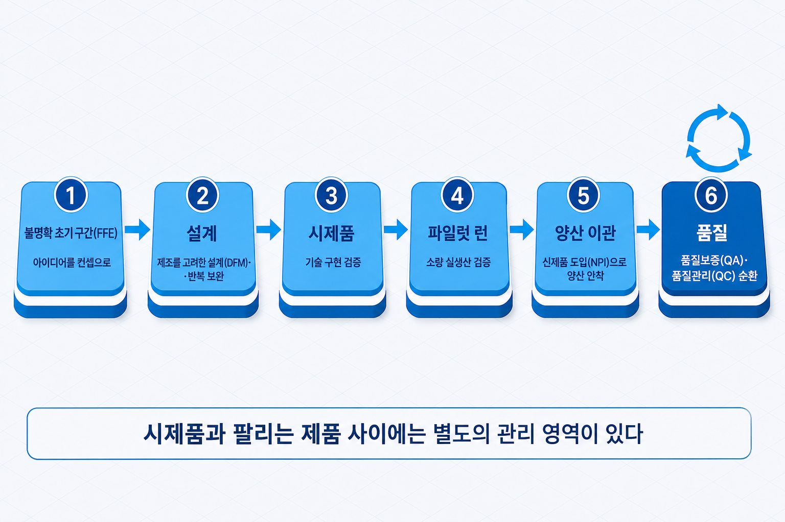
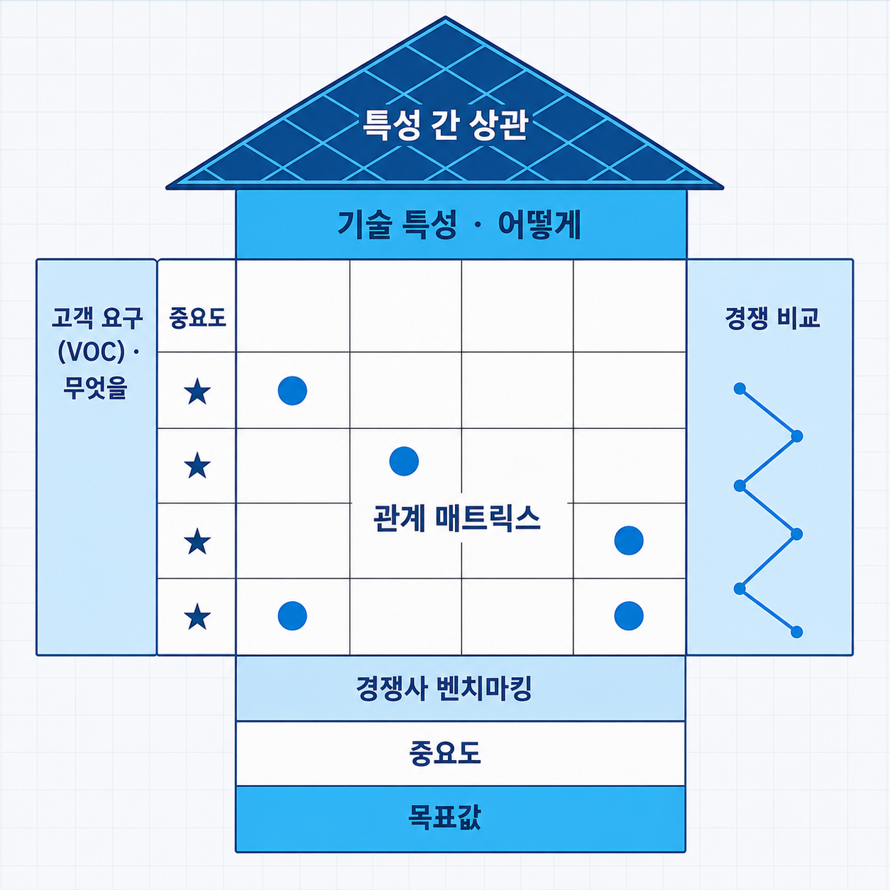

# II-7. 신제품 개발·양산·품질 — NPD 8단계에서 품질관리까지

시제품이 완성됐다고 해서 팔 수 있는 제품이 생긴 것은 아니다. 기술 개발을 마치고 출시를 준비하는 조직이 가장 자주 직면하는 간극이 여기에 있다 — 연구실에서 작동하는 물건과, 일정한 품질로 반복 생산되어 고객에게 전달되는 제품 사이에는 별도의 관리 영역이 존재한다. 앞 장(→ [II-6장](II-06_RnD_리스크관리.md))까지의 프로젝트 관리 세 장이 "개발을 어떻게 수행하는가"를 다뤘다면, 이 장은 그 결과물이 제품이 되기까지의 신제품 개발 프로세스 전체 — 아이디어 관리, 고객 요구의 사양 번역, 양산 전환, 품질관리 — 를 다룬다. 하드웨어 제조를 기준으로 서술하되, 소프트웨어·서비스에 대응시키는 관계는 말미에 별도로 정리한다.

> 그림 1 — 제품화 단계 지도: 개발에서 양산·품질까지. 시제품과 팔리는 제품 사이에는 별도의 관리 영역이 있다.

## 신제품 개발 프로세스(NPD) — 아이디어에서 출시까지

신제품 개발(New Product Development, NPD) 프로세스는 아이디어가 팔리는 제품이 되기까지의 과정을 단계로 관리하는 틀이다.

그 과정의 출발점은 정돈된 계획이 아니라 안개처럼 불명확한 구간이다. Preston Smith와 Donald Reinertsen(1991)이 명명한 **불명확 초기 구간**(Fuzzy Front End, FFE) — 아이디어는 있으나 컨셉·목표 시장·사양이 아직 확정되지 않은 상태다. 이 구간이 길어질수록 전체 개발이 지연되며, 구간을 빨리 벗어나게 하는 가속 요인은 고객에 대한 이해다. 고객 요구를 구조적으로 파악하는 방법은 고객 이해와 문제 정의 장(→ [I-5장](I-05_고객이해_문제정의.md))에서 다뤘다.

FFE를 벗어난 뒤의 흐름은 단계 모델로 관리한다. 학술 준거로는 Booz Allen Hamilton(1982)의 7단계 모델과 Philip Kotler의 교과서 8단계 모델이 널리 인용되며, 하드웨어 제품화 실무에서는 다음의 8단계 일반형으로 정리된다 — ① 니즈 인식 ② 아이디어 구체화 ③ 컨셉 확정 ④ 사양·예산 확정 ⑤ 상세 설계 ⑥ 시제품 제작 ⑦ 양산 ⑧ 출시. 단계 이름 자체보다 중요한 것은 각 단계에서 "무엇이 확정되어야 다음으로 넘어가는가"이다. 사양과 예산이 확정되지 않은 상태로 상세 설계에 진입하면 이후의 모든 변경이 재설계 비용으로 이어진다.

단계 사이에 심사 관문을 두고 계속·중단을 판정하는 구조가 Robert Cooper(1980년대)의 스테이지 게이트(Stage-Gate)다. 게이트의 구조와 판정 기준은 스테이지 게이트 장(→ [II-3장](II-03_스테이지게이트.md))을 참조하고, 이 장에서는 각 단계의 산출물 — 컨셉 문서·사양서·시제품·파일럿 결과 — 이 게이트의 심사 대상이 된다는 연결만 확인해 둔다.

## QFD — 고객 요구를 제품 사양으로 변환

고객이 원하는 것과 설계자가 정하는 사양은 언어가 다르다. 고객은 "가볍고 오래 쓰면 좋겠다"라고 말하고, 설계자는 중량 몇 그램·배터리 몇 시간으로 결정해야 한다. 이 번역을 체계화한 도구가 **품질기능전개**(Quality Function Deployment, QFD)다 — Yoji Akao가 Shigeru Mizuno와 함께 개발해 1972년 미쓰비시 중공업 고베 조선소에서 처음 본격 적용된 방법론으로, 고객의 소리(Voice of Customer, VOC)를 기술 특성으로 전개한다.

QFD의 대표 양식이 품질의 집(House of Quality)이다 — John Hauser와 Don Clausing(1988)이 하버드 비즈니스 리뷰에서 소개하며 널리 알려진 명칭이다. 왼쪽에 고객 요구와 중요도를, 위쪽에 기술 특성을 배열하고, 중앙 매트릭스에서 둘의 관계 강도를 표시한다. 꼭대기의 삼각형 지붕은 기술 특성 사이의 상관(한쪽을 올리면 다른 쪽이 희생되는 관계)을, 오른쪽은 경쟁 제품 대비 평가를, 아래쪽은 경쟁사 벤치마킹과 특성별 중요도·목표값을 담는다.

> 그림 2 — 품질의 집(House of Quality) 구조. 고객의 언어를 설계의 언어로 번역하는 한 장이다.

품질의 집이 주는 실질 효용은 두 가지다. 고객이 중요하게 여기는 요구가 어느 기술 특성에도 연결되지 않으면 설계 누락이고, 어느 고객 요구와도 연결되지 않는 특성에 개발비를 쓰고 있다면 과잉 설계다. 한 장의 표에서 누락과 과잉이 동시에 드러난다.

## 양산 전환 — 시제품에서 대량 생산으로

양산 전환의 실패는 대부분 설계가 끝난 뒤에 발견된다. 시제품은 숙련된 엔지니어가 한 대씩 조립하지만, 양산은 일반 작업자와 설비가 수천 대를 같은 품질로 만들어야 하기 때문이다. 그래서 양산 용이성을 설계 단계에서 미리 반영하는 접근이 **제조를 고려한 설계**(Design for Manufacturing, DFM)다. 부품 수를 줄이고, 조립 방향을 단순화하고, 공차(허용되는 치수 오차 범위)를 표준 공정 범위 안에 두는 식이다. 한 번의 설계 반영으로 끝나는 활동은 아니며, 시제품 제작과 공정 검증에서 드러나는 제약을 다시 설계로 되돌리는 반복 보완이 DFM의 실제 운용 방식이다. 같은 발상을 조립·검사·원가 관점에 각각 적용한 파생 기법들이 있으며, 통칭 Design for X라 부른다.

설계가 양산 가능해도 곧바로 대량 생산에 들어가지는 않는다. 그 사이에 파일럿 런(pilot run, 파일럿 생산)이 있다 — 실제 생산 라인·실제 인력·최종 부품으로 소량(대개 50~200개)을 생산해 공정 오류와 불량률을 조기에 발견하는 실검증 단계다. 시제품에서 보이지 않던 문제의 다수가 이 단계에서 드러난다.

파일럿을 통과한 뒤 양산 안착까지의 도입 관리가 신제품 도입(New Product Introduction, NPI)이다. 금형(양산용 성형 틀)과 생산 라인 셋업, 부품별 최소 주문 수량(Minimum Order Quantity, MOQ) 협의, 공급망 준비가 여기에 포함된다. 마지막 관문은 양산 이관 — 제품의 소유권이 개발팀에서 운영·생산팀으로 넘어가는 절차다. 이관 문서와 담당 교육이 부실하면 개발팀이 양산 문제 대응에 계속 투입되어 다음 개발이 지연된다. 이관의 마찰은 개발 조직을 어떻게 편성했는가에 따라서도 달라지는데, 조직 구조 유형(기능 조직·경량 팀·중량 팀)은 R&D 조직·기술인력 장(→ [III-6장](III-06_RnD조직_기술인력.md))에서 자세히 다룬다.

이 지점에서 용어 하나를 구분해 둔다. **시제품·파일럿 런·최소기능제품(MVP)은 목적이 다른 세 가지 검증**이다 — 시제품은 기술이 구현되는지를, 파일럿 런은 생산 체계가 작동하는지를, MVP는 시장 수요가 존재하는지를 확인한다. MVP는 수요 검증 기법 장(→ [I-15장](I-15_수요검증.md))에서 자세히 다룬다.

## 생산·운영 — 양산 이후에 시작되는 관리

양산이 시작되면 관리의 대상이 일회성 프로젝트에서 반복 프로세스로 바뀐다. 조달 → 생산 계획 → 실행 → 품질 확인 → 유통의 사이클이 매주 반복되고, 성과는 원가·리드타임(주문에서 납품까지의 소요 시간)·불량률로 측정된다.

이 반복 프로세스를 개선하는 대표 접근이 **린 생산**(Lean Manufacturing)이다. 가치 흐름의 관점에서 재고·대기·과잉 생산 같은 낭비를 제거하는 방법론으로, 도요타 생산방식을 일반화한 개념이며 James Womack과 Daniel Jones(1996)의 『Lean Thinking』으로 널리 알려졌다. 이름이 유사한 린스타트업은 가설 검증 방법론으로 대상이 전혀 다르다 — 고객개발·린스타트업 장(→ [I-14장](I-14_고객개발_린스타트업.md))에서 다뤘다.

부품 조달·재고·물류의 관리는 공급망 관리(Supply Chain Management, SCM)의 영역이다. 초기 기업에는 특히 MOQ와 조달 리스크가 문제가 된다 — 핵심 부품의 MOQ가 판매 계획보다 크면 재고가 현금을 잠식하고, 단일 공급처에 의존하면 한 곳의 지연이 전체 출시를 지연시킨다.

## 품질관리 — QA와 QC는 무엇이 다른가

품질보증(Quality Assurance, QA)과 품질관리(Quality Control, QC)는 실무에서 가장 자주 혼용되는 개념 쌍이다. QA는 예방·프로세스 지향이다 — 불량이 나오지 않도록 개발·생산 프로세스 자체를 설계하고 관리한다. QC는 검사·제품 지향이다 — 만들어진 제품을 검사해 불량을 걸러낸다. QC만으로 품질을 확보하려는 조직은 검사 비용이 늘어나는 반면, QA가 갖춰진 조직은 불량의 원인을 상류에서 차단한다.

예방 접근의 대표 도구가 **고장모드영향분석**(Failure Mode and Effects Analysis, FMEA)이다. 설계와 공정의 잠재 고장 유형을 사전에 나열하고 심각도·발생 가능성·검출 가능성으로 우선순위를 정해 대책을 세운다. 리스크·불확실성 관리 장(→ [II-6장](II-06_RnD_리스크관리.md))에서 다룬 리스크 관리 프로세스의 품질 영역 대응물이라 이해하면 정확하다.

품질 체계의 국제 기준은 ISO 9001이다. 품질경영시스템 요구사항을 정의한 표준으로, 고객 중심·리더십·인원 참여·프로세스 접근·개선·증거 기반 의사결정·관계 관리의 7원칙에 기초한다. 인증은 그 자체가 품질을 보증하기보다, 거래처·발주처와의 신뢰 기반으로 기능한다. 현행 기준은 2015판이며, 개정판(ISO 9001:2026)은 2026년 9월 16일 발간 예정이다(최종 국제표준안 승인 2026년 4월). 발간 후 3년의 전환기간(2029년 9월까지)이 주어지므로, 신규 인증을 준비 중이라면 개정 일정을 함께 확인하는 것이 안전하다.

통계 기반의 개선 방법론으로는 모토로라(1986)에서 출발해 GE로 확산된 식스시그마(Six Sigma)가 있다. 정의–측정–분석–개선–관리의 DMAIC 절차로 공정 변동을 줄여 가며, 목표 수준은 100만 번의 기회당 결함 3.4개다 — 사실상 "불량이 통계적 예외가 되는 수준"까지 변동을 관리하겠다는 선언이다.

제품화와 품질의 도구는 디지털 기술로 빠르게 보강되고 있다. 설계 단계에서는 생성형 AI 도입 조직이 28%에 이르고 설계 주기를 최대 70% 단축한 사례가 보고되며(StartUs Insights, 2026), 물리적 시제품 제작 전에 가상 모델로 성능을 검증하는 디지털 트윈은 개발 기간을 20~50% 줄이고 시제품 반복 횟수를 낮춘다. 품질 영역에서는 AI 비전 검사의 도입이 확대되고 있고, Gartner(2026)는 2030년까지 생산·품질 운영의 10%를 반자율 AI 에이전트가 수행할 것으로 전망한다(현재 약 2%). 도구가 교체되어도 이 장에서 다룬 골격 — 예방 중심의 체계와 단계별 검증 — 은 그대로 유지된다.

## 소프트웨어·서비스에는 어떻게 적용되는가

제조 용어를 일반화하면 구조는 그대로 재사용된다. 이 장의 개념들은 다음과 같이 대응된다.

| 제조 개념 | 소프트웨어·서비스 대응 |
|-----------|----------------------|
| 양산 | 배포·운영 체계 (반복 가능한 전달) |
| 파일럿 런 | 베타 테스트·단계적 출시 |
| QA·QC | 테스트 체계·운영 모니터링 |
| 공급망 관리 | 외부 의존성(클라우드·외부 API) 관리 |

핵심은 형태가 아니라 본질의 동일성이다 — 한 번 만드는 능력과 반복해서 같은 품질로 전달하는 능력은 별개이며, 후자를 설계하는 일이 이 장의 주제다.

## 사업계획에서의 위치

| 사업계획 구성 요소 | 이 장의 내용이 답하는 것 |
|------|------|
| 사업화 계획 | 양산 체계·품질 확보 방안, 시제품 제작·성능 검증 계획 |
| 제품 개발·출시 일정 | 양산·품질 관리 계획 |
| 원가·생산 준비도 | 양산 준비도·생산 원가 구조·품질 체계 |

제품이 만들어지는 과정을 갖췄다면, 다음 질문은 "이 기술이 지금 어느 성숙 단계에 있는가"이다. 다음 장은 그 판정 척도를 다룬다.

## 연결 장

- 선행: (→ [II-6장](II-06_RnD_리스크관리.md)) R&D 리스크·불확실성 관리
- 후행: (→ [II-8장](II-08_기술성숙도.md)) 기술 성숙도 평가
- 참조: (→ [II-3장](II-03_스테이지게이트.md)) 스테이지 게이트 — 단계 산출물과 게이트 심사 / (→ [I-5장](I-05_고객이해_문제정의.md)) 고객 이해와 문제 정의 — VOC / (→ [I-14장](I-14_고객개발_린스타트업.md)) 고객개발·린스타트업 — 린 생산과의 구분 / (→ [I-15장](I-15_수요검증.md)) 수요 검증 기법 — MVP / (→ [III-6장](III-06_RnD조직_기술인력.md)) R&D 조직·기술인력 — 개발 조직 편성
