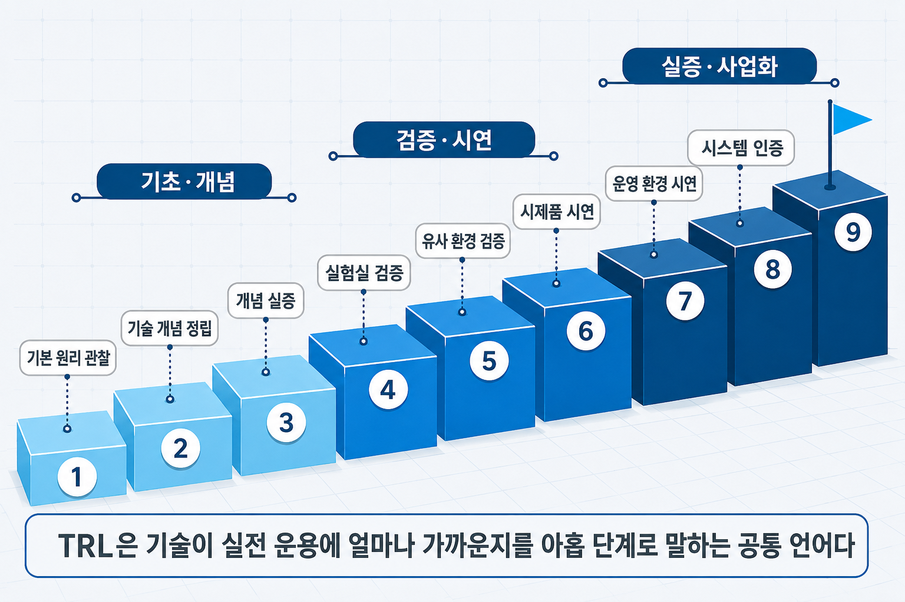
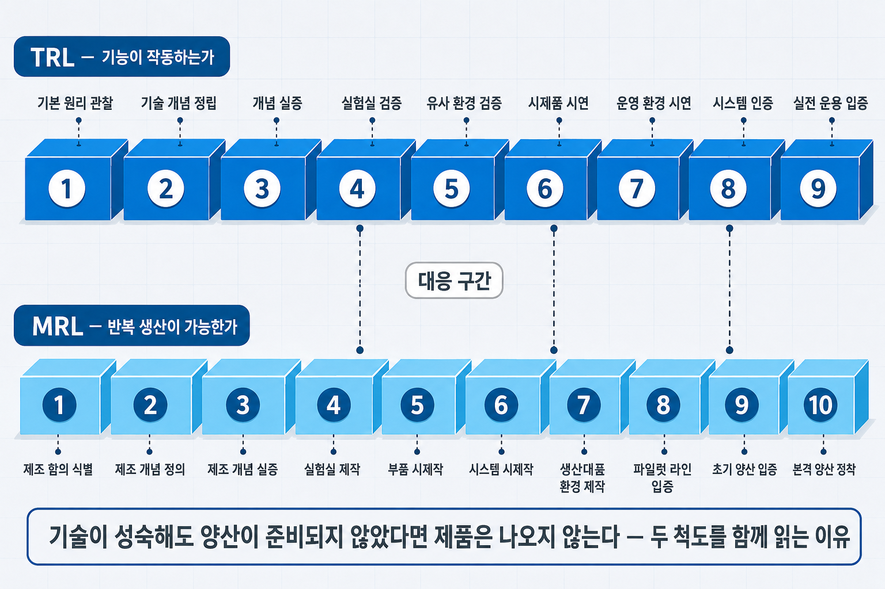
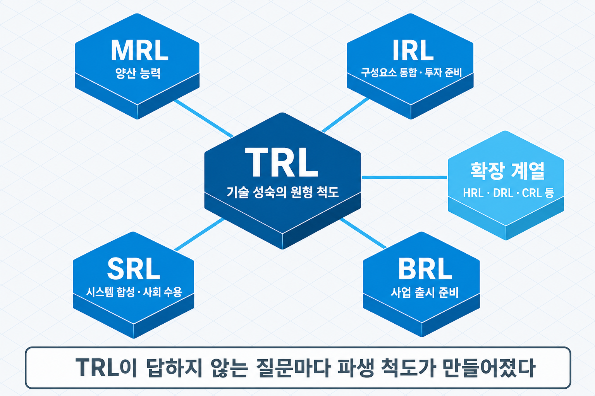

# II-8. 기술 성숙도 평가 — TRL 9단계와 xRL 계열

"우리 기술은 어디까지 왔는가"라는 질문에 연구 책임자는 "핵심 알고리즘 검증이 끝났다"고 답하고, 경영진은 "그래서 언제 제품이 되는가"를 되묻고, 투자자는 "남은 기술 리스크가 얼마인가"를 확인하려 한다. 같은 상태를 서로 다른 언어로 말하는 동안 개발 일정과 자금 계획은 어긋난 전제 위에 놓이기 시작한다. 이 소통 문제를 해결하는 공통 척도가 **기술성숙도**(Technology Readiness Level, TRL)다. 앞 장(→ [II-7장](II-07_신제품개발_양산_품질.md))이 시제품에서 양산·품질까지의 제품화 과정을 다뤘다면, 이 장은 그 과정에서 기술이 지금 어느 위치에 있는지를 측정하는 척도 — TRL 9단계와 그 확장 계열(xRL) — 를 다룬다.


> 그림 1 — TRL 9단계: 기술이 성숙해지는 경로. TRL은 기술이 실전 운용에 얼마나 가까운지를 아홉 단계로 표준화한 공통 척도다.

## TRL — 기술성숙도의 계보와 표준

기술성숙도(TRL)는 어떤 기술이 최종 목표 상태 — 실제 운용 환경에서의 성공적 작동 — 에 얼마나 가까운지를 1부터 9까지의 단계로 객관화한 척도다. 핵심 효용은 비교와 소통에 있다. 분야가 다른 기술이라도 같은 척도로 성숙 수준을 비교할 수 있고, 연구자·경영진·투자자가 "TRL 5"라는 한 마디로 같은 상태를 이해할 수 있다.

계보는 우주 개발에서 출발했다. NASA의 Stan Sadin이 1974년 7단계 척도로 처음 제안했고, 1989년 공식 정의를 거쳐 1990년대 John Mankins가 지금의 9단계 체계로 정비했다. 이후 유럽우주국(ESA)과 EU로 확산되어 EU 연구 프로그램 Horizon 2020(2014)이 전면 채택했으며, ISO 16290:2013으로 국제 표준화되었다. 한국에서도 국가연구개발 법령의 별표 「기술성숙도(TRL) 수준별 정의」로 9단계가 명문화되어, 정부 R&D의 공통 척도로 정착했다.

우주 기술을 위해 만들어진 척도가 전 산업으로 확산된 이유는 구조의 보편성 때문이다. 어떤 기술이든 "기초 원리 → 개념 → 검증 → 실증 → 운용"의 성숙 경로를 거치며, TRL은 그 경로 위의 현재 위치를 표시한다.

## TRL 9단계 — 각 단계는 무엇을 보는가

| 단계 | 정의 | 구간 |
|------|------|------|
| TRL 1 | 기본 원리 관찰·보고 | 기초연구 |
| TRL 2 | 기술 개념·응용 분야 정립 | 기초연구 |
| TRL 3 | 개념의 실험적 증명(분석·실험) | 기초연구 |
| TRL 4 | 실험실 환경에서 부품·시스템 검증 | 검증 |
| TRL 5 | 유사(relevant) 환경에서 부품·시스템 검증 | 검증 |
| TRL 6 | 유사 환경에서 시제품(prototype) 시연 | 시제품 |
| TRL 7 | 운영(operational) 환경에서 시제품 시연 | 실증 |
| TRL 8 | 시스템 완성·인증(qualified) | 실증 |
| TRL 9 | 실제 운영 환경에서 성공적 운용 입증 | 사업화 |

이 표의 핵심은 단계 상승의 본질이다. TRL이 올라간다는 것은 기능이 좋아졌다는 뜻이 아니라 **검증 환경이 올라갔다**는 뜻이다 — 실험실(TRL 4)에서 유사 환경(TRL 5~6)으로, 다시 실제 운영 환경(TRL 7 이상)으로. 같은 성능이라도 어느 환경에서 입증되었는가가 단계를 결정하며, 각 단계에는 그 환경에서의 검증 증거가 따라야 한다.

한국의 실무 통용 구분은 1~2 기초연구, 3~4 실험, 5~6 시작품, 7~8 실용화, 9 사업화다. 정부 R&D에서는 과제 유형에 따라 대상 구간을 달리 정의하기도 한다 — 원천기술형 과제는 초반부터 5단계 전후까지를, 혁신제품형 과제는 6~8단계를 중점 구간으로 두는 방식이다. 제도별 상세 구조는 이 장의 범위 밖이므로, 자신의 과제가 어느 구간을 요구하는지 해당 제도의 현행 기준으로 확인하는 것이 안전하다.

## TRL만으로 부족한 이유 — xRL 계열의 분화

TRL은 기술 자체의 성숙만 측정한다. 기능이 작동한다는 사실과, 그 기술이 제품이 되어 시장에 도달한다는 사실 사이에는 TRL이 답하지 않는 질문들이 남아 있다 — 적정 비용으로 반복 생산할 수 있는가, 다른 구성요소와 통합되는가, 사업으로 성립하는가, 사회가 받아들이는가. 이 공백을 메우기 위해 TRL의 단계 구조를 본뜬 파생 지표들이 만들어졌고, 통칭 **xRL 계열**이라 부른다.

가장 중요한 파생 지표는 **제조성숙도**(Manufacturing Readiness Level, MRL)다. 미국 국방부(DoD)가 정형화한 10단계 척도로, "설계 요구를 충족하는 제품을 적정 비용·일정으로 양산할 수 있는 능력"을 측정한다. TRL이 "기능이 작동하는가"를 묻는다면 MRL은 "같은 품질로 반복 생산이 가능한가"를 묻는다 — 앞 장(→ [II-7장](II-07_신제품개발_양산_품질.md))에서 다룬 시제품과 양산 사이의 간극을 척도로 만든 것이다. 하드웨어·딥테크 분야에서는 "TRL 7, MRL 5"처럼 두 지표를 병기해 기술은 성숙했으나 양산 준비는 미흡한 상태를 정확히 표현하는 방식이 확산되고 있다.

MRL 10단계는 개념(1~3) → 시제품(4~6) → 파일럿(7~8) → 산업(9~10)의 네 구간으로 구성된다.

| 단계 | 정의 | 구간 |
|------|------|------|
| MRL 1 | 제조 함의 식별 | 개념 |
| MRL 2 | 제조 개념 정의 | 개념 |
| MRL 3 | 제조 개념 실증 | 개념 |
| MRL 4 | 실험실 환경에서 제작 능력 확보 | 시제품 |
| MRL 5 | 유사 생산환경에서 부품 시제작 | 시제품 |
| MRL 6 | 유사 생산환경에서 시스템 시제작 | 시제품 |
| MRL 7 | 생산대표 환경에서 제작 입증 | 파일럿 |
| MRL 8 | 파일럿 라인 입증·초기 양산 착수 준비 | 파일럿 |
| MRL 9 | 저율 초기 양산(LRIP) 입증 | 산업 |
| MRL 10 | 본격 양산 가동·린 생산 정착 | 산업 |

TRL 표와 나란히 놓고 읽으면 두 척도의 초점 차이가 분명해진다 — TRL은 검증 **환경**이 올라가고, MRL은 생산 **체계**가 올라간다.


> 그림 2 — TRL과 MRL: 두 척도가 묻는 다른 질문. 기술이 성숙해도 양산이 준비되지 않았다면 제품은 나오지 않는다 — 두 척도를 함께 읽는 이유다.

MRL 외의 핵심 파생 지표는 다음과 같다.

| 지표 | 측정 대상 | 단계 |
|------|-----------|:---:|
| TRL | 기술 자체의 성숙·검증 수준 | 9 |
| MRL | 적정 비용·일정의 양산 능력 | 10 |
| IRL(통합) | 구성요소 간 통합·인터페이스 성숙도 | 9 |
| IRL(투자) | 사업모델 검증 기반의 투자 유치 준비도 | 가변 |
| SRL(시스템) | 다수 기술이 결합된 시스템 전체의 성숙도 | 합성 |
| SRL(사회) | 기술이 사회에 수용·적응되는 수준 | 9 |
| BRL | 기술 기반 사업의 출시 준비도 | 9 |

이 가운데 IRL(투자)은 성격이 다르다. Steve Blank가 2013년 제안한 Investment Readiness Level로, 엔지니어링 진척이 아니라 **사업모델 가설의 검증 진척**을 정량화한다. 검증의 방법론 자체는 고객개발·린스타트업 장(→ [I-14장](I-14_고객개발_린스타트업.md))에서 다룬 고객개발 체계가 담당하며, IRL은 그 진척을 투자자와 소통하는 척도 역할을 한다.


> 그림 3 — xRL 계열 지도: TRL에서 분화한 척도들. TRL이 답하지 않는 질문마다 파생 척도가 만들어졌다.

## 같은 약어, 다른 지표 — 인용 전에 확인할 중의성

xRL 계열을 인용할 때 가장 자주 발생하는 오류는 약어 충돌이다. 같은 약어가 기관과 맥락에 따라 전혀 다른 지표를 가리킨다.

| 약어 | 의미 A | 의미 B |
|------|--------|--------|
| IRL | Integration(구성요소 통합 — 시스템공학) | Investment(투자 준비 — 스타트업) |
| SRL | System(TRL×IRL 합성 — 복합 시스템) | Societal(사회적 수용 — EU·덴마크) |
| MRL | Manufacturing(양산 능력 — 美 DoD) | Market(시장 수요·경쟁 준비) |
| DRL | Data(AI용 데이터 품질) | Design(설계 타당성) |
| CRL | Commercialization(사업화 성숙) | Customer(고객 채택 준비) |

두 IRL은 약어만 같을 뿐 완전히 다른 도구다 — 하나는 인터페이스의 통합 위험을, 다른 하나는 사업모델 검증의 진척을 측정한다. 파생 지표 다수는 단일 표준 없이 기관·논문마다 정의와 단계 수가 다르다는 점도 함께 유의해야 한다. 실무 원칙은 하나다. **보고서·제안 문서에서 xRL 지표를 인용할 때는 첫 등장에서 풀네임과 출처를 1회 병기**하고, 이후 약어를 사용한다.

## 여러 축을 함께 읽는 방법 — 합성 프레임워크

단일 척도의 한계를 보완하기 위해 여러 지표를 결합하는 프레임워크도 정형화되어 있다.

**SRL(시스템성숙도)** 은 TRL과 IRL(통합)을 곱해 산출하는 합성 지수다. 개별 기술이 각각 성숙해도 통합이 미성숙하면 시스템 전체는 미성숙하다는 원리를 수치로 만든 것으로, 항공·국방 등 다수 기술이 결합되는 복합 시스템에서 사용된다.

**BRLa**(Balanced Readiness Level Assessment)는 TRL·MRL에 조직(ORL)·규제(RRL)·조달(ARL) 준비도를 더해 신흥 기술을 다축으로 평가하는 균형 프레임워크다. 기술과 양산이 준비되어도 규제 인허가나 조직 역량이 미성숙하면 사업화가 지연된다는 문제의식을 반영한다.

가장 실용적인 결합은 TRL-MRL 대응 매핑이다. 통상 TRL 1~3에 MRL 1~3, TRL 4~5에 MRL 4~5, TRL 6~7에 MRL 5~7, TRL 8~9에 MRL 7~9가 대응하며, 자사의 두 지표가 이 대응 범위에서 크게 어긋나 있다면 — 예컨대 TRL 8에 MRL 4라면 — 기술과 양산 사이의 준비 격차가 경고 신호로 드러난 것이다.

## 평가에서 자주 나오는 오류

**첫째, 근거 없는 상향 판정이다.** TRL의 단계 정의는 주장이 아니라 증거를 요구한다 — "유사 환경에서 검증했다"고 표기하려면 어떤 환경에서 무엇을 어떤 조건으로 시연했는지의 기록이 따라야 한다. 실험실 수준의 결과를 상위 단계로 표기하면 검증 환경과 단계가 어긋난 상태가 되고, 그 위에 수립된 개발 일정·자금 계획 전체가 어긋난 전제를 공유하게 된다.

**둘째, 최종 목표 단계만 제시하는 방식이다.** "완료 시 TRL 7 달성"이라는 한 줄에는 중간 진척을 확인할 장치가 없다. 단계별 목표(예: 1차년도 TRL 5 → 2차년도 TRL 7)와 각 단계의 검증 기준을 함께 정의해야 진척 관리가 가능해지고, 스테이지 게이트(→ [II-3장](II-03_스테이지게이트.md))의 게이트 판정 기준과도 연결된다.

두 오류의 공통 처방은 같다. 현재 단계는 보유한 검증 증거로 정직하게 판정하고, 목표 단계는 중간 검증 기준과 함께 제시하는 것이다.

## 초기 팀의 성숙도 판정 — 증거 체크리스트와 구간 관점

TRL은 주장이 아니라 증거로 판정한다는 원칙을 초기 팀이 실제로 적용하려면, 단계마다 "무엇이 있어야 그 단계라고 말할 수 있는가"의 목록이 필요하다. 아래 체크리스트는 각 단계의 정의를 **보유해야 할 기록**으로 바꾼 것이다. 자기 기술의 현재 단계를 판정할 때는 위에서부터 내려오며 증거가 끊기는 첫 단계의 바로 아래가 현재 단계다.

| 단계 | 이 단계라고 말하려면 있어야 할 증거 | 초기 팀의 흔한 오판 |
|------|------|------|
| TRL 1 | 기본 원리를 기술한 문헌·관찰 기록 | — |
| TRL 2 | 원리를 어떤 응용에 쓸지 정리한 개념 문서 — 예상 성능과 제약 포함 | 아이디어 문서만으로 TRL 3 이상을 주장 |
| TRL 3 | 핵심 기능 한 가지를 분석·실험으로 확인한 기록 — 조건·결과 수치 포함 | 시뮬레이션 결과를 실험실 검증(TRL 4)으로 표기 |
| TRL 4 | 실험실 환경에서 부품·모듈이 통합 작동한 시험 기록 — 표준 데이터·시험 조건 명시 | 일부 모듈의 단독 시험을 시스템 검증으로 표기 |
| TRL 5 | 실제 조건을 모사한 유사 환경(소음·진동·실사용 데이터)에서의 검증 기록 | 실험실 결과에 "현장 적용 가능"이라는 문장을 붙여 TRL 5로 표기 |
| TRL 6 | 유사 환경에서 시제품 전체가 작동한 시연 기록 — 시연 장소·참관자·결과 | 파트너 방문 시연 한 차례를 TRL 7로 표기 |
| TRL 7 | 실제 운영 환경(고객 현장)에서 시제품이 일정 기간 작동한 기록 — 운영 로그 | 파일럿 계약 체결 사실만으로 TRL 7을 주장 — 운영 기록이 있어야 한다 |
| TRL 8 | 완성된 시스템의 인증·시험 통과 기록 또는 양산 사양 확정 문서 | 인증 신청 상태를 인증 완료로 표기 |
| TRL 9 | 실제 운영 환경에서의 반복 운용 실적 — 유료 고객 운용 기록 | 첫 유료 계약 한 건을 사업화 완료로 표기 |

**R&D 유형별 구간** — 개발의 출발점과 도착점은 R&D의 유형에 따라 다르다. 기초 연구는 TRL 1~3(원리 검증·개념 실증), 응용 연구는 TRL 4~6(시제품·유사 환경 검증), 개발 연구는 TRL 7~9(시제품 완성·상용화 준비)를 대상 구간으로 둔다. 초기 기술 팀 대부분은 응용 연구 구간에서 출발한다 — 현재 TRL 3~4에서 18개월 안에 6~7에 이르는 계획이 전형이며, 같은 기간에 1에서 9까지를 목표로 두는 계획은 구간 개념이 없는 것이다. 자기 R&D가 어느 유형인지를 먼저 정하면 목표 구간의 폭이 정해지고, 그 폭이 일정과 자금 계획의 근거가 된다.

**IRL(투자)의 병기** — 초기 팀에는 TRL 하나로 답할 수 없는 질문이 하나 더 있다. 기술이 성숙하는 동안 사업모델 가설은 얼마나 검증되었는가다. 이 진척을 표기하는 척도가 IRL(투자, Investment Readiness Level — Steve Blank, 2013)이다. 두 척도를 나란히 적으면 "기술은 TRL 6까지 왔는데 사업 검증은 문제-해결 적합 확인에 머물러 있다"처럼 기술과 사업 사이의 준비 격차가 드러난다. IRL의 단계 정의는 기관과 버전에 따라 다르므로, 각 단계에 그 단계를 뒷받침하는 증거를 함께 적는다.

## 사업계획에 적용하기

기술 개발 단계 요소는 **현재 단계(증거) → 단계별 목표(검증 기준) → 사업 검증 병기**의 세 부분으로 구성한다. 아래는 제조 현장용 AI 이상 감지 모듈을 개발하는 3인 팀의 가상 예시다.

| 시점 | TRL | TRL 증거 | IRL(투자) | IRL 증거 |
|------|:---:|------|:---:|------|
| 현재 | 3~4 | 공개 데이터셋 기준 정탐률 82% 실험 기록, 단일 모듈 실험실 통합 시험 | 3 | 목표 고객 12곳 인터뷰 — 문제-해결 적합 확인 |
| 6개월 | 4 | 표준 데이터셋 정탐률 85% 이상, 시험 조건 문서 | 4 | 저충실도 시제품으로 파트너 2곳 사용 의사 확인 |
| 12개월 | 5~6 | 파트너 현장 유사 환경(소음·진동)에서 성능 저하 15% 미만, 시제품 시연 기록 | 5 | 파일럿 사용자의 반복 사용 데이터 — 제품-시장 적합 초기 검증 |
| 18개월 | 6~7 | 고객 현장 파일럿 2곳 운영 로그 3개월 | 6 | 유료 전환 1건 이상 — 수익 구조·채널 검증 |

**서술 예시 — 현재 단계의 근거와 단계별 목표**

```
[현재 단계] TRL 3~4
근거: 공개 데이터셋 기준 정탐률 82% 실험 기록(시험 조건 문서 첨부),
      단일 모듈의 실험실 통합 시험 완료. 유사 환경 검증 기록은 없으므로 TRL 5로 표기하지 않는다.

[단계별 목표]
1단계(0~6개월): TRL 4 — 표준 데이터셋에서 정탐률 85% 이상, 자체 시험 보고서로 확인
2단계(7~12개월): TRL 5~6 — 파트너 현장 유사 환경에서 성능 저하 15% 미만, 시제품 시연 기록
3단계(13~18개월): TRL 6~7 — 고객 현장 파일럿 2곳에서 3개월 운영 로그 확보

[사업 검증 병기] IRL(투자, Steve Blank 2013) 3 → 6
현재: 목표 고객 12곳 인터뷰로 문제-해결 적합 확인(IRL 3)
18개월: 파일럿 유료 전환 1건 이상으로 수익 구조 검증(IRL 6)
기술 목표(TRL 7)에 비해 사업 검증이 뒤처지면 3단계에서 개발보다 파일럿 확대를 우선한다.
```

**흔한 오류**

| 오류 | 계획이 성립하지 않는 이유 | 방향 |
|------|------------------------|------|
| 현재 TRL 없이 목표 TRL만 제시한다 | 출발점이 없으면 개발 분량을 산정할 수 없고 일정·자금 계획의 현실성을 확인할 수 없다 | 현재 단계를 보유 기록(실험 보고서·시제품·특허)과 함께 적는다 |
| 실험실 결과에 "현장 적용 가능"을 붙여 TRL 5~7로 표기한다 | 검증 환경과 단계가 어긋나면 그 위의 개발 일정·자금 계획 전체가 어긋난 전제를 공유한다 | 체크리스트의 증거 열과 대조해 증거가 끊기는 단계 아래로 판정한다 |
| 18개월에 TRL 1에서 9까지를 목표로 둔다 | 유형별 구간 개념이 없는 계획이며, 각 단계의 검증 환경을 확보할 시간이 없다 | R&D 유형을 정하고 3~4 → 6~7처럼 현실적 구간을 둔다 |
| "핵심 알고리즘 개발 완료"로 목표를 적는다 | 어느 단계의 어떤 상태인지가 없어 완료 여부를 판정할 수 없다 | 단계마다 목표 TRL과 그 단계의 검증 기준을 수치로 적는다 |
| TRL만 적고 사업 검증의 진척을 적지 않는다 | 기술이 성숙해도 고객·수익 가설이 미검증이면 제품은 시장에 도달하지 못한다 | IRL(투자)을 병기하고 두 척도의 격차를 대응 계획에 반영한다 |

체크리스트를 대조해 현재 단계가 생각보다 낮게 판정되는 것은 계획의 약점이 아니다. 낮은 단계에서 출발해 증거를 쌓아 올라가는 계획이, 높은 단계를 주장하고 증거를 요구받는 계획보다 실행 중에 무효가 되는 일이 적다.

## 사업계획에서의 위치

| 사업계획 구성 요소 | 이 장의 내용이 답하는 것 |
|------|------|
| 기술 개발 단계 | 기술개발 단계 표기·현재 기술 수준 진단·단계별 목표(TRL 마일스톤) |
| 기술 성숙 근거 | 개발 로드맵의 단계 표기 |
| 기술 리스크·자금 | 단계별 자금 소요와 개발 진척의 연결 |

이 장의 결론은 두 문장으로 정리된다. 성숙도는 주장이 아니라 검증 환경과 증거로 판정하며, TRL 하나로 모든 질문에 답하는 대신 질문에 맞는 척도 — 양산은 MRL, 통합은 IRL, 사업은 BRL — 를 병기해 읽는다.

성숙도 판정은 자사의 검증 증거가 1차 근거이지만, 기술 분야 전체가 어느 성숙 국면에 있는지는 내부 증거만으로 알 수 없다. 특허 출원 추이·논문 수·시장 진입 기업 수 같은 외부 정보가 보조 신호가 되며, 그중 가장 체계화된 정보원이 특허다. 다음 장은 기술 주변의 특허 지형을 읽는 방법을 다룬다.

## 연결 장

- 선행: (→ [II-7장](II-07_신제품개발_양산_품질.md)) 신제품 개발·양산·품질
- 후행: (→ [II-9장](II-09_특허정보분석.md)) 특허 정보분석
- 참조: (→ [II-1장](II-01_기술예측_기술로드맵.md)) 기술예측·기술로드맵 — TRL 활용 표기 / (→ [II-3장](II-03_스테이지게이트.md)) 스테이지 게이트 — 단계별 목표와 게이트 기준 / (→ [I-14장](I-14_고객개발_린스타트업.md)) 고객개발·린스타트업 — IRL(투자)의 검증 체계
