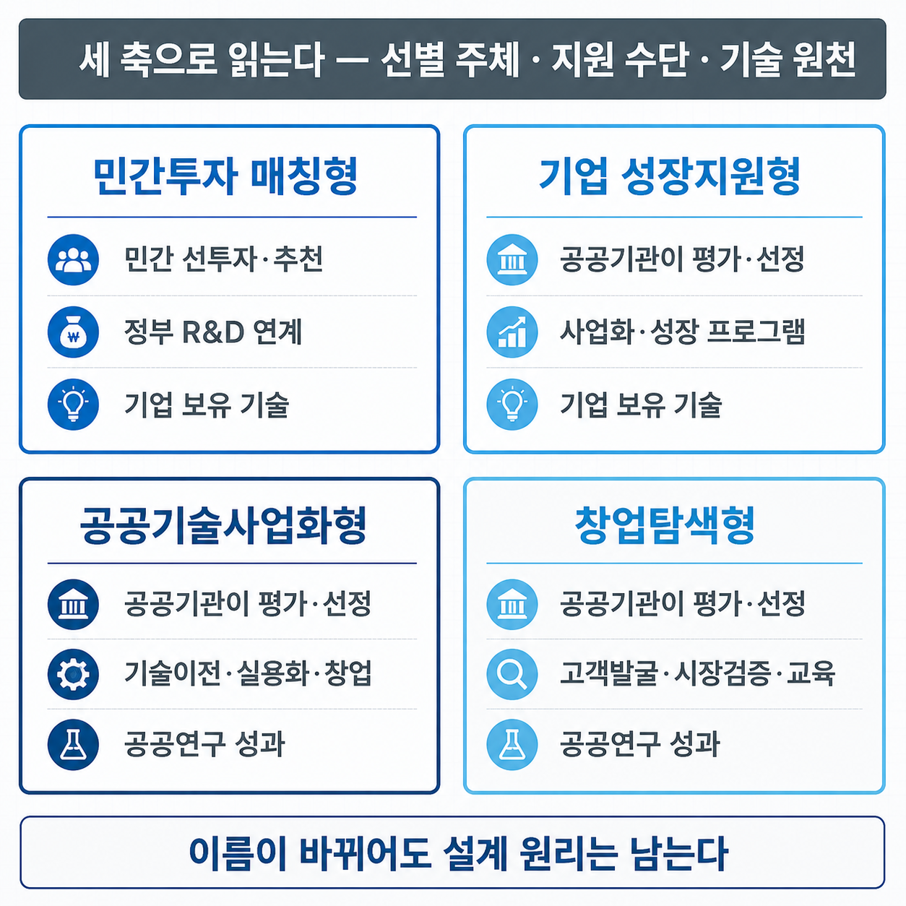
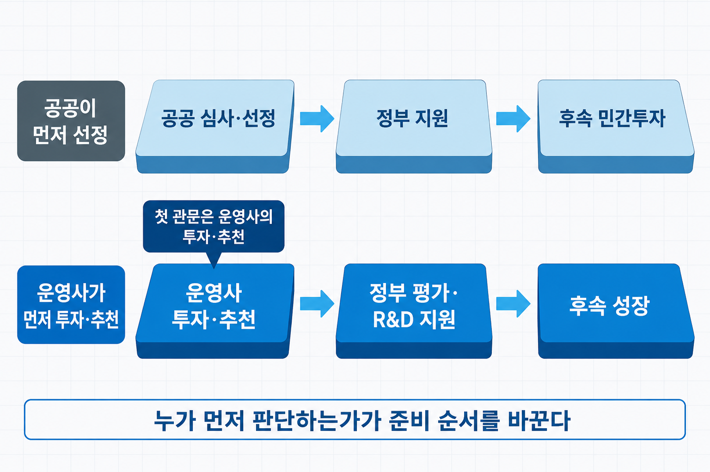
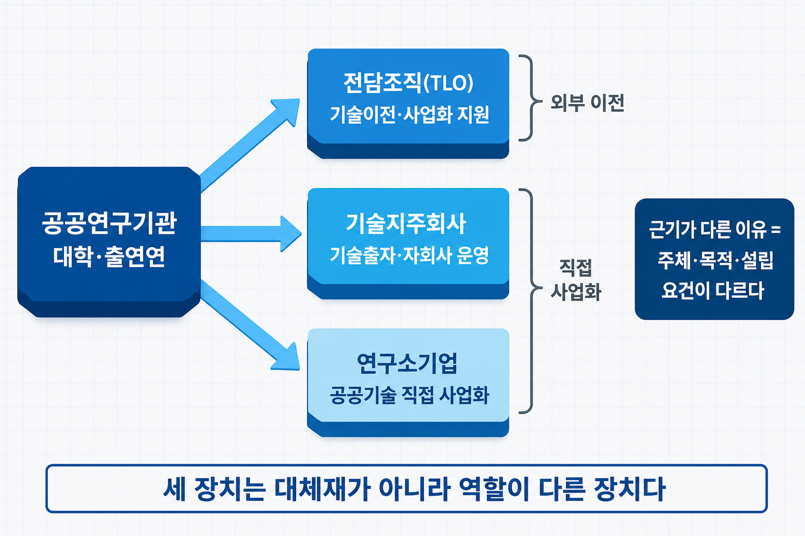

# V-2. 창업·기술사업화 지원 제도 지도 — 네 가지 유형

## 제도는 많은데 무엇부터 봐야 하는가

지원 제도 목록은 검색하면 나온다. 정부 부처와 지방자치단체, 대학과 공공기관이 운영하는 사업이 매년 수백 건 공고된다. 그런데 목록을 다 읽어도 "내가 지금 지원할 수 있는 제도가 무엇인가"라는 질문에는 답이 나오지 않는다. 목록에는 사업의 이름이 있을 뿐, **제도가 어떤 전제 위에 설계되었는지**는 담겨 있지 않기 때문이다.

필요한 것은 목록이 아니라 지도다. 지원 제도는 몇 가지 설계 원리로 나뉘고, 그 원리를 알면 새로 나온 사업도 어느 유형인지 바로 분류된다. 사업의 이름과 예산은 해마다 바뀌지만 **설계 원리는 잘 바뀌지 않는다.**

앞 장(→ [V-1장](V-01_한국_RnD제도.md))에서 국가 R&D가 놓인 규율의 틀을 다뤘다면, 이 장은 그 틀 위에 놓인 지원 제도를 유형으로 정리한다. 규제와 공공 판로의 제도는 다음 장(→ [V-3장](V-03_규제샌드박스_혁신조달.md))에서 이어진다.

> 그림 1 — 지원 제도 네 유형 카드 격자. 이름이 바뀌어도 설계 원리는 남는다.

## 지원 제도는 어떻게 분류하는가

세 가지 질문을 제기하면 대부분의 제도가 분류된다.

**첫째, 누가 먼저 검증하는가.** 공공이 심사로 대상을 고르는 방식과, 민간이 자기 자금을 투입해 검증한 결과를 공공이 이어받는 방식이 있다. 이 차이에 따라 준비 서류와 설득 대상이 달라진다.

**둘째, 무엇을 지원하는가.** 사업화 자금, 연구개발 자금, 교육·멘토링, 공간·장비는 성격이 다르다. 자금 규모만 보고 지원하면 정작 필요한 지원을 놓친다.

**셋째, 누구의 기술인가.** 자체 보유 기술로 시작하는 경우와 대학·출연연의 연구 성과를 이전받아 시작하는 경우는 적용되는 법률 자체가 다르다.

이 세 축을 조합하면 네 가지 유형이 나온다. 아래에서 각 유형이 **어떤 문제를 풀기 위해 그렇게 설계되었는지**를 살펴본다.

## 민간이 먼저 고르는 방식 — 민간투자 매칭형

통상적인 공공 지원은 심사로 대상을 고른 뒤 자금을 집행하고, 기업은 그 이후에 민간 투자를 유치한다. 그런데 정부가 유망 기업을 직접 고르는 데에는 한계가 있다. 심사자가 짧은 시간에 기술의 시장성을 판단해야 하고, 서류를 잘 쓰는 기업과 사업을 잘하는 기업이 늘 일치하지도 않는다.

이 유형에서는 그 판단을 민간이 먼저 한다. **정부가 지정한 운영사**(엔젤투자사, 초기 전문 벤처캐피탈, 창업기획자, 기술기업 등)가 유망한 창업팀을 발굴해 **먼저 투자하고 추천하면, 정부가 그 투자에 연구개발 자금을 매칭**하는 구조다. 대표적인 사례가 민간투자주도형 기술창업지원(TIPS)이다.

설계 의도는 분명하다. **자기 자금을 투입한 민간의 판단을 신호로 삼는 것**이다. 투자자는 회수를 목표로 하므로 시장성을 자기 손실을 감수하고 검증한다. 공공은 그 검증 결과를 근거로 후속 자금을 더한다. 지원 근거는 「중소기업창업 지원법」상 창업기업·예비창업자에 대한 지원이다.

이 구조가 신청자에게 뜻하는 바는 **1차 관문이 정부가 아니라 운영사**라는 점이다. 공고문 평가 항목을 분석하기 전에, 투자자가 납득할 사업 논리와 시장 근거를 먼저 갖춰야 한다. 심사 서류의 논리와 투자 유치의 논리는 강조점이 다르다. 투자자가 어떤 재원으로 어떤 판단을 하는지는 VC·CVC·정책금융 장(→ [IV-7장](IV-07_VC_CVC_정책금융.md))에서 자세히 다룬다.

> 그림 2 — 민간투자 매칭형의 순서 역전. 누가 먼저 판단하는가에 따라 준비 순서가 달라진다.

## 성장 단계에 맞춰 지원하는 방식 — 성장 단계형

창업 초기에 겪는 어려움과 매출이 발생한 뒤 겪는 어려움은 다르다. 아직 사업자 등록 전이라면 아이디어를 시제품으로 만들어 검증하는 일이 과제이고, 창업 후 몇 년이 지났다면 시장에서 반복 구매를 만드는 일이 과제다.

이 유형에서는 그 차이가 제도에 반영되어 있다. **창업 준비 단계, 창업 초기, 도약기로 대상을 나누고**, 단계마다 사업화 자금과 함께 교육·멘토링·공간을 결합해 제공한다. 예비창업패키지·초기창업패키지·창업도약패키지가 이 계열의 사례다. 운영은 전담기관이 총괄하고, 대학·연구기관·민간 기관이 주관기관으로 참여해 프로그램을 운영하는 방식이 일반적이다.

자금의 용도도 정해져 있다. 시제품 제작, 마케팅, 지식재산권 출원·등록처럼 **사업화 과정에서 실제로 지출되는 항목**이 대상이다. 연구개발 자체를 지원하는 유형과 구분되는 지점이다.

신청자 관점에서 중요한 것은 **단계 구분이 곧 자기 위치 판별 기준**이라는 점이다. 사업자 등록 여부와 업력이 지원 자격을 결정하므로, 창업 시점을 언제로 두느냐에 따라 지원 가능한 제도가 달라진다. 개발을 마친 뒤 매출이 발생하기 전까지의 자금 공백 구간에 대해서는 기술사업화 경로 장(→ [I-13장](I-13_기술사업화_경로.md))에서 다룬다.

## 공공의 기술로 창업하는 방식 — 공공기술사업화형

대학과 출연연(정부출연연구기관)이 만든 연구 성과는 논문과 특허로 남는다. 이것을 사업으로 연결하는 경로는 별도의 법률 체계로 마련되어 있고, 여기서부터는 **적용 법률이 주체에 따라 달라진다.**

| 경로 | 근거 | 역할 |
|------|------|------|
| **전담조직(TLO)** | 「기술의 이전 및 사업화 촉진에 관한 법률」 제11조 | 대통령령으로 정하는 공공연구기관은 기술이전·사업화 업무를 전담하는 조직을 두어야 한다. 기술 이전의 실무 창구 |
| **기술지주회사** | 대학 = 「산업교육진흥 및 산학연협력촉진에 관한 법률」 제36조의2 / 공공연구기관 = 기술이전법 | 보유 기술을 자회사에 출자해 사업화한다. 대학의 경우 **산학협력단이 기술지주회사 자본금의 100분의 30을 초과해 기술을 현물출자하고 발행주식 총수의 100분의 50을 초과해 보유**해야 하며, **기술지주회사는 자회사 의결권 주식의 100분의 20 이상을 보유**한다(대통령령으로 정하는 사유가 있으면 예외) |
| **연구소기업** | 「연구개발특구의 육성에 관한 특별법」 | 공공연구기관 등 설립 주체가 **자본금의 20% 이상을 출자**해 특구 안에 설립하는 기업. 합작투자형·기존기업전환형·신규창업형으로 나뉘며, 특구진흥재단의 요건 검토를 거쳐 등록된다 |

지분 요건은 두 층으로 나뉘어 있으니 혼동하지 않아야 한다. **산학협력단이 기술지주회사를 얼마나 보유하는가**(50% 초과)와 **기술지주회사가 자회사를 얼마나 보유하는가**(20% 이상)는 서로 다른 기준이다.

근거가 달라지는 이유는 단순하다. **설립 주체가 다르기 때문**이다. 대학의 산학협력단이 세우는 회사와 출연연이 세우는 회사는 소관 법률이 다르고, 특구라는 지역 제도를 활용하는 경우는 또 다른 법률이 적용된다. 자기 기관이 어느 법률의 적용을 받는지 확인하지 않으면 요건을 잘못 준비하게 된다.

세 경로는 대체재가 아니라 **역할이 다른 장치**다. 전담조직은 기술을 외부에 이전하는 창구이고, 기술지주회사와 연구소기업은 기술을 법인의 자본으로 출자해 직접 사업화하는 형태다.

다만 이 장은 **경로의 지도**까지만 다룬다. 실시권을 어떻게 설정하고 기술료를 어떤 구조로 정할지는 계약의 영역이며 기술이전·라이선싱 계약 장(→ [IV-3장](IV-03_기술이전_라이선싱.md))에서 자세히 다룬다. 연구자 개인이 직무발명을 어떻게 신고하고 무엇을 배분받는지, 교원·연구원이 어떤 형태로 창업할 수 있는지는 연구자 제도 장(→ [V-4장](V-04_연구자_제도.md))에서 별도로 다룬다.

> 그림 3 — 공공기술사업화의 세 경로. 세 경로는 대체재가 아니라 역할이 다른 장치다.

## 고객을 찾는 과정을 지원하는 방식 — 창업탐색형

기술이 뛰어나도 그 기술을 구매할 고객이 없으면 사업이 성립하지 않는다. 연구 성과 기반 창업에서 특히 자주 나타나는 문제다. 실험실에서 성능을 확인한 것과 시장에서 값을 지불할 사람을 찾은 것은 다른 일이기 때문이다.

이 유형의 지원 대상은 자금이나 공간이 아니라 **탐색 활동 자체다.** 공공연구 성과를 보유한 예비창업팀이 잠재 고객을 직접 만나 가설을 검증하는 과정을 교육·멘토링과 탐색 비용으로 지원하는 구조다. 국내에서는 공공기술 기반 시장연계 창업탐색 지원사업이 여기 해당하며, 사업 브랜드는 텍스코어(TeX-Corps)다. 초기에는 한국형 아이코어라는 명칭으로 알려졌고, 지금도 두 명칭이 함께 쓰인다.

설계 의도는 **사업화 이전 단계에 수요 검증을 제도로 편성한 것**이다. 자금을 먼저 지원하고 결과를 요구하는 대신, 고객을 만나 배우는 과정을 지원해 사업 방향 자체를 교정하게 한다.

이 유형이 준거로 삼는 고객개발 방법론 자체는 고객개발·린스타트업 장(→ [I-14장](I-14_고객개발_린스타트업.md))에서 자세히 다룬다. 이 장에서는 그 방법론이 **제도로 편성된 형태**만 다룬다.

## 내 상황에 맞는 유형 찾기

앞의 세 축에 자기 상황을 대입하면 검토 순서가 정해진다.

| 상황 | 우선 검토할 유형 |
|------|----------------|
| 투자 유치를 준비 중이거나 투자자 접점이 있다 | 민간투자 매칭형 — 운영사 설득이 선행 |
| 아이디어·시제품 단계이고 검증 자금이 필요하다 | 성장 단계형 — 단계 자격 확인이 먼저 |
| 대학·출연연 기술을 이전받아 시작한다 | 공공기술사업화형 — 소속 기관의 근거 법률 확인 |
| 기술은 있으나 고객이 불분명하다 | 창업탐색형 — 수요 검증을 먼저 |

유형을 먼저 정하면 준비 자료의 방향이 달라진다. 투자자에게 제시할 자료, 지원사업에 제출할 자료, 기술 이전 계약을 준비하는 자료는 요구되는 근거가 서로 다르다.

> ⚠️ 각 사업의 지원 규모·자격 요건·일정·평가 방식은 해마다 바뀌고 사업이 신설·통합되기도 한다. 실제 준비 단계에서는 **해당 연도 공고문을 반드시 확인**해야 한다. 이 장에서 정리한 것은 그 아래에 놓인 유형 구조다.

## 사업계획에서의 위치

| 사업계획 구성 요소 | 이 장의 내용이 답하는 것 |
|------|------|
| 자금 계획·지원 제도 활용 | 지원 유형에 맞춘 사업화 계획의 초점 조정 |
| 기술 확보 | 공공기술 활용·기술 이전 기반 사업의 근거 정리 |
| 자금 조달 구조 | 공적 자금과 민간 투자의 연계 구조 |

유형을 알면 새로 나온 사업도 분류할 수 있다. 다음 장에서는 자금을 확보한 뒤에 남는 두 관문 — 규제와 공공 판로 — 에 제도로 무엇이 마련되어 있는지를 다룬다.

## 연결 장

- 선행: (→ [V-1장](V-01_한국_RnD제도.md)) 한국 R&D 제도의 구조
- 후행: (→ [V-3장](V-03_규제샌드박스_혁신조달.md)) 규제샌드박스·혁신조달
- 참조: (→ [IV-7장](IV-07_VC_CVC_정책금융.md)) VC·CVC·정책금융 — 투자자의 판단 구조 / (→ [IV-3장](IV-03_기술이전_라이선싱.md)) 기술이전·라이선싱 계약 — 계약 층 / (→ [V-4장](V-04_연구자_제도.md)) 대학·출연연 연구자를 위한 제도 — 연구자 관점 / (→ [I-13장](I-13_기술사업화_경로.md)) 기술사업화 경로 — 자금 공백 구간 / (→ [I-14장](I-14_고객개발_린스타트업.md)) 고객개발·린스타트업 — 창업탐색형의 방법론
