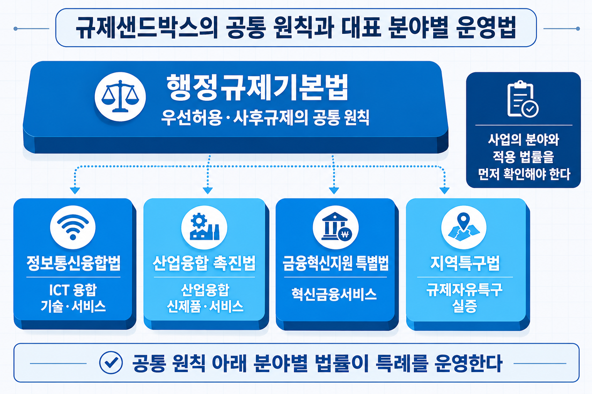
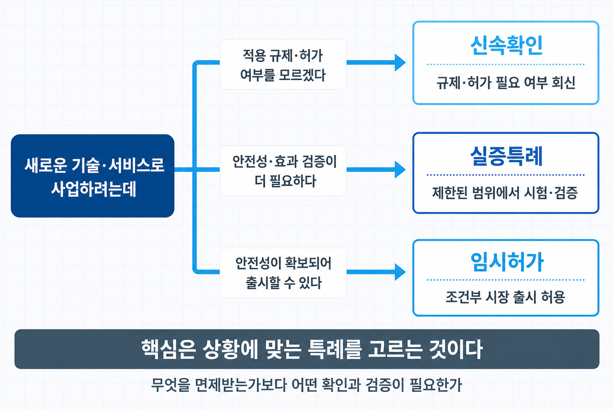
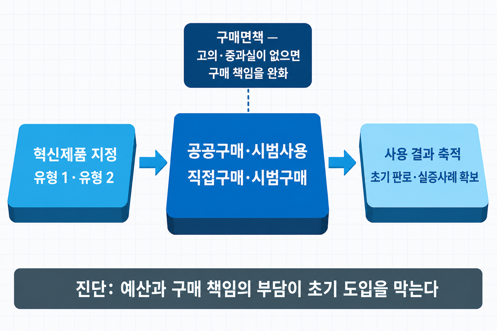

# V-3. 규제샌드박스·혁신조달 — 실증특례·임시허가·혁신제품 지정

## 만들었는데 팔 수 없고, 공공은 구매하지 않는다

기술을 완성하고 자금까지 확보한 뒤에도 두 개의 관문이 남는다.

하나는 **규제**다. 새로운 방식의 서비스를 만들었는데 현행 법령에 그 행위를 허가할 기준이 없거나, 기존 기준이 지금 기술을 전제로 만들어지지 않아 적용이 곤란한 경우다. 위법은 아니지만 적법하다는 확인도 받지 못한 상태에서는 사업을 시작하기 어렵다.

다른 하나는 **판로**다. 공공기관이 유력한 수요처인데, 검증 실적이 없는 신제품을 먼저 구매하는 기관을 찾기가 어렵다. 실적이 없어 판매하지 못하고, 판매하지 못해 실적이 쌓이지 않는 상태가 이어진다.

두 관문에 대응하는 제도가 각각 마련되어 있다. 앞 장(→ [V-2장](V-02_창업_사업화_지원제도.md))에서 자금 지원 제도를 유형으로 정리했다면, 이 장은 **규제와 공공 판로에 관한 제도**를 다룬다.

> 그림 1 — 규제샌드박스의 2층 구조. 원칙은 하나, 특례를 주는 법은 넷이다.

## 규제샌드박스란 무엇인가

규제샌드박스는 **새로운 기술·서비스에 대해 기존 규제를 한시적으로 면제하거나 유예해, 시장에서 시험할 공간을 마련하는 제도**다. 규제를 없애는 것이 아니라, 검증 기간 동안 적용을 미뤄 두고 그 결과로 법령 정비를 판단하는 구조다.

한국의 제도는 두 층으로 되어 있다. **위층은 「행정규제기본법」**이 담당한다. 규제 전환의 기본 방향과 원칙이 여기 있다. **아래층은 분야별 개별법 네 가지**다. 2019년에 정보통신융합법과 산업융합촉진법 개정, 금융혁신지원 특별법 제정, 지역특구법 전부개정으로 각각 도입되었고, 소관 부처도 분야마다 다르다.

| 분야 | 근거 법률 | 소관 |
|------|----------|------|
| ICT 융합 | 정보통신융합법 | 과학기술정보통신부 |
| 산업 융합 | 산업융합촉진법 | 산업통상부 |
| 혁신 금융 | 금융혁신지원 특별법 | 금융위원회 |
| 규제자유특구 | 지역특구법 | 중소벤처기업부 |

이 구조에서 신청자가 먼저 해야 할 일은 분명하다. **자기 사업이 어느 법의 대상인지 판별하는 것**이다. 같은 기술이라도 서비스의 성격과 적용 산업에 따라 소관이 달라지고, 신청 창구와 심의 절차도 함께 달라진다.

## 무엇을 받는가 — 신속확인·실증특례·임시허가

한국 제도의 특징은 특례가 세 종류라는 점이다. 해외 제도가 실증특례 중심으로 운영되는 것과 대비된다.

**신속확인**은 규제 유무가 불분명할 때 신청한다. 규제부처가 **30일 이내에 규제가 있는지 여부를 확인**해 회신한다. 규제가 없다는 회신을 받으면 그대로 사업을 시작할 수 있다.

**실증특례**는 허가의 근거 법령에 기준·요건이 없거나 적용이 곤란할 때, **일정 조건 아래 시장에서 실증을 허용**하는 조치다. 안전 조건과 책임보험 가입 등이 함께 부과된다.

**임시허가**는 안전성에 문제가 없다고 판단되는 경우 **우선 시장에 출시할 수 있도록 임시로 허가**하는 조치다.

세 가지를 관통하는 관점은 "무엇을 면제받는가"가 아니라 **"무엇을 확인받는가"** 다. 규제가 없다는 확인, 조건부로 해도 된다는 확인, 임시로 판매해도 된다는 확인이 각각의 결과물이다.

**특례 기간은 2026년 개정으로 늘어났다.** 종전에는 실증특례와 임시허가 모두 최대 2+2년이었으나, 개정 후 **실증특례는 최대 4+2년, 임시허가는 최대 3+2년**까지 부여할 수 있다. 함께 개정된 사항으로 동일·유사 과제의 관계부처 의견 조회 기간이 **30일에서 15일로 단축**되었고, 특례 유효기간이 끝나기 전에 **법령 정비를 완료하도록 의무화**되었다. 근거는 산업융합촉진법 개정(2026년 5월 시행)이며, 정보통신융합법 등도 함께 개정되었다.

> 그림 2 — 특례 3종 판별. 무엇을 면제받는가가 아니라 무엇을 확인받는가.

## 샌드박스의 구조적 역설

제도가 정착하는 과정에서 구조에서 비롯된 문제도 함께 드러났다.

**첫째, 분야별 개별법 체계라 진입 자체에 비용이 든다.** 사업이 어느 법의 대상인지 판별하는 일이 신청자의 몫이고, 융합 서비스일수록 소관이 명확하지 않다. 제도를 하나의 법으로 통합하자는 논의가 이어지는 배경이다. 다만 통합법은 아직 논의 단계다.

**둘째, 특례가 끝난 뒤가 불확실하다.** 특례는 한시적 조치이므로, 그 기간에 법령이 정비되어야 사업을 계속할 수 있다. 그런데 정비가 이어지지 않으면 실증을 마치고도 사업을 중단해야 하는 상황이 생긴다. 지적되는 원인은 주무부처에 법령 개정을 강제할 권한이 없고 부처 간 이견을 조율할 장치가 부족하다는 점이다. 2026년 개정에서 **정비 완료를 의무화**하고 정비가 지연되면 임시허가 기간을 연장하도록 한 것은 이 문제에 대한 대응이다.

**셋째, 개정마저 법마다 따로 진행된다.** 앞서 살펴본 기간 연장도 산업융합촉진법과 정보통신융합법 등을 각각 개정해 이뤄졌다. 분절 구조가 제도 운영뿐 아니라 제도 개선의 속도에도 영향을 준다는 점을 확인할 수 있다.

실무 관점에서 이 역설이 뜻하는 바는 하나다. **특례를 받는 것이 목표가 아니라 특례 기간에 무엇을 남길 것인지가 목표**다. 실증 데이터와 안전성 근거를 법령 정비 논의에 쓸 수 있는 형태로 축적해야 한다.

## 공공이 먼저 구매한다 — 혁신조달과 혁신제품 지정

판로에 관한 제도는 진단이 다르다. 공공기관이 신제품을 사지 않는 이유가 예산 부족이 아니라 **구매 담당자의 책임 부담**이라는 것이다. 검증 실적이 없는 제품을 샀다가 문제가 생기면 담당자가 감사와 책임을 감당해야 하므로, 안전한 선택은 이미 검증된 제품을 구매하는 것이다.

혁신조달은 그 부담을 제도로 덜어 내는 설계다. 핵심 장치가 **혁신제품 지정**이다.

| 구분 | 내용 |
|------|------|
| 유형1 | 국가 우수연구개발 혁신제품 · 기술인정 혁신제품 |
| 유형2 | 혁신시제품 |
| 효과 | 지정 후 **3년간 수의계약** 가능 · 구매 담당자에 대한 **구매면책** |
| 제안 경로 | 공급자제안형 · **수요자제안형**(공공기관이 혁신 수요를 먼저 제기) |

**구매면책**이 이 제도의 논리적 핵심이다. 담당자가 정상적인 절차로 혁신제품을 구매했다면 결과에 문제가 생겨도 책임을 묻지 않는다는 것으로, 진단(책임 부담이 구매를 막는다)에 대한 직접적인 처방이다. **수의계약 허용**은 경쟁입찰 준비 부담을 덜어 실제 구매가 성사되도록 하는 보완 장치다.

조달청은 혁신제품을 예산으로 구매해 수요기관이 시범 사용하고 결과를 회신하는 **시범구매**도 운영한다. 실적이 없어 판매하지 못하고 판매하지 못해 실적이 쌓이지 않는 순환을 해소하기 위한 장치다.

기술 기업 관점에서 공공조달은 초기 거점 후보가 된다. 시장 진입 순서를 어떻게 설계할지는 시장진입 전략 장(→ [I-8장](I-08_시장진입_전략.md))에서 자세히 다룬다.

> 그림 3 — 혁신제품 지정이 작동하는 방식. 면책과 수의계약은 같은 진단에 근거한 두 장치다.

## 국가전략기술과 기술주권

규제와 판로 위에 한 층이 더 있다. 어떤 기술 영역을 국가 차원에서 육성할지 정하는 제도다.

근거는 **「국가전략기술 육성에 관한 특별법」**(법률 제19236호)이며, 2023년 3월 제정되어 같은 해 9월 시행되었다. 부처마다 흩어져 있던 전략기술 육성 정책에 범부처 차원의 법적 근거를 마련한 것이다.

이 법에 따라 **12대 분야**가 국가전략기술로 지정되어 있다. 반도체·디스플레이, 이차전지, 첨단 모빌리티, 차세대 원자력, 첨단 바이오, 우주항공·해양, 수소, 사이버보안, 인공지능, 차세대 통신, 첨단로봇·제조, 양자다. 그 아래 **50개 중점기술**이 세부 지정되어 있고, 「제1차 국가전략기술 육성 기본계획(2024~2028)」이 22개 부·처·청 공동으로 수립되었다.

기업 관점에서 확인할 지점은 자기 기술이 이 분류에 해당하는지 여부다. 지정 영역에는 과제 기획·세제·금융에서 별도 우대가 적용되는 경우가 있다.

한편 인공지능처럼 기술 자체가 국가 정책 의제가 된 영역에서는 제도의 층위를 구분해 두는 것이 바람직하다. **여기서 다룬 것은 육성·지정·규제라는 제도의 구조**이고, 기업이 인공지능 거버넌스를 자기 전략 변수로 어떻게 다룰지는 AI 시대 기술경영 장(→ [III-5장](III-05_AI시대_기술경영.md))에서 자세히 다룬다.

## 사업계획에서의 위치

| 사업계획 구성 요소 | 이 장의 내용이 답하는 것 |
|------|------|
| 규제 대응 계획 | 규제 대응 계획과 실증·인증 계획의 근거 |
| 판로 확보 전략 | 공공 수요 연계와 초기 매출 경로 |
| 리스크 | 규제 리스크 대응 방안 |

> ⚠️ 특례 신청 창구·심의 일정·혁신제품 지정 요건과 절차는 소관 부처와 연도에 따라 달라지고, 개정 사항의 시행 시점도 법률마다 다르다. 실제 준비 단계에서는 **해당 제도의 공식 안내와 최신 공고를 반드시 확인**해야 한다.

규제와 판로까지 정리하면 기업 관점의 제도 지도는 대체로 채워진다. 다음 장에서는 대상을 바꾸어, 대학과 출연연에서 연구를 수행하는 사람에게 적용되는 제도를 다룬다.

## 연결 장

- 선행: (→ [V-2장](V-02_창업_사업화_지원제도.md)) 창업·기술사업화 지원 제도 지도
- 후행: (→ [V-4장](V-04_연구자_제도.md)) 대학·출연연 연구자를 위한 제도
- 참조: (→ [I-8장](I-08_시장진입_전략.md)) 시장진입 전략 — 공공조달 거점 / (→ [III-5장](III-05_AI시대_기술경영.md)) AI 시대 기술경영 — AI 거버넌스의 기업 전략 층
