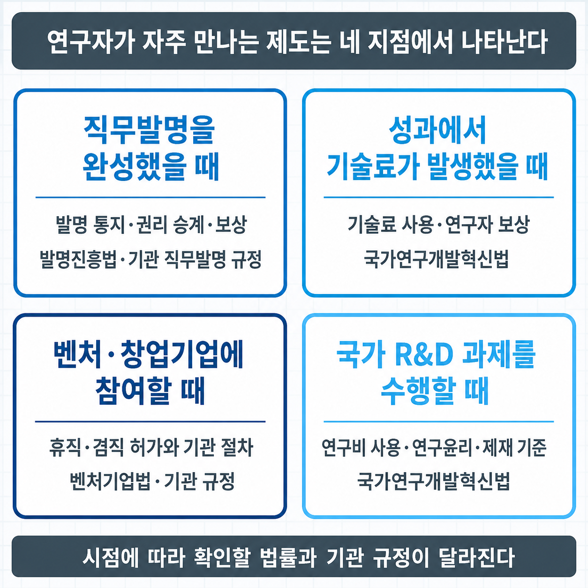
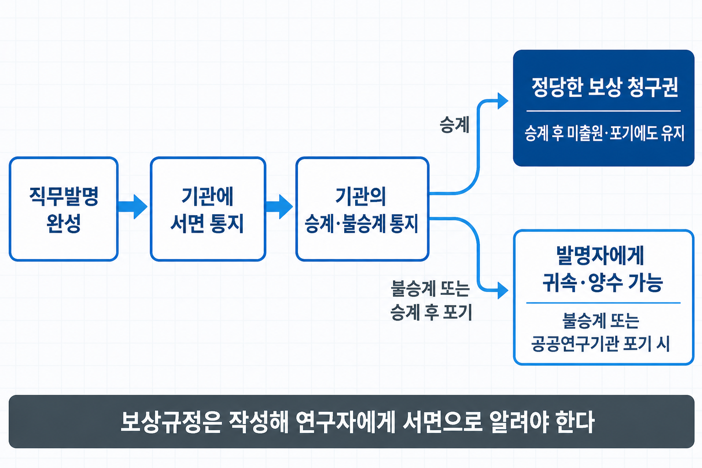
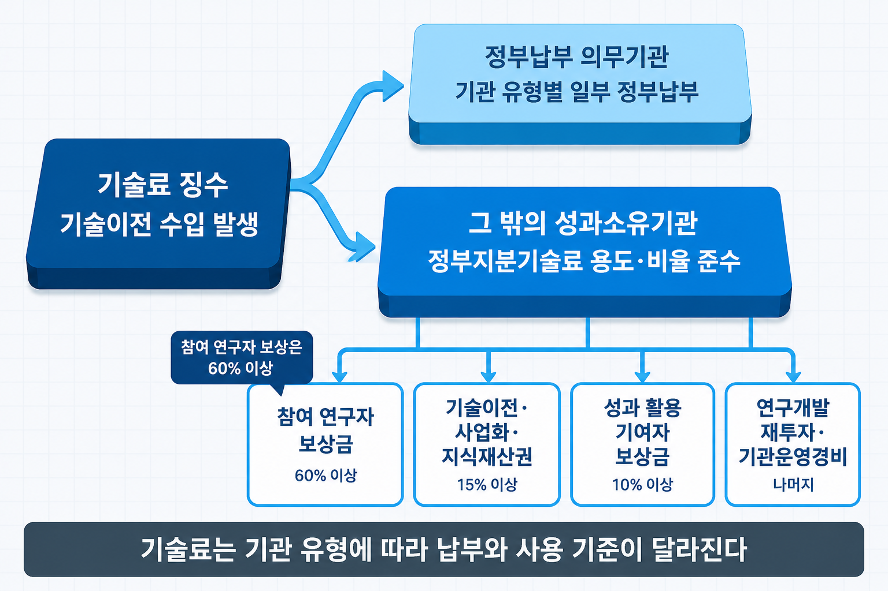

# V-4. 대학·출연연 연구자를 위한 제도 — 직무발명·기술료·연구원 창업

## 성과는 나왔는데, 그다음 절차를 알려 주는 사람이 없다

제V부의 앞선 세 장(V-1~V-3장)은 기업 관점이었다. 이 장은 대상을 바꾸어, **대학과 출연연에서 정부 R&D 과제를 수행하는 연구자와 산학협력 담당자**에게 적용되는 제도를 다룬다. 학생과 예비 창업자에게도 먼 주제가 아니다 — 대학원 연구실에서 과제에 참여하는 시점부터, 또는 대학·출연연의 기술을 이전받아 창업하려는 시점부터 이 제도들의 적용 대상이 되며, 참여 연구자 등록과 직무발명 신고, 기술료 배분은 학생 연구자에게도 해당된다.

연구 성과가 나온 뒤 무엇을 해야 하는지는 연구자가 각자 개별적으로 확인해야 한다. 발명을 어디에 어떻게 신고해야 하는지, 신고하면 자신에게 어떤 권리가 생기는지, 기술이 팔렸을 때 수입이 어떤 기준으로 나뉘는지, 직접 창업하려면 무엇을 먼저 확인해야 하는지가 한곳에 정리되어 있지 않기 때문이다.

이 절차들은 관행이 아니라 **법률과 기관 규정으로 정해져 있다.** 구조를 알면 언제 무엇을 준비해야 하는지가 분명해진다.

> 그림 1 — 연구자가 제도와 만나는 네 지점. 네 지점마다 근거 법률이 다르다.

## 연구자가 제도와 만나는 네 지점

제도는 연구자의 일과 무관하게 존재하는 것이 아니라, **연구 활동의 특정 시점마다 적용된다.** 발명이 나왔을 때는 발명진흥법이, 그 발명으로 수입이 생겼을 때는 국가연구개발혁신법의 기술료 규정이, 직접 사업화하려 할 때는 벤처기업법의 특례와 소속 기관 규정이, 과제를 수행하는 동안에는 연구비·연구윤리 규정이 적용된다.

한 가지 더 짚어 둘 것이 있다. 대학에서 연구 계약의 당사자는 연구자 개인이 아니라 **산학협력단**이다. 산학협력단은 「산업교육진흥 및 산학연협력촉진에 관한 법률」 제25조에 따라 대학이 학칙으로 정하는 바에 따라 두는 조직이며, **법인**으로서 설립등기를 통해 성립한다. 계약과 회계의 주체가 기관이라는 점이 기업 담당자와 다른 출발점이다.

## 직무발명이란 무엇인가

**직무발명은 종업원이 직무 수행 과정에서 완성한 발명으로, 그 성질상 사용자의 업무 범위에 속하는 발명**을 말한다. 대학·출연연 연구자가 과제를 수행하며 만든 발명이 여기 해당한다. 근거 법률은 「발명진흥법」이며, 보상에 관한 핵심 조항은 제15조다.

구조는 **권리 이전과 보상 청구의 교환**이다. 연구자가 발명에 대한 권리를 계약이나 근무규정에 따라 기관에 승계하면, 그 대가로 **정당한 보상을 받을 권리**를 가진다. 발명의 권리를 기관에 귀속시키는 이유는 출원·유지·이전을 기관이 전문적으로 수행하는 것이 활용에 유리하기 때문이고, 그 대신 발명자의 기여는 보상 청구권으로 보장한다.

기관에는 절차 의무가 따른다. **보상 형태와 보상액 결정 기준, 지급 방법을 명시한 보상규정을 작성해 종업원에게 서면으로 알려야 하며**, 그 규정을 만들거나 바꿀 때는 종업원과 **협의**해야 한다. 보상 수준이 기관장의 재량이 아니라 사전에 공개된 규정에 따르도록 한 것이다.

연구자에게 실익이 큰 조항이 두 가지 더 있다.

**첫째, 기관이 권리를 승계한 뒤 출원하지 않거나 출원을 포기·취하해도 정당한 보상 의무는 남는다.** 보상액을 정할 때는 그 발명이 산업재산권으로 보호되었더라면 종업원이 받을 수 있었던 경제적 이익을 고려해야 한다. 승계해 놓고 출원하지 않는 방식으로 보상을 피할 수 없다는 뜻이다.

**둘째, 공공연구기관이 승계한 권리를 포기하는 경우 그 발명을 완성한 종업원이 권리를 양수할 수 있다.** 기관이 활용하지 않기로 한 발명을 발명자가 직접 이전받을 수 있는 통로다. 창업을 준비하는 연구자에게는 특히 확인할 가치가 있는 조항이다.

공무원 신분인 연구자에게는 「공무원 직무발명의 처분·관리 및 보상 등에 관한 규정」이 별도로 적용된다.

기업이 직무발명 제도를 어떻게 설계하고 지식재산 확보 수단으로 쓰는지는 IP 전략·포트폴리오 장(→ [IV-1장](IV-01_IP전략_포트폴리오.md))에서 자세히 다룬다. 이 장에서 정리하는 것은 연구자에게 적용되는 제도다.

> 그림 2 — 직무발명 절차와 갈림길. 승계 여부에 따라 연구자에게 남는 권리가 달라진다.

## 기술료 — 성과가 수입이 되었을 때

기술이 이전되어 수입이 생기면 그 수입의 처리도 제도로 정해져 있다. 국가 R&D 성과에서 발생하는 이 수입을 **기술료**라고 한다. 같은 대상을 계약 실무에서는 실시료, 일반적인 맥락에서는 로열티라고도 부른다. 세 표현이 가리키는 것은 같으며, 공공기술 이전에서는 기술료가 표준 표기다.

성과를 소유한 기관이 영리법인인지 비영리법인인지에 따라 처리가 달라진다. **영리법인**은 징수한 기술료 중 일정 부분을 정부에 납부하며, 그 비율은 기업 규모에 따라 다르다. 반면 **대학·출연연 같은 비영리법인**은 납부 대신 **사용 용도에 제한**을 받는다. 기술료를 기관이 자유롭게 쓰지 못하고, 정해진 용도로만 집행해야 한다.

| 용도 | 기준 |
|------|------|
| 참여 연구자 보상금 | **정부 지분 기술료의 60% 이상**(2024년 기준) |
| 지식재산권 출원·등록·유지 비용 | 정부 출연금 지분의 5% 이상 |
| 그 밖의 용도 | 연구개발 재투자, 기관 운영경비 등 |

이 구조의 설계 의도는 분명하다. **공적 자금으로 만든 성과의 수입을 기관 재량에 두지 않고, 발명자 보상과 다음 연구에 쓰이도록 용도를 법으로 정한 것**이다. 보상금 비율에 하한을 둔 이유도 같다.

연구자 관점에서 확인할 지점은 두 가지다. 첫째, **자신이 해당 과제의 참여 연구자로 등록되어 있는지**다. 배분은 참여 연구자를 기준으로 이뤄진다. 둘째, 기관의 **기술료 배분 내규**다. 법이 정한 것은 하한과 용도이고, 참여 연구자들 사이의 배분 기준은 기관 규정에 있다.

기술의 값을 어떤 방법으로 산정하는지는 기술가치평가 장(→ [IV-4장](IV-04_기술가치평가.md))에서, 실시권과 기술료를 계약에서 어떻게 설계하는지는 기술이전·라이선싱 계약 장(→ [IV-3장](IV-03_기술이전_라이선싱.md))에서 자세히 다룬다.

> 그림 3 — 기술료가 흐르는 경로. 용도가 정해진 수입이라는 점이 출발점이다.

## 교원·연구원 창업은 어떻게 하는가

기술을 직접 사업화하려는 연구자에게는 신분을 유지한 채 창업할 수 있는 특례가 있다. 근거는 「벤처기업육성에 관한 특별조치법」이다.

**휴직**(제16조)은 벤처기업이나 창업기업의 대표자·임원으로 근무하기 위해 소속 기관에서 휴직하는 제도다. 기간은 창업 준비 기간 6개월을 포함해 **5년 이내**이며, 소속 기관의 장이 필요하다고 인정하면 **1년 이내에서 연장**할 수 있다. **겸직**(제16조의2)은 소속을 유지한 채 창업기업의 임원을 겸하는 경로다.

⚠️ **여기서 반드시 확인할 것이 있다. 법률은 휴직·겸직을 허용할 뿐, 어떤 형태의 창업이 가능한지는 소속 기관의 규정이 정한다.**

실제 규정에서는 겸직 신청 대상을 **벤처기업, 그리고 산학협력단 산하 기술지주회사와 그 자회사**로 한정하는 경우가 일반적이다. 그 밖의 형태로 회사를 세우면 승인 대상에서 제외될 수 있다. **연구자가 임의로 법인을 설립하고 겸직을 신고하는 구조가 아니다.**

함께 규정되는 조건도 기관마다 다르다. 총장 승인 같은 사전 승인 절차, 창업 기간의 한도와 연장 절차, 지분 일부의 대학 기여 또는 기술지주회사의 투자 유치 의무, 강의·연구 부담의 유지, 이해충돌 심사가 대표적이다. **창업을 결심한 시점이 아니라 창업을 검토하는 시점에 소속 기관 규정을 먼저 확인해야 하는 이유**다.

또 하나의 쟁점은 **지식재산 귀속**이다. 창업 이후에도 재직 상태가 유지되면, 그 기간에 만든 개량 발명은 직무발명으로 기관에 귀속될 수 있다. 창업기업이 그 기술을 쓰려면 별도의 실시 계약이 필요하다. 창업 전에 보유하던 기술과 창업 후에 나온 발명의 경계를 계약으로 정리해 두어야 분쟁을 피할 수 있다. 공동 개발에서 이 경계를 어떻게 정의하는지는 기술이전·라이선싱 계약 장(→ [IV-3장](IV-03_기술이전_라이선싱.md))에서 다룬다.

기술지주회사·연구소기업 등 기관 차원의 사업화 경로는 창업·기술사업화 지원 제도 지도 장(→ [V-2장](V-02_창업_사업화_지원제도.md))에서 유형별로 정리했다.

## 과제를 수행하는 동안 지는 의무

성과와 창업 이전에, 과제를 수행하는 동안 적용되는 의무가 있다.

**연구개발비 사용**은 고시인 「국가연구개발사업 연구개발비 사용 기준」이 비목별 범위를 정한다. 연구수당과 학생인건비 같은 실무 쟁점이 여기 속한다. 2026년 6월 시행령 개정으로 일상 경비를 비목 구분 없이 쓰는 연구혁신비가 신설되고 간접비가 네거티브 방식으로 바뀌는 등 자율성이 확대되었으므로(→ [V-1장](V-01_한국_RnD제도.md)), 집행 기준은 고시의 현행판으로 확인한다.

**연구윤리와 제재처분**은 국가연구개발혁신법 제4장이 규율한다. 부정행위 금지(제31조), 제재처분(제32조), 제재처분의 절차와 재검토 요청(제33조)이 이어진다. 연구자 개인에게 영향이 큰 것은 **참여제한**이다. 일정 기간 국가 R&D 과제에 참여할 수 없게 되므로 연구 활동 자체가 중단된다.

**성과의 소유·활용**은 같은 법 제16조와 제17조에 있다. 앞에서 다룬 기술료 배분은 이 조항들을 전제로 작동한다.

이 의무들은 자율성 확대에 대응하는 구조다. 사전에 일일이 통제하지 않는 대신 사후 책임을 묻는 방식이라는 점은 한국 R&D 제도의 구조 장(→ [V-1장](V-01_한국_RnD제도.md))에서 다뤘다.

## 사업계획에서의 위치

| 사업계획 구성 요소 | 이 장의 내용이 답하는 것 |
|------|------|
| 성과 활용·기술이전 계획 | 기관 보유 기술의 실시 권원과 지식재산 귀속 정리 |
| 기술이전·실시 계약 검토 | 보상 청구와 기술료 배분의 전제 확인 |
| 창업 계획 | 연구자 창업의 형태·승인·지분 조건 확인 |

> ⚠️ 보상규정의 산정 방식, 기술료 배분 내규, **창업 형태·승인 절차·창업 기간 한도·지분 조건은 기관마다 다르다.** 법령이 정한 것은 하한과 원칙이고 구체적인 적용은 소속 기관 규정에 있으므로, 실제 준비 단계에서는 **소속 기관의 규정과 최신 매뉴얼을 반드시 확인**해야 한다.

이 장으로 제도의 네 층 — 국가 R&D 규율(→ [V-1장](V-01_한국_RnD제도.md)), 지원 제도 유형(→ [V-2장](V-02_창업_사업화_지원제도.md)), 규제와 공공 판로(→ [V-3장](V-03_규제샌드박스_혁신조달.md)), 연구자 개인의 제도(이 장) — 이 정리되었다. 마지막 장(→ [V-5장](V-05_지속가능_미래.md))에서는 이 모든 활동이 향하는 방향을 다룬다.

## 연결 장

- 선행: (→ [V-3장](V-03_규제샌드박스_혁신조달.md)) 규제샌드박스·혁신조달
- 후행: (→ [V-5장](V-05_지속가능_미래.md)) 지속가능·미래 기술경영
- 참조: (→ [IV-1장](IV-01_IP전략_포트폴리오.md)) IP 전략·포트폴리오 — 직무발명의 기업 관점 / (→ [IV-3장](IV-03_기술이전_라이선싱.md)) 기술이전·라이선싱 계약 — 실시 계약·경계 정리 / (→ [IV-4장](IV-04_기술가치평가.md)) 기술가치평가 / (→ [V-2장](V-02_창업_사업화_지원제도.md)) 창업·기술사업화 지원 제도 지도 — 기관 차원 경로 / (→ [V-1장](V-01_한국_RnD제도.md)) 한국 R&D 제도의 구조 — 자율·책임 구조
